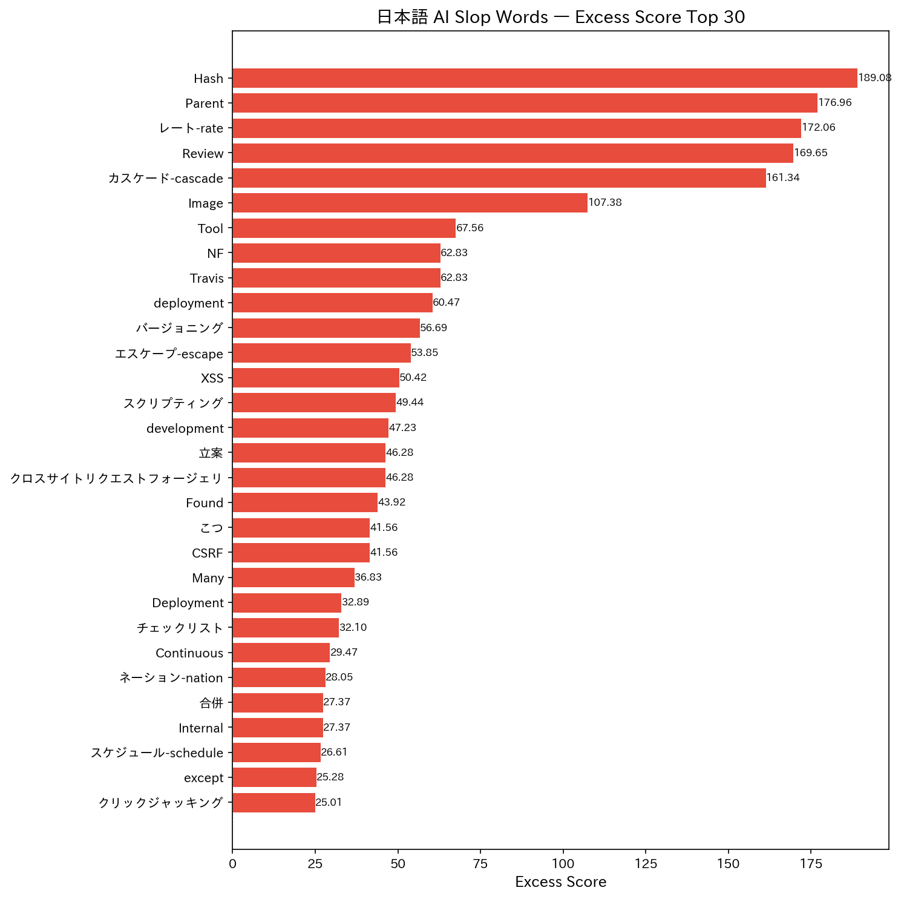
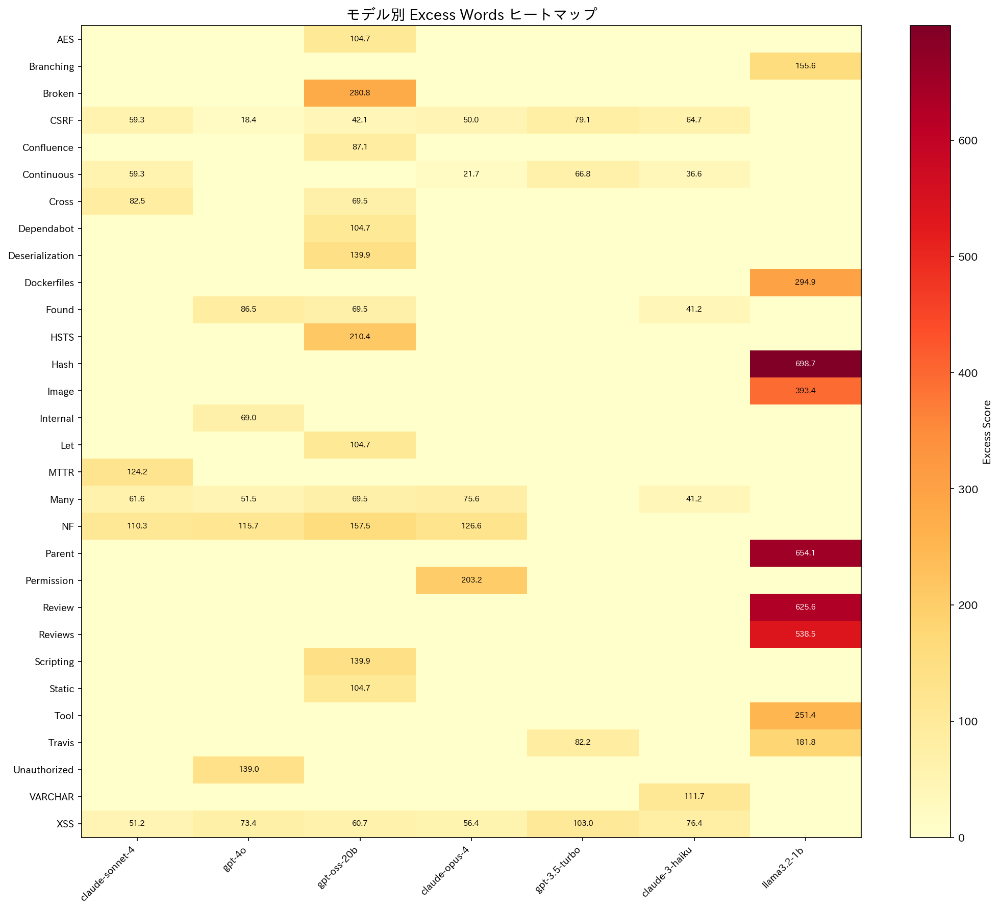
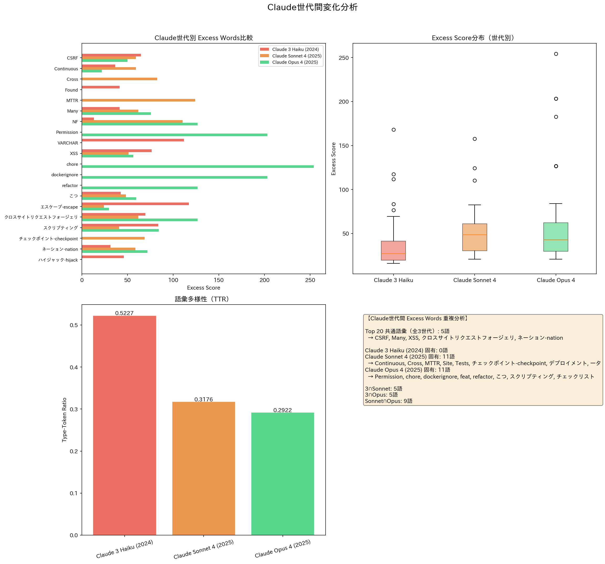

# Excess Vocabulary in Japanese AI-Generated Text

日本語AI生成テキストにおけるexcess vocabulary（過剰語彙）の定量分析。

## Overview
英語圏で確立されたexcess vocabulary手法（Geng & Trotta 2024）を日本語に初めて適用し、
AI生成テキストに特徴的な語彙パターンを特定した研究。

## Key Findings
- 7つのLLM（Claude 3 Haiku, Claude Sonnet 4, Claude Opus 4, GPT-3.5, GPT-4o, GPT-OSS 20B, Llama 3.2 1B）の日本語excess wordsを特定
- Claude世代間でslop語彙が増加する傾向を発見
- 英語excess words（delve, intricate等）に対応する日本語語彙を同定
- LLM登場前後（2020-2022 vs 2024-2026）の人間記事で共進化の兆候を確認

## Dataset
- AI-generated samples: 350 articles (7 models × 10 themes × 5 trials)
- Human corpus (pre-LLM): 700 articles from Qiita/Zenn (2020-2022)
- Human corpus (post-LLM): ~479 articles from Qiita/Zenn (2024-2026)

## Methodology
1. Controlled text generation with uniform prompts across models
2. MeCab morphological analysis (unidic-lite dictionary)
3. Excess score calculation: (AI_freq - human_freq) / human_freq
4. Statistical validation: χ² test with Bonferroni correction
5. Cross-model comparison and generational analysis
6. English-Japanese excess word mapping
7. Coevolution analysis (pre/post LLM human writing)

## Repository Structure
- `scripts/` — Analysis pipeline (Python)
- `data/` — AI samples and human corpus
- `results/` — Analysis results, figures, and reports

## Related Work
- Geng & Trotta (2024). "Delving into ChatGPT usage in academic writing through excess vocabulary." arXiv:2406.07016
- Arrigo et al. (2025). "Human-LLM Coevolution: Evidence from Academic Writing." arXiv:2502.09606
- Our previous work: [AI Text Slop](https://github.com/kenimo49/ai-text-slop) — 180-sample Japanese AI text pattern analysis

## Author
Ken Imoto ([@kenimo49](https://github.com/kenimo49))

## License
MIT
