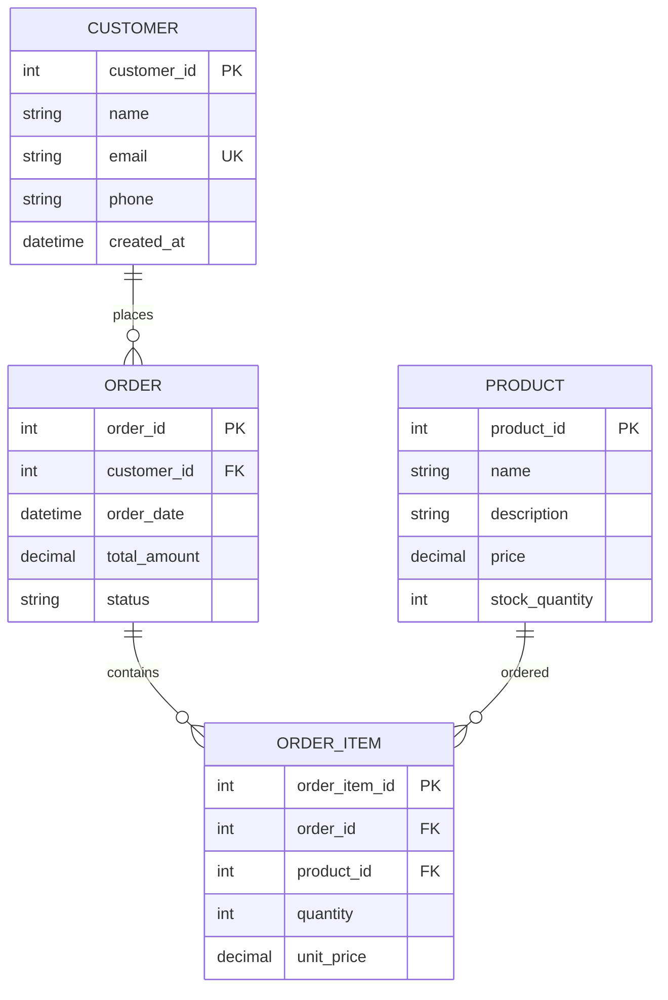

# リレーショナルデータベース設計の基本

## はじめに

データベース設計は、アプリケーション開発において最も重要な基盤の一つです。適切に設計されたデータベースは、システムのパフォーマンス、保守性、拡張性を大きく左右します。本記事では、リレーショナルデータベース設計の基本的な考え方と実践的な手法について解説します。

## 1. データベース設計の基本原則

### 1.1 正規化の重要性

正規化は、データの重複を排除し、整合性を保つための手法です。適切な正規化により、以下のメリットが得られます。

- **データ整合性の向上**: 重複データによる矛盾を防ぐ
- **更新異常の回避**: 一箇所の変更で全体に反映される
- **ストレージの効率化**: 重複データの削除による容量削減

### 1.2 第一正規形（1NF）から第三正規形（3NF）

```sql
-- 非正規化テーブル（悪い例）
CREATE TABLE orders_bad (
    order_id INT PRIMARY KEY,
    customer_name VARCHAR(100),
    customer_email VARCHAR(100),
    customer_phone VARCHAR(20),
    product_names TEXT, -- カンマ区切りの商品名
    product_prices TEXT -- カンマ区切りの価格
);

-- 正規化されたテーブル（良い例）
CREATE TABLE customers (
    customer_id INT PRIMARY KEY,
    name VARCHAR(100) NOT NULL,
    email VARCHAR(100) UNIQUE NOT NULL,
    phone VARCHAR(20)
);

CREATE TABLE orders (
    order_id INT PRIMARY KEY,
    customer_id INT NOT NULL,
    order_date TIMESTAMP DEFAULT CURRENT_TIMESTAMP,
    FOREIGN KEY (customer_id) REFERENCES customers(customer_id)
);

CREATE TABLE order_items (
    order_item_id INT PRIMARY KEY,
    order_id INT NOT NULL,
    product_id INT NOT NULL,
    quantity INT NOT NULL,
    unit_price DECIMAL(10,2) NOT NULL,
    FOREIGN KEY (order_id) REFERENCES orders(order_id)
);
```

## 2. エンティティ関連図（ER図）の活用

### 2.1 エンティティの特定

データベース設計の第一歩は、システムで扱うエンティティ（実体）を特定することです。



### 2.2 リレーションシップの定義

エンティティ間の関係を明確にすることで、適切な外部キー制約を設定できます。

- **1:1関係**: ユーザーとプロフィール
- **1:N関係**: 顧客と注文
- **N:N関係**: 商品とカテゴリ（中間テーブルが必要）

## 3. インデックス戦略

### 3.1 適切なインデックスの設計

```sql
-- プライマリーキーインデックス（自動作成）
CREATE TABLE users (
    user_id INT PRIMARY KEY AUTO_INCREMENT,
    username VARCHAR(50) NOT NULL,
    email VARCHAR(100) NOT NULL,
    created_at TIMESTAMP DEFAULT CURRENT_TIMESTAMP
);

-- 一意制約インデックス
CREATE UNIQUE INDEX idx_users_email ON users(email);
CREATE UNIQUE INDEX idx_users_username ON users(username);

-- 複合インデックス
CREATE INDEX idx_orders_customer_date ON orders(customer_id, order_date);

-- 部分インデックス（条件付きインデックス）
CREATE INDEX idx_active_orders ON orders(order_date) 
WHERE status = 'active';
```

### 3.2 インデックス設計のベストプラクティス

- **頻繁に検索される列**: WHERE句で使用される列
- **結合条件**: JOIN条件で使用される外部キー
- **ソート条件**: ORDER BY句で使用される列
- **複合インデックスの順序**: 選択性の高い列を先頭に配置

## 4. データ型の適切な選択

### 4.1 効率的なデータ型の選択

```sql
CREATE TABLE products (
    -- 適切な整数型の選択
    product_id INT UNSIGNED PRIMARY KEY AUTO_INCREMENT,
    
    -- 文字列長の最適化
    product_code VARCHAR(20) NOT NULL,  -- CHAR(20)よりもVARCHARが効率的
    name VARCHAR(255) NOT NULL,
    description TEXT,  -- 長いテキストにはTEXT型を使用
    
    -- 数値型の精度指定
    price DECIMAL(10,2) NOT NULL,  -- FLOAT/DOUBLEより精度が高い
    weight DECIMAL(8,3),
    
    -- 真偽値
    is_active BOOLEAN DEFAULT TRUE,
    
    -- 日時型
    created_at TIMESTAMP DEFAULT CURRENT_TIMESTAMP,
    updated_at TIMESTAMP DEFAULT CURRENT_TIMESTAMP ON UPDATE CURRENT_TIMESTAMP
);
```

### 4.2 データ型選択の指針

- **文字列**: 固定長の場合はCHAR、可変長の場合はVARCHAR
- **数値**: 金額などの精度が重要な場合はDECIMAL
- **日時**: TIMESTAMPは自動更新機能が便利
- **真偽値**: BOOLEANまたはTINYINT(1)

## 5. 制約とトリガーの活用

### 5.1 データ整合性の保証

```sql
-- 外部キー制約
ALTER TABLE orders 
ADD CONSTRAINT fk_orders_customer 
FOREIGN KEY (customer_id) REFERENCES customers(customer_id)
ON DELETE RESTRICT ON UPDATE CASCADE;

-- チェック制約
ALTER TABLE products 
ADD CONSTRAINT chk_price_positive 
CHECK (price > 0);

-- トリガーによる自動処理
DELIMITER //
CREATE TRIGGER update_order_total 
AFTER INSERT ON order_items
FOR EACH ROW
BEGIN
    UPDATE orders 
    SET total_amount = (
        SELECT SUM(quantity * unit_price) 
        FROM order_items 
        WHERE order_id = NEW.order_id
    )
    WHERE order_id = NEW.order_id;
END//
DELIMITER ;
```

## 6. パフォーマンス考慮事項

### 6.1 クエリ最適化を意識した設計

- **適切な正規化レベル**: 過度な正規化は結合コストを増大
- **非正規化の検討**: 読み取り性能が重要な場合の戦略的重複
- **パーティショニング**: 大きなテーブルの分割による性能向上

```sql
-- パーティショニングの例
CREATE TABLE order_history (
    order_id INT,
    customer_id INT,
    order_date DATE,
    total_amount DECIMAL(10,2)
) PARTITION BY RANGE (YEAR(order_date)) (
    PARTITION p2022 VALUES LESS THAN (2023),
    PARTITION p2023 VALUES LESS THAN (2024),
    PARTITION p2024 VALUES LESS THAN (2025)
);
```

## まとめ

リレーショナルデータベース設計は、システムの基盤となる重要な作業です。正規化、ER図の活用、適切なインデックス設計、データ型の選択、制約の設定など、基本原則を理解し実践することで、保守性が高く、パフォーマンスに優れたデータベースを構築できます。

設計段階で十分に検討することで、後の運用段階でのトラブルを大幅に減らすことができます。常にビジネス要件とシステム要件のバランスを考慮し、適切な設計決定を行うことが重要です。