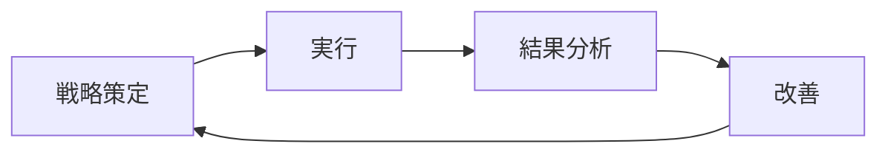

# 効果的なソフトウェアテスト戦略の立て方

## はじめに

ソフトウェア開発において、品質保証は非妥協的な要素です。しかし、多くの開発チームが「テストをどのように体系的に行うべきか」という課題に直面しています。本記事では、実践的なソフトウェアテスト戦略の立て方について、具体例を交えながら解説します。

## テスト戦略とは何か

テスト戦略とは、**プロジェクト全体を通してテスト活動をどのように実施するかを定めた高レベルな計画**です。単純にテストケースを書くことではなく、以下の要素を包含します：

- テストの目的と範囲
- テストレベルとテストタイプの選定
- リソース配分と優先順位
- 品質基準と完了条件

## ステップ1: 要件分析とリスク評価

### 機能要件の整理

まず、テスト対象となる機能要件を明確に整理します。

```markdown
例：ECサイトの場合
- ユーザー認証機能
- 商品検索・表示機能
- カート機能
- 決済処理機能
- 在庫管理機能
```

### リスク分析の実施

各機能に対してリスクレベルを評価し、テストの重点領域を決定します。

| 機能 | ビジネスインパクト | 技術的複雑さ | リスクレベル |
|------|-------------------|--------------|--------------|
| 決済処理 | 高 | 高 | 最高 |
| ユーザー認証 | 高 | 中 | 高 |
| 商品検索 | 中 | 中 | 中 |

## ステップ2: テストピラミッドの構築

### テストレベルの定義

効率的なテスト戦略では、**テストピラミッド**に基づいてテストレベルを構築します。

```
        E2E テスト (少)
       ↗              ↖
 統合テスト (中)
 ↗                    ↖
ユニットテスト (多)
```

### 各レベルの役割分担

**ユニットテスト（70%）**
```javascript
// 例：価格計算関数のテスト
describe('calculatePrice', () => {
  test('税込価格を正しく計算する', () => {
    expect(calculatePrice(1000, 0.1)).toBe(1100);
  });
  
  test('割引適用時の価格を正しく計算する', () => {
    expect(calculatePrice(1000, 0.1, 0.2)).toBe(880);
  });
});
```

**統合テスト（20%）**
- APIとデータベース間の連携
- 外部サービスとの通信
- モジュール間のインターフェース

**E2Eテスト（10%）**
- ユーザージャーニー全体の検証
- ブラウザ操作の自動化
- システム全体の動作確認

## ステップ3: テストタイプの選定

### 機能テスト

基本的な機能が仕様通りに動作することを確認します。

```gherkin
# 例：Gherkin記法によるシナリオ
Feature: ユーザーログイン
  Scenario: 正常なログイン
    Given ユーザーがログインページにアクセスする
    When 正しいメールアドレスとパスワードを入力する
    And ログインボタンをクリックする
    Then ダッシュボードページが表示される
```

### 非機能テスト

- **パフォーマンステスト**: レスポンス時間、スループット
- **セキュリティテスト**: 認証、認可、データ保護
- **ユーザビリティテスト**: UI/UXの検証

## ステップ4: テスト環境戦略

### 環境の分離

```yaml
# 例：Docker Composeによる環境定義
version: '3.8'
services:
  app-test:
    build: .
    environment:
      - NODE_ENV=test
      - DB_URL=postgresql://test_db:5432/testdb
  
  test-db:
    image: postgres:13
    environment:
      - POSTGRES_DB=testdb
      - POSTGRES_USER=testuser
```

### CI/CDパイプラインでの統合

```yaml
# 例：GitHub Actionsでのテスト実行
name: Test Pipeline
on: [push, pull_request]

jobs:
  test:
    runs-on: ubuntu-latest
    steps:
      - uses: actions/checkout@v2
      - name: Setup Node.js
        uses: actions/setup-node@v2
        with:
          node-version: '16'
      
      - name: Run Unit Tests
        run: npm test
      
      - name: Run Integration Tests
        run: npm run test:integration
      
      - name: Run E2E Tests
        run: npm run test:e2e
```

## ステップ5: 品質ゲートの設定

### カバレッジ基準

```javascript
// jest.config.js
module.exports = {
  coverageThreshold: {
    global: {
      branches: 80,
      functions: 80,
      lines: 80,
      statements: 80
    }
  }
};
```

### 品質指標の監視

- **テスト合格率**: 95%以上
- **バグ検出率**: リリース前に80%以上
- **テスト実行時間**: 統合テスト30分以内

## ステップ6: 継続的改善

### テスト結果の分析

定期的にテスト結果を分析し、戦略を見直します：

1. **テスト効率の測定**: 欠陥検出率、テスト実行時間
2. **テストギャップの特定**: 本番環境で発見されたバグの分析
3. **フィードバックループの構築**: 開発チームとQAチーム間の連携強化

### テスト戦略の進化



## まとめ

効果的なソフトウェアテスト戦略は、以下の要素のバランスが重要です：

1. **リスクベース**: 高リスク領域に重点を置く
2. **効率性**: テストピラミッドによる最適化
3. **自動化**: 繰り返し可能で高速なテスト実行
4. **継続的改善**: データに基づく戦略の見直し

テスト戦略は一度作れば終わりではありません。プロジェクトの成長と共に進化させ、チーム全体の品質意識を高めることが、長期的な成功につながります。

---

*この記事が、あなたのプロジェクトにおけるテスト戦略構築の参考になれば幸いです。具体的な実装についてご質問がありましたら、お気軽にお声がけください。*