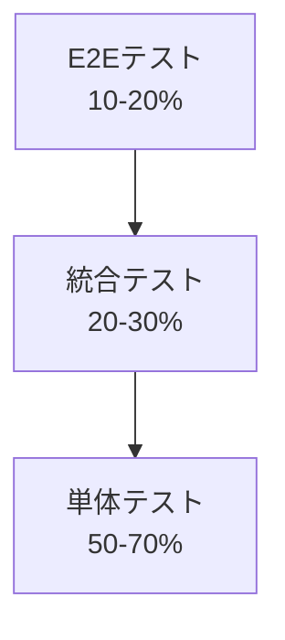

# ソフトウェアテスト戦略の立て方：品質向上への実践的アプローチ

## はじめに

ソフトウェア開発において、テストは品質を保証する重要な工程です。しかし、場当たり的なテストでは効果的な品質向上は期待できません。本記事では、体系的なテスト戦略の立て方について、実践的な観点から解説します。

## テスト戦略とは

テスト戦略とは、**プロジェクトの目標、制約、リスクを考慮して、最適なテストアプローチを定義する計画**です。単にテストケースを作成するのではなく、「何を」「なぜ」「どのように」テストするかを明確にする指針となります。

### テスト戦略の主な要素

- **テスト目標の明確化**
- **リスク分析と優先度付け**
- **テスト手法の選択**
- **テストレベルの定義**
- **リソース配分の最適化**

## テスト戦略策定のステップ

### 1. プロジェクト要件の理解

まず、プロジェクトの背景と要件を深く理解することが重要です。

```markdown
## 確認すべき要素
- ビジネス要件と技術要件
- 品質要件（性能、セキュリティ、可用性など）
- 制約条件（予算、スケジュール、人員）
- ステークホルダーの期待値
```

### 2. リスク分析

システムの重要度とリスクを評価し、テストの重点領域を特定します。

```python
# リスク評価の例（Python疑似コード）
def calculate_risk_priority(probability, impact, detection_difficulty):
    """
    リスク優先度の計算
    probability: 発生確率 (1-5)
    impact: 影響度 (1-5)
    detection_difficulty: 検出困難度 (1-5)
    """
    return probability * impact * detection_difficulty

# 機能別リスク評価
features = [
    {"name": "決済処理", "prob": 2, "impact": 5, "detection": 4},
    {"name": "ユーザー認証", "prob": 3, "impact": 4, "detection": 3},
    {"name": "レポート生成", "prob": 4, "impact": 2, "detection": 2}
]

for feature in features:
    risk_score = calculate_risk_priority(
        feature["prob"], feature["impact"], feature["detection"]
    )
    print(f"{feature['name']}: リスクスコア = {risk_score}")
```

### 3. テストレベルの設計

テストピラミッドを参考に、各レベルのテスト配分を決定します。



#### 各レベルの特徴と適用場面

| テストレベル | 目的 | コスト | 実行速度 | 適用場面 |
|-------------|------|--------|----------|----------|
| 単体テスト | 個別機能の検証 | 低 | 高速 | 関数・メソッドレベル |
| 統合テスト | モジュール間連携 | 中 | 中程度 | API・コンポーネント間 |
| E2Eテスト | エンドユーザー体験 | 高 | 低速 | 重要なユーザージャーニー |

### 4. テスト手法の選択

プロジェクトの特性に応じて、適切なテスト手法を組み合わせます。

#### 機能テスト手法

```javascript
// 境界値テストの例
describe('入力値検証テスト', () => {
  const testCases = [
    { input: 0, expected: 'invalid' },      // 最小値未満
    { input: 1, expected: 'valid' },       // 最小値
    { input: 50, expected: 'valid' },      // 正常値
    { input: 100, expected: 'valid' },     // 最大値
    { input: 101, expected: 'invalid' }    // 最大値超過
  ];

  testCases.forEach(({ input, expected }) => {
    it(`入力値${input}のテスト`, () => {
      const result = validateInput(input);
      expect(result).toBe(expected);
    });
  });
});
```

#### 非機能テスト手法

- **性能テスト**: 負荷テスト、ストレステスト
- **セキュリティテスト**: 脆弱性診断、ペネトレーションテスト
- **可用性テスト**: 障害復旧テスト、冗長性テスト

### 5. 自動化戦略

効率的なテスト実行のため、自動化の範囲と優先度を定義します。

```yaml
# 自動化優先度の判定基準
automation_criteria:
  high_priority:
    - 実行頻度が高い
    - 手動実行が困難
    - 回帰テストで必須
  medium_priority:
    - 定期実行が必要
    - 人的ミスが発生しやすい
  low_priority:
    - 探索的テストが有効
    - 自動化コストが高い
```

## 実践的なテスト戦略の例

### Webアプリケーションの場合

```markdown
## テスト戦略概要
### 1. 単体テスト (60%)
- フロントエンド: Jest + React Testing Library
- バックエンド: JUnit + Mockito
- カバレッジ目標: 80%以上

### 2. 統合テスト (25%)
- API テスト: Postman + Newman
- データベーステスト: Testcontainers

### 3. E2Eテスト (15%)
- 重要ユーザージャーニーのみ
- ツール: Cypress
- 実行頻度: 毎日1回
```

## 継続的改善

テスト戦略は一度策定すれば終わりではありません。プロジェクトの進展に応じて継続的に見直しを行います。

### 改善のための指標

- **欠陥検出率**: テストで発見されたバグの割合
- **テスト効率**: 投入工数に対する品質向上効果
- **顧客満足度**: リリース後のフィードバック
- **開発生産性**: テスト工程が開発速度に与える影響

## まとめ

効果的なテスト戦略の策定には、プロジェクトの特性を深く理解し、リスクベースでテストの重点を決定することが重要です。また、テストピラミッドを意識した階層設計と、適切な自動化により、品質と効率の両立が可能になります。

テスト戦略は生きた文書として、プロジェクトの変化に応じて柔軟に更新していくことで、継続的な品質向上を実現できます。まずは現在のプロジェクトでできる小さな改善から始めて、段階的に成熟したテスト戦略を構築していきましょう。

---

*この記事が皆様のテスト品質向上の参考になれば幸いです。ご質問やフィードバックがありましたら、お気軽にコメントください。*