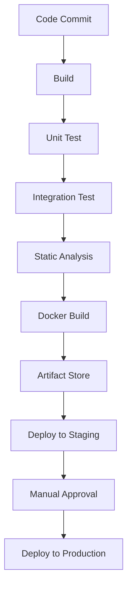

# CI/CDパイプラインの構築方法 ― エンジニア向け実践ガイド

## 1. はじめに  
ソフトウェア開発の現場では、**ビルド → テスト → デプロイ**を人手で行うとヒューマンエラーが発生しやすく、リリース速度が低下します。CI（継続的インテグレーション）とCD（継続的デリバリ／デプロイ）の導入により、コードをコミットした瞬間から本番環境までのフローを自動化できます。  
この記事では、実際に使えるパイプライン構築の流れと、代表的なツール（GitHub Actions, GitLab CI, Jenkins）を使った具体例を紹介します。

## 2. CI/CDとは  
| 用語 | 意味 | 目的 |
|------|------|------|
| CI | Continuous Integration | コードの変更を頻繁に統合し、ビルドやテストを自動化 |
| CD | Continuous Delivery / Deployment | CI の成果をステージング・本番環境へ自動でリリース |

CI/CD のメリット  
- **高速リリース**：自動化により数分でデプロイが完了  
- **品質保証**：全テストが走るため不具合が早期発見  
- **信頼性**：環境差異が減り、同じコードで同じ結果を再現  

## 3. パイプライン設計の基本設計図  
以下は一般的なパイプラインの構成例です。



1. **ビルド**：依存関係の解決とコンパイル  
2. **テスト**：ユニット→統合→E2E（必要に応じて分岐）  
3. **静的解析**：コード品質を自動で評価  
4. **Dockerビルド**：イメージ化して一貫性を保つ  
5. **Artifact Store**：S3やJFrog Artifactoryなどに保存  
6. **デプロイ**：Kubernetes・EC2・Serverless へ自動デプロイ  
7. **マニュアル承認**：リリース承認フローを設置  

## 4. 代表的なCI/CDツールの選択ポイント  
| ツール | 主な特徴 | 主なユースケース |
|--------|-----------|-----------------|
| GitHub Actions | GitHub と統合が強力、無料枠充実 | GitHub リポジトリ中心のプロジェクト |
| GitLab CI | 完全に統合されたリポジトリ・CI/CD | GitLab Self‑Hosted 環境 |
| Jenkins | 柔軟性とプラグインエコシステム | 大規模カスタムパイプライン |
| CircleCI | 高速ビルド、キャッシュ機能 | CI の高速化が重要なプロジェクト |

## 5. 具体例：GitHub Actions での CI/CD  
以下は Node.js アプリを対象にした最小構成の `workflow` 例です。

```yaml
name: CI/CD Pipeline

on:
  push:
    branches: [ main ]
  pull_request:
    branches: [ main ]

jobs:
  build_and_test:
    runs-on: ubuntu-latest
    steps:
      - uses: actions/checkout@v4
      - name: Use Node.js 20
        uses: actions/setup-node@v4
        with:
          node-version: 20
      - run: npm ci
      - run: npm run lint
      - run: npm test

  docker_build:
    needs: build_and_test
    runs-on: ubuntu-latest
    steps:
      - uses: actions/checkout@v4
      - name: Build Docker image
        run: |
          docker build -t myapp:${{ github.sha }} .
          docker tag myapp:${{ github.sha }} registry.example.com/myapp:${{ github.sha }}
      - name: Push to registry
        uses: docker/login-action@v3
        with:
          registry: registry.example.com
          username: ${{ secrets.REGISTRY_USER }}
          password: ${{ secrets.REGISTRY_PASS }}
        run: docker push registry.example.com/myapp:${{ github.sha }}

  deploy:
    needs: docker_build
    runs-on: ubuntu-latest
    environment:
      name: staging
      url: https://staging.example.com
    steps:
      - name: Deploy to Kubernetes
        uses: azure/k8s-deploy@v4
        with:
          manifests: |
            k8s/deployment.yaml
          images: |
            registry.example.com/myapp:${{ github.sha }}
```

### ポイント  
- **`needs`** でジョブ間の依存関係を明示。  
- **Secrets** を使ってレジストリ認証情報を安全に管理。  
- **環境** を設定し、GitHub の環境通知を活用。  

## 6. パイプラインを安全に保つためのベストプラクティス  

| 項目 | 実装例 |
|------|--------|
| **Secrets の管理** | GitHub Secrets / GitLab CI Variables で暗号化保存 |
| **レジストリ認証** | 役割ベースのアクセス制御（RBAC）を設定 |
| **スキャン** | `trivy` や `clair` でコンテナイメージを脆弱性スキャン |
| **ロールバック** | デプロイ失敗時に前バージョンに戻せるスクリプトを用意 |
| **監視とアラート** | Prometheus + Alertmanager でビルド／デプロイ失敗を検知 |
| **コードレビュー** | PR 時に必ずCIが成功するように `status checks` を設定 |

## 7. 失敗パターンと回避策  
| 失敗例 | 原因 | 回避策 |
|--------|------|--------|
| テストが頻繁に失敗 | 環境差異 | 同一 Docker イメージでテスト |
| デプロイ後に本番でクラッシュ | リリースノート不足 | `changelog` を必須にし、変更点を可視化 |
| CI が長時間実行 | キャッシュ未設定 | `actions/cache` を利用し、依存パッケージを再利用 |

## 8. まとめ  
- **パイプライン設計**：ビルド→テスト→イメージ化→デプロイという一連のフローを明確に定義。  
- **ツール選定**：プロジェクト規模・運用環境に合わせて GitHub Actions / GitLab CI / Jenkins などを選択。  
- **セキュリティ**：Secrets 管理、レジストリ認証、脆弱性スキャンを組み込み。  
- **継続的改善**：失敗時のメトリクスを可視化し、リファクタリングを繰り返す。  

CI/CD を正しく設計すれば、エンジニアは **コードに集中**し、**デプロイのリスクを最小化**できるようになります。ぜひ、今回紹介したパイプライン設計図と実装例をベースに、自社プロジェクトに最適化したパイプラインを構築してみてください。