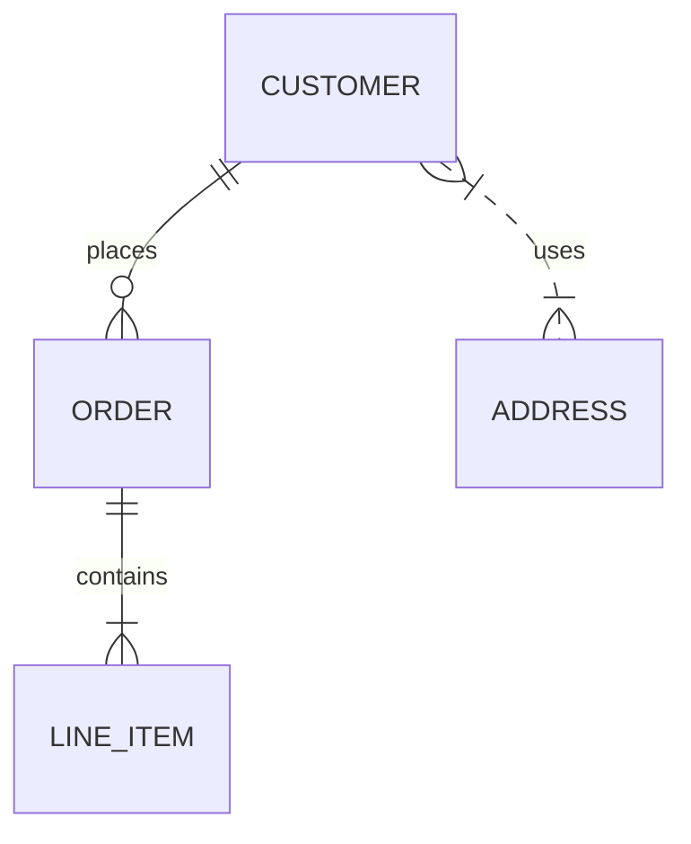

# リレーショナルデータベース設計の基本

エンジニア向けに、リレーショナルデータベース（RDB）の設計を行う際に押さえておくべき基本概念と実務で役立つポイントをまとめました。  
設計に悩む場面が出てきたら、ぜひ「ここから思い出そう！」を目安に参照してください。

---

## 1. 何故設計が重要なのか

- **データの整合性**：テーブル設計が甘いと、同じ情報が複数箇所に不整合で残り、ビジネスロジックが壊れる。
- **パフォーマンス**：正規化/非正規化を適切に使わないと、読み書きが遅くなるケースが多い。
- **拡張性**：要件変更時にテーブルを増やしたり、カラムを増やしたりする際、既存テーブルへの影響を最小化できる設計が必要。

> **ポイント**  
> RDB設計は「データを表現する」だけではなく、「データがどう利用されるか」を先に想定する設計思想です。

---

## 2. まずはER図で概念モデル化

ER図（Entity‑Relationship Diagram）は、ドメインを可視化する最初のステップです。

| 要素 | 代表的な記号 | 意味 |
|------|-------------|------|
| エンティティ | 四角形 | データの集合（テーブル） |
| 属性 | 円 | エンティティに属する情報（カラム） |
| リレーション | ひし形 | エンティティ間の関係 |
| 主キー | **（太字）** | エンティティを一意に特定 |



ER図を描く際の注意点:

- **ユニークな名前**：テーブル名・カラム名は一意でなければならない。命名規則を統一（例：`snake_case` か `camelCase` か）。
- **ビジネス用語を尊重**：テーブル名はビジネス領域をそのまま反映させると後々の保守が楽です。

---

## 3. 正規化とそのレベル

正規化はデータの重複・不整合を排除するプロセスです。以下は代表的な正規形（NF）です。

| 正規形 | 条件 | 目的 |
|--------|------|------|
| 1NF | 全カラムが原子値 | カラムを分解し「単一の値」を保証 |
| 2NF | 1NF + 主キーに対して完全関数従属 | 主キーで決まらないカラムを別テーブルへ分離 |
| 3NF | 2NF + 推移的従属の除去 | カラム間の非主キー依存を排除 |
| BCNF | 3NF + 主キー以外の候補キーを考慮 | より厳密な整合性確保 |
| 4NF | 4値従属の排除 | 複数値属性の扱いを正規化 |

> **実務上の留意点**  
> すべてを3NFまで正規化しても、パフォーマンスが低下するケースがあります。**非正規化**（結合しやすい形を残す）を併用することも検討してください。

---

## 4. キー設計のベストプラクティス

| キー | 用途 | 設計上の注意 |
|------|------|--------------|
| 主キー（PK） | テーブルのレコード一意性 | *整数型*（auto_increment）または *UUID* を使用。文字列より高速。 |
| 外部キー（FK） | テーブル間参照整合性 | ON DELETE/UPDATE のアクションはビジネスロジックに合わせて設定。 |
| ユニークキー | 追加の一意性制約 | 例えば `email`、`username` 等。 |
| インデックス | クエリ高速化 | `WHERE` 句で頻繁に使うカラムに。複合インデックスは使用頻度を確認。 |

**例：**  
```sql
CREATE TABLE user (
    user_id BIGINT PRIMARY KEY AUTO_INCREMENT,
    email VARCHAR(255) NOT NULL UNIQUE,
    username VARCHAR(50) NOT NULL UNIQUE,
    created_at TIMESTAMP DEFAULT CURRENT_TIMESTAMP
);
```

---

## 5. データ型選択の重要性

- **整数型**：`INT` → 4 bytes、`BIGINT` → 8 bytes。数値範囲を予測できる範囲で選ぶ。
- **文字列型**：`VARCHAR` は可変長。文字数が固定なら `CHAR` を使う。  
- **日付型**：`DATE`・`DATETIME`・`TIMESTAMP` で用途に応じて使い分ける。
- **BLOB / TEXT**：大量テキスト・バイナリは `TEXT`・`BLOB`。必要に応じて外部ストレージに切り替える。

> **備忘録**  
> データ型を誤ると、**ストレージの肥大化** や **型キャストのオーバーヘッド** が発生します。設計段階で数値の範囲をチェックしましょう。

---

## 6. 制約（Constraints）の使い分け

| 制約 | 目的 | 例 |
|------|------|----|
| NOT NULL | 欠損データ防止 | `name VARCHAR(100) NOT NULL` |
| UNIQUE | 同一値禁止 | `email VARCHAR(255) UNIQUE` |
| CHECK | 期待値範囲制限 | `CHECK (age >= 0)` |
| DEFAULT | デフォルト値 | `status VARCHAR(10) DEFAULT 'active'` |
| FOREIGN KEY | 参照整合性 | `FOREIGN KEY (user_id) REFERENCES user(user_id)` |

> **ポイント**  
> *CHECK* 制約は DBMS によっては無視されることがあるため、アプリ側で再チェックする仕組みを入れると安全です。

---

## 7. インデックス戦略

- **主キーは自動で B‑Tree インデックス** が作成されます。  
- `WHERE`, `JOIN`, `ORDER BY` で頻繁に使う列にインデックスを付与。  
- **複合インデックス** は列順に注意。検索条件の最も頻繁に使用される列を先に配置。  
- **カバーインデックス**：SELECT 句で使われる全カラムをインデックスに含めれば、テーブルへのアクセスを回避できる。  

> **実務ヒント**  
> `EXPLAIN` を使ってクエリ計画を確認し、必要以上にインデックスを張ると書き込みが遅くなるので注意。

---

## 8. 正規化とパフォーマンスのバランス

1. **要件を洗い出す**  
   - 書き込みが重視か読み取りが重視か。  
   - データ量、更新頻度、結合回数を見積もる。

2. **プロトタイプでテスト**  
   - スキーマを作成してサンプルデータで実際にクエリを走らせ、`EXPLAIN` でボトルネックを確認。

3. **非正規化の判断基準**  
   - 「結合が頻繁に発生するが書き込みは稀」なら、非正規化を検討。  
   - 「データの一貫性が極めて重要」なら、正規化を優先。

4. **再正規化**  
   - スキーマが固まったら、一度正規化レベルを上げてみて、パフォーマンスと保守性を評価。  

---

## 9. スキーマのバージョン管理

- **DDL を Git で管理**  
  ```bash
  git add schema/001_create_user.sql
  git commit -m "Add user table"
  ```
- **マイグレーションツール**  
  - **Flyway** / **Liquibase** などを使用し、スキーマ変更をスクリプト化。  
  - `RELEASE` 版と `DEV` 版を分離し、テスト環境での回帰確認を必須に。

> **コツ**  
> 変更を小さく分割し、1 つのマイグレーションに「テーブル作成＋インデックス設置」だけを入れると、問題発生時のロールバックが簡単です。

---

## 10. まとめ

| ステップ | 重要ポイント |
|----------|--------------|
| 1. ER図 | 概念モデル化 → 仕様決定 |
| 2. 正規化 | データの重複排除 |
| 3. キー設計 | 一意性・参照整合性 |
| 4. データ型 | ストレージと性能 |
| 5. 制約 | データ整合性 |
| 6. インデックス | クエリ高速化 |
| 7. バランス | 正規化 vs パフォーマンス |
| 8. バージョン管理 | DDL を Git で管理 |

**設計は「完璧」を目指すよりも「実際に動く設計」を重視することが、開発を円滑に進める秘訣です。**  
設計段階で「これが必要か？」という疑問を常に投げかけ、無駄を省きましょう。

---

### さらに深掘りしたい方へ

- **ER図の自動生成ツール**：draw.io、MySQL Workbench、dbdiagram.io  
- **正規化チェック**：dbt の `fivetran` など  
- **パフォーマンスチューニング**：MySQL なら `mysqltuner`、PostgreSQL なら `pg_stat_statements`

---

> **最後に**  
> RDB設計は「技術」だけでなく「ビジネス」も絡む領域です。データを扱う人々（営業・マーケ・開発）と頻繁にコミュニケーションを取り、要件を共有して設計に落とし込むことが、品質の高いデータベースを作る鍵となります。  

Happy Designing! 🚀