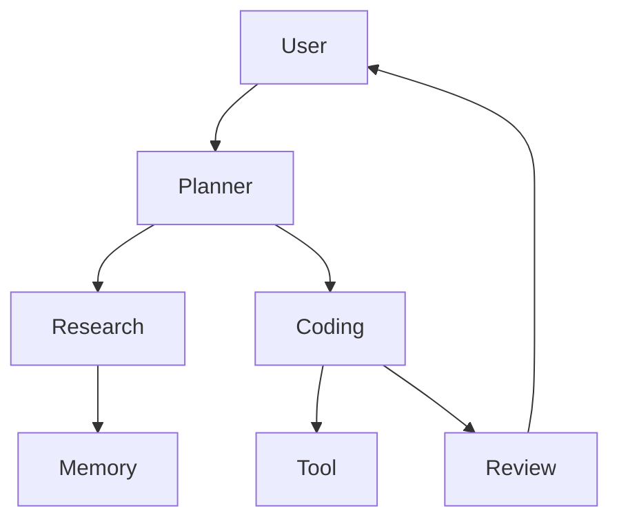

2024年から2025年にかけて、LLM（大規模言語モデル）の活用は単なる「チャットインターフェース」を飛び出し、特定の役割を持つ複数のAIが協調して動く**マルチエージェントシステム（MAS）**へと急速に進化しています。日本国内でも、世界最高峰のAI計算基盤である**ABCI 3.0**が2025年1月にフル稼働を開始するなど、高度なAIモデルを支えるインフラ整備が進んでいます。

本記事では、MASの設計思想、主要フレームワークの比較、そして実務での導入方法について、最新の技術動向を踏まえて解説します。

**1. なぜマルチエージェントが必要なのか**
従来の単一エージェント（Single Agent）には、複雑なタスクにおいて以下の課題があります。

- **複雑タスクでの精度低下**: 膨大なコンテキストを一度に処理しようとして論理性が欠如する。
- **ハルシネーション（幻覚）**: 事実に基づかない情報を「もっともらしく」出力してしまう。
- **コンテキスト管理の限界**: 処理が大規模になるほど、一貫性を保つのが困難になる。

Multi-Agent（MAS）では、人間組織のように**役割分担**を行うことで、これらの問題を構造的に解決します。

- **Planner**: 全体の実行計画の策定。
- **Research**: 外部知識（RAG等）を用いた調査。
- **Coding**: 具体的な実装コードの生成。
- **Review**: 生成物の品質および論理的妥当性の検証。

**2. 基本アーキテクチャ**
マルチエージェントは、環境を自律的に観測し、判断して行動する「エージェント」の集合体です。



### 構成要素

- **Agent**: 特定の役割を与えられたAI主体。
- **Memory**: エージェント間で共有される文脈や知識の保存領域。
- **Tool**: 検索エンジンや計算機、APIなど、AIが外部世界へ干渉するための手段。
- **Orchestration**: どのエージェントが、いつ、どの順番で処理を行うかを制御する仕組み。

**3. フレームワーク比較**
最新の**AI事業者ガイドライン（2025年版）** では、AIエージェントの導入が増えている現状を反映し、そのリスク管理の重要性が強調されています。

### 主なフレームワーク
- **LangGraph**: LangChainをベースとし、循環的なフローをグラフ構造で定義。
- **CrewAI**: 「役割（Role）」を重視し、複数のエージェントを「チーム（Crew）」として組織化。
- **AutoGen**: Microsoftが開発。エージェント間の「対話」を通じて問題を解決。
- **Semantic Kernel**: MicrosoftのSDK。既存システムとの統合に強い。
- **OpenAI Agents SDK**: OpenAIの強力なモデル機能を標準化。

### 実務比較
| 観点 | LangGraph | CrewAI | AutoGen | Semantic Kernel |
| :--- | :--- | :--- | :--- | :--- |
| **制御性** | 高い | 低い | 中 | 高い |
| **実装速度** | 低い | 高い | 中 | 中 |
| **自律性** | 中 | 高い | 高い | 低い |
| **デバッグ性** | 高い | 低い | 低い | 高い |
| **エンタープライズ適性** | 高い | 中 | 低い | 高い |

### 選定指針
- **制御重視**: 金融や法務など、プロセスを厳密に管理したい場合は **LangGraph**。
- **スピード重視**: 記事作成や企画など、素早くPoCを回したい場合は **CrewAI**。
- **自律性重視**: 複雑な問題解決のディスカッションをさせたい場合は **AutoGen**。
- **既存システム統合**: エンタープライズ向けの堅牢な統合が必要なら **Semantic Kernel**。

---

## 4. 実装例

### CrewAI（シンプル構成）
```python
from crewai import Agent, Task, Crew

researcher = Agent(
    role="Researcher",
    goal="Summarize multi-agent frameworks",
    backstory="AI expert"
)

task = Task(
    description="Summarize MAS frameworks",
    agent=researcher
)

crew = Crew(
    agents=[researcher],
    tasks=[task]
)

result = crew.run()
print(result)
```

### LangGraph（擬似コード：ステート管理）
```python
graph = StateGraph()

graph.add_node("planner", planner_agent)
graph.add_node("coder", coding_agent)
graph.add_node("review", review_agent)

graph.add_edge("planner", "coder")
graph.add_edge("coder", "review")

graph.run()
```

**5. 活用パターン**
マルチエージェントは多岐にわたる産業分野で応用されています。

- **コーディング支援**: **Devin** や **Cline** のように、分析、実装、デバッグ、テスト実行を自律的に担当するエージェントが普及しつつあります。
- **リサーチ自動化**: 国内企業のSakana AIが発表した「**AIサイエンティスト**」は、アイデア出しから論文執筆、査読までを自律的に行います。
- **業務自動化**: サプライチェーンにおける受発注条件の自動交渉など、人間以上のスピードで全体最適を実現します。

**6. 導入ステップ**
1. **CrewAIでPoCを作成**: 小さなユースケースで効果を素早く検証する。
2. **RAGでデータ接続**: 自社データや専門知識をAIが参照できるように整備する。
3. **Review Agentで品質管理**: 誤出力を防ぐための監視エージェントを組み込む。
4. **LangGraphで本番化**: 処理フローをグラフ化し、安定性と追跡性を確保する。

**7. 課題と対策**
MASの自律性は高いベネフィットをもたらしますが、同時にリスクも伴います。

- **無限ループとコスト増大**: エージェント同士が意図せず対話を続けてしまう。
  - **対策**: 最大試行回数の設定やタイムアウト管理の徹底。
- **ナレッジ負債（Knowledge Debt）**: AIが自律的にHOW（手順）を決めてしまうため、人間がそのロジックを理解できなくなるリスク。
  - **対策**: ログの保存、プロセスの可視化、定期的な人間によるレビュー（Human-in-the-loop）。
- **ハルシネーションの連鎖**: あるエージェントの誤情報を他のエージェントが「事実」として処理してしまう。
  - **対策**: 各工程で**RAG**によるエビデンス確認を強制する。

**8. まとめ**
マルチエージェントは、単なるツールではなく、**ソフトウェア開発プロセス全体を再設計する技術**です。これからの時代、AIが「WHAT（何をするか）」と「HOW（どうやるか）」を担い、人間が「WHY（なぜやるか）」という要求定義を担う「**Software Engineering 3.0**」の構造へと進化していきます。


**議論しましょう**
あなたの現場ではどのフレームワークを使っていますか？
MAS導入で直面した課題、あるいは「LangGraphとCrewAI、どちらを選ぶべきか」といった経験談をぜひコメントで共有してください。

この記事が参考になった場合は、**Like**や**フォロー**をお願いします。
