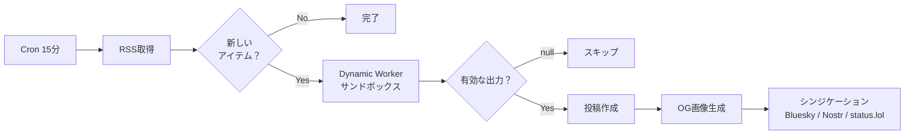

> 本記事は[cogley.jpの完全版](https://cogley.jp/articles/ja/cloudflare-dynamic-workers)の要約版です。Mermaidフロー図やセキュリティモデル図などは完全版をご覧ください。

データベースに保存したJavaScriptテンプレートを実行する必要があった。RSSフィードのアイテムをSNS投稿にフォーマットするコードだ。テンプレートは何でもあり得る：手書き、AI生成、ブログからのコピペ。D1データベースやR2バケットにアクセスできる本番Worker内で任意のコード文字列を実行するわけにはいかない。

2026年3月にリリースされたCloudflareの[Dynamic Workers](https://blog.cloudflare.com/dynamic-workers/)がこれを解決した。親Workerが実行時にコード文字列から新しいWorkerを生成し、それぞれが独自のV8アイソレートで動作する。アクセス権限は親が明示的に制御する。自分のパブリッシングスタックに半日で組み込めた。

## Dynamic Workers以前の問題

データベースにJavaScript関数を保存し、Cloudflare Worker内で実行したい場合、選択肢は3つ——どれも問題があった：

1. **`new Function()` / `eval()`**——Workerプロセス内でコードを実行する。すべてのバインディング、シークレット、インターネットにフルアクセスできてしまう。悪意あるテンプレートが1つあれば、D1データベース、R2バケット、APIキーが丸見えになる。
2. **文字列補間のみ**——テンプレートを`{{title}} - {{link}}`のような単純なパターンとして扱う。安全だが、ロジックを表現できない：「タイトルのないアイテムをスキップ」も、条件付きフォーマットも、長さに基づくトランケーションもできない。
3. **外部実行サービス**——コードを別のサンドボックスAPIに送る。レイテンシが増え、もう一つのデプロイメントを管理する必要があり、Workersのエッジコンピューティングの意味がなくなるネットワークホップが発生する。

Dynamic Workersは、選択肢1のJavaScript表現力と選択肢3の分離性を、選択肢2のシンプルさで実現する。コードは同じマシン上の別のV8アイソレートで実行され、明示的に渡さないものには一切アクセスできない。

## 仕組み

親Workerがコード文字列から新しいWorkerを生成する。各Workerは独自のV8サンドボックスを持ち、ミリ秒で起動し、何にアクセスできるかは親が制御する。

APIはシンプルだ：

```javascript
const worker = env.LOADER.load({
  compatibilityDate: '2026-03-21',
  mainModule: 'transform.js',
  modules: { 'transform.js': codeString },
  globalOutbound: null, // ネットワークアクセスをすべてブロック
});

const result = await worker.getEntrypoint().myMethod(data);
```

重要なのは2点：

1. **`globalOutbound: null`**——生成されたWorkerはHTTPリクエストを発行できない。外部への通信も、データの持ち出しも、SSRFも不可能。
2. **選択的なバインディング公開**——親がどのバインディング（D1、R2、KV）を渡すか決める。何も渡さなければ、サンドボックスは純粋な関数になる：データ入力、データ出力、それだけ。

## 実際の使い方：RSSフィードの自動投稿テンプレート

自分のパブリッシングシステム（[cogley.jp](https://cogley.jp)）は、Cloudflare Workers上のHono APIを中心としたモノレポで、D1、R2、KV、Vectorize、複数のWorkflowsをバックエンドに持つ。マイクロポスト、長文記事、フィード、Bluesky・Nostr・status.lolへのシンジケーションを処理している。

RSSフィードリーダーはすでに組み込み済みで、`feeds`テーブルには未使用の`auto_post`と`auto_post_template`カラムがあった。「フィードに新しいアイテムが来たら、投稿を自動作成する」というアイデアはずっとあった。

Dynamic Workers以前は、フィードごとのフォーマットロジックをWorkerに直接ハードコードする必要があった——`formatEsoliaBlogPost()`のような関数をデプロイコードに組み込み、出力形式を変更するたび、あるいは別のフォーマットの新しいフィードを追加するたびに再デプロイ。今は、JavaScript関数をデータベースのカラムに保存し、cronがサンドボックス内で実行する。まったく異なるフォーマットの新しいフィードの追加は、デプロイメントではなくAPIコールで済む。

### フロー



### テンプレート

テンプレートは`auto_post_template`カラムに保存されたアロー関数だ。これは自社のバイリンガルテックブログ用に実行しているもの：

```javascript
(item) => {
  if (!item.title) return null; // タイトルのないアイテムをスキップ
  const title = item.title;
  const link = item.link || "";
  const summary = item.summary || "";
  const teaser = summary.length > 150
    ? summary.substring(0, 147) + "..."
    : summary;

  let content = `**${title}**`;
  if (teaser) content += `\n\n${teaser} ☕`;
  if (link) content += `\n\n${link}`;
  content += `\n\n(Japanese version also available on the blog.)`;

  return {
    content,
    stream: "tech",
    visibility: "public",
    mood: "binoculars",
    syndicate_to: ["bluesky", "nostr", "statuslog"]
  };
}
```

関数はプレーンなデータオブジェクト——タイトル、リンク、要約、コンテンツ、著者、ソースフィードのメタデータ——を受け取る。投稿の形を返すか、スキップする場合は`null`を返す。

これは文字列補間では表現できない種類のロジックだ。テンプレートが判断を行う：タイトルのないアイテムをスキップ、150文字を超える要約をトランケーション、ティーザー行の条件付き表示、ムードやシンジケーションターゲットの選択。mustache的な`{{title}} - {{link}}`テンプレートでは、これらの動作ごとに個別の設定フィールドが必要で、ロジック自体はWorkerコードにハードコードするしかない。Dynamic Workersでは、テンプレートがロジックそのものであり、変更はデータベースの1行を更新するだけ。再デプロイもコード変更も不要。

### セキュリティモデル

テンプレートコードは何でもあり得る。サンドボックスが安全を保証する：

| 対策 | 説明 |
|------|------|
| バインディングなし | Cloudflareバインディングはゼロ。D1もR2もKVもシークレットもなし |
| ネットワークなし | `globalOutbound: null`がすべてのアウトバウンドHTTPをブロック |
| データ入出力のみ | プレーンオブジェクトを受け取り、プレーンオブジェクトを返す |
| 出力検証 | 親が戻り値を厳格なスキーマで検証、文字列をサニタイズ、制御文字を除去 |

テンプレートがエラーを投げたり無効な値を返した場合、フィードアイテムは理由付きで`skipped`にマークされる。システムは次のアイテムの処理に進む。

### コスト

1日あたりのユニークWorkerロードにつき$0.002（ベータ期間中は無料）＋標準のCPU時間。1日に数回テンプレートを実行するcronの場合、画像解析やコンテンツ要約で既に支払っているAI推論コストに比べれば実質ゼロ。

## もう一つのユースケース：ライブコード変換

[svelte.cogley.jp](https://svelte.cogley.jp)というReact・Vue・AngularからSvelte 5への移行インタラクティブリファレンスを運営している。サイト自体は静的SSRで、マッピングデータはすべてTypeScriptファイルに組み込まれている。だが、利用者はフレームワーク間のコード変換を行っている最中であり、「コンポーネントを貼り付けてSvelte 5版を取得」する機能があれば役に立つ。

Dynamic Workersで構築する方法：

1. ユーザーがReact/Vue/Angularコンポーネントを貼り付ける
2. サーバーがWorkers AIに変換プロンプトとともに送信
3. AI生成のSvelteコードがDynamic Workerサンドボックスでパースを検証
4. 検証済みの結果をユーザーに返す

信頼できない入力が2層——ユーザー投稿のコードとAI生成の出力——の両方を同じサンドボックスが処理する。「コードを貼り付けて変換結果を取得」するツールが必要な場面なら、どこでも使えるパターンだ。

## 向いていないケース

自分のスタック全体でDynamic Workersを評価した結果、合わない場所が3つ：

- **型付きアプリケーションルート**——HonoルートはDrizzle ORMで型付けされ、静的デプロイの恩恵を受けている。動的にしても得るものがない。
- **耐久性のあるWorkflows**——画像処理、シンジケーション配信、文字起こしはマルチステップでリトライ可能なCloudflare Workflowsを使う。Dynamic Workersはエフェメラル——プリミティブが違う。
- **「すべてを動的に」**——Dynamic Workersが解決する問題は具体的だ。広く適用すると、目的のない複雑さが増える。

適切なユースケースは**ユーザー設定可能なトランスフォーム**と**信頼できないコードのサンドボックス