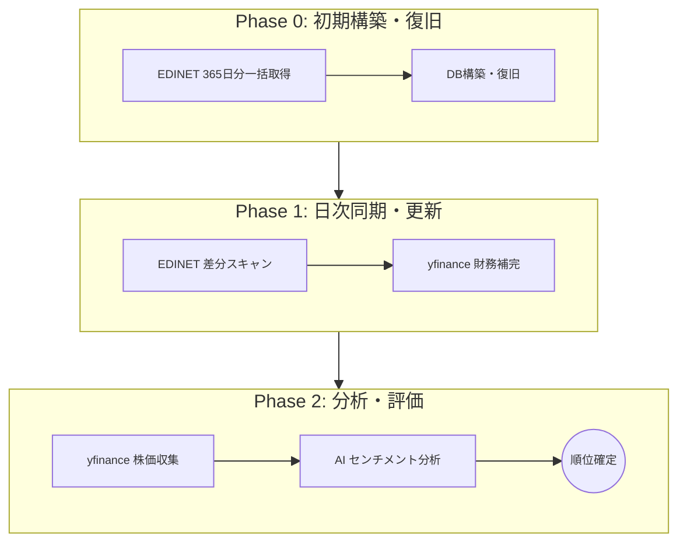

## TL;DR
- **課題**: 365日分の EDINET XBRL 取得における I/O ボトルネックの解消（推定 6 時間の短縮）
- **解決**: 並列スキャン ＆ 非対称ダウンロード・パースによる「Turbo パイプライン」の実装
- **成果**: バックフィル **7分42秒**、週次分析 **91秒** という高いパフォーマンスを実現

## はじめに
これまで本連載では、個人投資家エンジニアの武器となる「止まらない・超高速なスクリーナー」を目指し、以下の技術的挑戦と知見を公開してきました。

1. **[Python + yfinance で日本株分析：データ欠損・429エラーを「自己修復」して止まらないスクリーナーを作る](https://qiita.com/akkyey/items/00f5b3275749dbd820c3)**
2. **[【yfinance】欠損の多い RSI をPandas MultiIndex で 4,000 銘柄をだいたい2分で高速復旧する](https://qiita.com/akkyey/items/466b4fd05cb9408920f4)**
3. **[「手続き」から「宣言」へ。Polars Expression で 4,000 銘柄を 0.03 秒で「捌く」設計の妙](https://qiita.com/akkyey/items/02790d25e584204909d0)**

この記事は、連載の「総仕上げ」として、**データの完全性と処理性能の双方を追求した実装の詳細** を解説します。当初、365日分のデータ取得において大きな課題となっていた順次処理のボトルネックを、いかにして最適化し、信頼性と速度を両立させたか、その技術的なアプローチを公開します。

> **💡 今回の戦略：適材適所のハイブリッド運用**
> 1. **財務データ（EDINET）**: 1円単位の正確さが求められるファンダメンタル指標は、公式ソースから自前で取得・検証
> 2. **マーケットデータ（yfinance）**: リアルタイム性や簡便さが重要な株価・チャート情報は、既存 API を賢く活用
> この「公式の堅牢さ」と「API の機動力」を組み合わせたハイブリッド構成が、最強の武器となります。

---

## 1. EDINET とは？：日本市場の「公式データベース」
技術的な解説に入る前に、本パイプラインの心臓部である **EDINET** について整理しておきます。

- **正式名称**: Electronic Disclosure for Investors' NETwork（[EDINET公式サイト](https://disclosure2.edinet-fsa.go.jp/)）
- **運営**: 金融庁
- **役割**: 金融商品取引法に基づく有価証券報告書等の提出・閲覧システム
- **最大の特徴**: 全ての上場企業が、同一の規則（XBRL形式）で正確な財務数値を公開する**「日本市場の一次情報ソース」**です

多くの投資サイトや API が二次的な提供（転載）であるのに対し、EDINET は「官報」に近い立場であり、1円単位での正確性と、提出直後の速報性が保証されています。これを直接プログラムで叩くことは、投資家エンジニアとして究極の優位性を持つことを意味します。

---

## 2. なぜ「全銘柄 365日分」のスキャンが必要なのか
ここまでの高速化に挑んだ最大の理由は、**「公式ソースによる完全な財務データベース」** を自前で持ちたかったからです。なぜ「365日」という期間にこだわったのか、それには明確な理論的根拠があります。

- **「絶対に逃さない」1枚の有報**: 上場企業には 1 年に一度、必ず「有価証券報告書（本決算）」を提出する義務があります。365 日分を漏らさずスキャンすれば、**どんなに変則決算や提出遅延があっても、全上場企業 3,900 社以上の「最新の本決算」を 100% 確実に捕捉** できます
- **再生可能性（Recovery by Speed）への渇望**: GitHub Actions や Google Colab といったエフェメラル（一時的）なクラウド環境では、DB の消失や破損は常に隣り合わせのリスクです。しかし、リスクレベルが同等な場所にバックアップ（DBのスナップショット等）を保持し続けるより、**「原本（EDINET）からいつでも、誰よりも速く最新状態を復元できる力」** を持つ方が、システムの堅牢性と鮮度において圧倒的に優位であると考えたからです
- **yfinance の限界**: yfinance は便利ですが、日本株の財務データにおいては「最新の一部」しか取れない、あるいは更新が遅延することがあります。「昨日提出されたばかりの有報」を即座に計算へ反映させるには、EDINET を自前で逐次スキャンするのが唯一の正解でした
- **比較の公平性**: 全銘柄の「確定した通期データ」を 1 円単位で揃えることで初めて、PER や ROE といった指標を「同じ土俵（確定値）」で比較できる、最強のスクリーナーが誕生します

---

## 3. yfinance の「手軽さ」と「危うさ」
株価取得でおなじみの yfinance は、財務データも取れます。
- **メリット**: `ticker.info` 一発で取れる
- **デメリット**: 
  - 日本株の連結・単独が混在したり、米国基準への変換で数値がズレることがある
  - **エンジニアリングの壁（逐次処理）**: 株価（マーケットデータ）は複数銘柄を一括ダウンロード（バッチ取得）できますが、財務データ（インフォメーション）は **1銘柄ずつ個別にリクエスト** を投げる必要があります。4,000銘柄を愚直に回すと、API レート制限に即座に抵抵し、絶望的な待ち時間が発生します

これに対し、公式ソースである **EDINET** は、その設計思想からして対照的です。
- **メリット（日付ベースの横断スキャン）**: EDINET API は「全銘柄がその日に提出した書類リスト」を一発で返してくれます。yfinance で全銘柄（約 4,000 社）の更新を確認するには **4,000 回の API 発行** が必要ですが、EDINET なら過去 1 年分を遡っても **わずか 365 回のリクエスト** で完遂できます。このリクエスト数の圧倒的な差（1/10 以下）が、スキャンの実行効率を劇的に向上させます

「より正確な確定値が、より高い並列性で欲しい」―― その答えは公式ソースの **EDINET** にありました。

---

## 4. 戦略的バックフィル：20GB の巨大データをどう回避するか？
EDINET の全書類データを「元帳（バルク）」で落とそうとすると、そのサイズは **20GB** を軽く超えます。個人開発のストレージやネットワークでこれを毎回事実上のフルバックアップするのは非効率の極みです。

ここで採用したのが **「365日分の差分スキャン」** という戦略です。
- **大前提**: 上場企業は年に一度、必ず「有価証券報告書（本決算）」を提出します
- **戦略**: EDINET API v2 で過去 365 日分の「差分リスト」を取得し、そこから銘柄ごとに最新の本決算 1 枚を抽出して積み上げれば、**最小限の通信量で、全銘柄の財務データを 100% 網羅** できます

「量で圧倒する」のではなく「期間で絞り、質（本決算）で抜く」。これが Turbo エンジンの設計思想です。

---

## 5. データの収集からランキング確定までの全体フロー

テクニカルな詳細に入る前に、システム全体がどのようにデータを統合し、最終的な投資判断（順位）を下しているか、その「大きな流れ」を可視化します。



このフローは、以下のタイミングで実行されることを想定しています。

- **Phase 0（初期構築・復旧）**: **初回のみ**（または DB 破損・環境移行時の「破壊からの復旧」時）
- **Phase 1（日次同期・更新）**: **1 日 1 回**。当日の提出書類を差分スキャンし、最新状態を維持します
- **Phase 2（分析・評価）**: **任意のタイミング**。最新の財務・市場データに基づき、いつでも最新のランキングを出力できます

この「公式情報の堅牢さ」を基盤に、「API の機動力」と「AI のインテリジェンス」を積み上げる多層構造が、分析の精度と速度を両立させています。

---

## 6. Turbo パいプラインの全体像（シーケンス図）

この「非対称かつロックフリー」な並列処理フローを視覚化すると、以下のようになります。ダウンロード（I/O）の待ち時間を、高負荷なパース処理（CPU）で埋める設計が要です。

```mermaid
sequenceDiagram
    participant User as 実行ユーザー
    participant S as Metadata Fetch (並列)
    participant F as Filter (本決算優先)
    participant D as DL (2並列)
    participant P as Turbo Scan (CPU数並列)
    participant O as Output (Lock-free)
    participant DB as SQLite / Orchestrator
    
    User->>S: 過去365日分をスキャン開始
    S->>User: 全書類 (約9,200枚) のリスト取得
    Note over User,S: メタデータ取得を並列化し 8.6秒で完遂
    User->>F: 書類型型 (120:有報) でフィルタ
    F-->>User: 銘柄ごとの代表1枚 (約3,900枚)
    
    loop 全銘柄
        User->>D: 順次ダウンロード (I/O待ち)
        D->>P: 取得完了次第、パースキューへ
        P->>P: ZIP解凍 ＆ XML解析 (Turbo Scan)
        P->>O: 銘柄ごとの個別 JSON へ書き込み
    end

    Note over D,O: DL 待ちの隙間にパース（Turbo Scan）を詰め込む「非対称戦略」
    
    User->>DB: 全 JSON を一括マージして DB 統合
    DB->