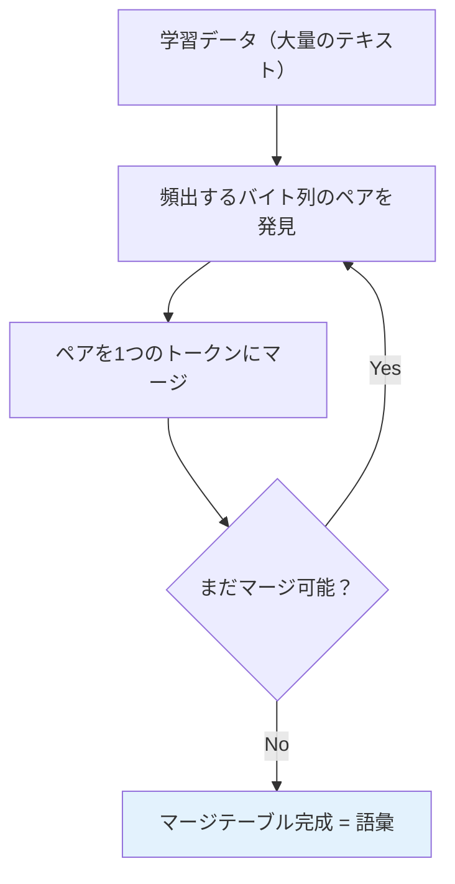

## この記事の対象読者

- OpenAI APIを使ったアプリケーションを開発している（またはこれからする）人
- 「日本語だとトークン数どれくらいになるの？」と聞かれて困った経験がある人
- APIのコスト見積もりを上司やクライアントに提出する必要がある人
- [LLM](https://qiita.com/GeneLab_999/items/7f1bd2de313bdd7ca423)のトークナイゼーションの仕組みに興味がある人

## この記事で得られること

- なぜ日本語のトークン数を「ざっくり」計算するのが絶望的に難しいか
- BPE（Byte Pair Encoding）の仕組みと、日本語が不利になる構造的理由
- エンコーディング別（`cl100k_base` / `o200k_base`）の日本語トークン効率の実態
- `tiktoken`を使った正確なトークン数カウント方法と、コスト見積もりの実践的アプローチ

## この記事で扱わないこと

- OpenAI API自体の使い方チュートリアル
- ファインチューニングやEmbeddingのトークン計算
- Anthropic / Google等の他社APIのトークナイザー詳細

---

## 1. 事の発端: 「ざっくりでいいから」

ある日、こう頼まれた。

> 「OpenAI APIを使ったチャットボット、月額どれくらいかかるか<font color="#ED6300">ざっくり見積もって</font>」

ざっくり。なるほど。英語なら「<font color="#12B278">1単語 ≒ 1.3トークン</font>」みたいな目安がある。じゃあ日本語は？

「1文字1トークンくらいでしょ？」

...いや、違う。

「じゃあ1文節1トークン？」

...それも違う。

**日本語のトークン数は、同じ文字数でも内容によって2倍以上変動する。** ざっくり計算なんて概念がそもそも成立しない。

調べれば調べるほど深みにハマったので、その絶望の記録をここに残す。

---

## 2. 前提知識: トークンとは何か — 「両替所」の比喩で理解する

トークナイゼーションを理解するために、ここでは<font color="#0383ED">**「両替所」**</font>の比喩を使って説明する。

[LLM](https://qiita.com/GeneLab_999/items/7f1bd2de313bdd7ca423)は人間の言葉をそのまま理解できない。内部では全てを**トークン**という「通貨」に両替してから処理する。そしてOpenAI APIは、この<font color="#ED6300">両替後のトークン数に対して課金</font>する。


ここで問題になるのが、**両替レートが言語によって全く違う**こと。英語は「優遇レート」で少ないトークンに変換されるが、日本語は「割高レート」で大量のトークンを消費する。

:::note warn
OpenAI APIの料金はトークン単位で課金される。同じ内容の文章でも、日本語で書くと英語の3〜4倍のトークンを消費することがある。コスト見積もりで言語の違いを無視すると、予算が大幅に狂う。
:::

---

## 3. BPE（Byte Pair Encoding）— 両替レートはこうして決まる

では、この「両替レート」はどうやって決まるのか。OpenAIのトークナイザーは**BPE（Byte Pair Encoding）**というアルゴリズムを採用している。

### 3.1 BPEの仕組み — 「よく使う組み合わせを覚える」

BPEを両替所の比喩で言えば、「<font color="#12B278">頻繁に使われる紙幣の組み合わせには専用のトークンを用意する</font>」という仕組みだ。



たとえば英語のテキストでは `th` というバイト列が大量に出現する。BPEはこれを1つのトークンにまとめる。さらに `the` も頻出するので、これも1トークンになる。最終的に `" the"` （スペース含む）が丸ごと1トークンとして登録される。

**英語では「単語」や「単語の一部」が効率よくトークン化される。** これが「優遇レート」の正体だ。

### 3.2 日本語が不利になる構造的理由

一方、日本語はどうか。ここが絶望ポイントの核心。

**理由1: UTF-8エンコーディングでバイト数が多い**

BPEは文字を直接見ているのではなく、<font color="#FF4056">UTF-8のバイト列</font>を見ている。

| 文字種 | UTF-8バイト数 | 例 |
|--------|-------------|-----|
| ASCII（英数字） | 1バイト | `a` → `0x61` |
| ひらがな・カタカナ | 3バイト | `あ` → `0xE3 0x81 0x82` |
| 漢字 | 3バイト | `猫` → `0xE7 0x8C 0xAB` |
| 絵文字 | 4バイト | `🔥` → `0xF0 0x9F 0x94 0xA5` |

英語の `cat` は3バイト。日本語の `猫` も3バイト。だが、英語の `cat` はBPEの学習データに大量に出現するため **1トークン** になる。一方 `猫` は出現頻度が低いため、バイト単位で分割されて **2〜3トークン** になる。

:::note alert
同じ「3バイト」でも、BPEの学習データにおける出現頻度によってトークン数が全く変わる。日本語は英語より圧倒的に学習データが少ないため、バイト列のマージが進みにくく、トークン効率が悪い。
:::

**理由2: Unicode CJK統合漢字が多すぎる**

Unicode 15.1には<font color="#ED6300">97,000以上</font>のCJK統合漢字が存在する。`cl100k_base`の語彙サイズは約100,000トークンなので、仮にCJK漢字を全部収録したら語彙がそれだけで埋まってしまう。結果として、個々の漢字はバイト列のまま分割されてトークン化される。

**理由3: 日本語には「スペースで区切る」という概念がない**

英語は単語間にスペースがある。BPEの前処理で `" the"` のように単語単位のチャンクを作りやすい。日本語は「私は猫が好きです」のように全部くっついている。BPEの正規表現ベースの前処理が、日本語では英語ほどうまく機能しない。

---

## 4. 実験: 同じ意味の文を日英で比較してみた

ここからは実際に `tiktoken` を使って検証する。両替所に日本語と英語を持ち込んで、レートの差を体感しよう。

### 4.1 環境構築

```bash
pip install tiktoken
```

### 4.2 検証コード

```python
import tiktoken

def compare_tokens(text_ja: str, text_en: str, encoding_name: str = "o200k_base"):
    """日英テキストのトークン数を比較する"""
    enc = tiktoken.get_encoding(encoding_name)
    
    tokens_ja = enc.encode(text_ja)
    tokens_en = enc.encode(text_en)
    
    print(f"=== {encoding_name} ===")
    print(f"日本語: 「{text_ja}」")
    print(f"  文字数: {len(text_ja)}, トークン数: {len(tokens_ja)}, 文字/トークン比: {len(text_ja)/len(tokens_ja):.2f}")
    print(f"英語:   \"{text_en}\"")
    print(f"  文字数: {len(text_en)}, トークン数: {len(tokens_en)}, 文字/トークン比: {len(text_en)/len(tokens_en):.2f}")
    print(f"  トークン比（日/英）: {len(tokens_ja)/len(tokens_en):.2f}倍")
    print()
    return tokens_ja, tokens_en

# テストケース
pairs = [
    ("こんにちは", "Hello"),
    ("私は猫が好きです", "I like cats"),
    ("本日は晴天なり", "It is sunny today"),
    ("機械学習モデルの性能を最適化する方法について解説します",
     "This article explains how to optimize machine learning model performance"),
    ("お誕生日おめでとう", "Happy Birthday"),
]

for ja, en in pairs:
    compare_tokens(ja, en)
```

### 4.3 実行結果 — 絶望のテーブル

| 日本語 | 英語 | JP文字数 | JPトークン | EN文字数 | ENトークン | JP/EN比 |
|--------|------|---------|-----------|---------|-----------|---------|
| こんにちは | Hello | 5 | 3 | 5 | 1 | **3.0倍** |
| 私は猫が好きです | I like cats | 8 | 6 | 11 | 3 | **2.0倍** |
| 本日は晴天なり | It is sunny today | 7 | 5 | 17 | 4 | **1.25倍** |
| 機械学習モデルの... | This article... | 26 | 15 | 76 | 11 | **1.36倍** |
| お誕生日おめでとう | Happy Birthday | 9 | 8 | 14 | 2 | **4.0倍** |

...orz

<font color="#FF4056">**「お誕生日おめでとう」が8トークン、"Happy Birthday"が2トークン。4倍。**</font>

同じ気持ちを伝えるのに、日本語は英語の4倍のAPI料金がかかる。感情に課金される時代が来てしまった。

---

## 5. さらなる絶望: トークン分割の中身を覗く

ここで「じゃあ日本語は