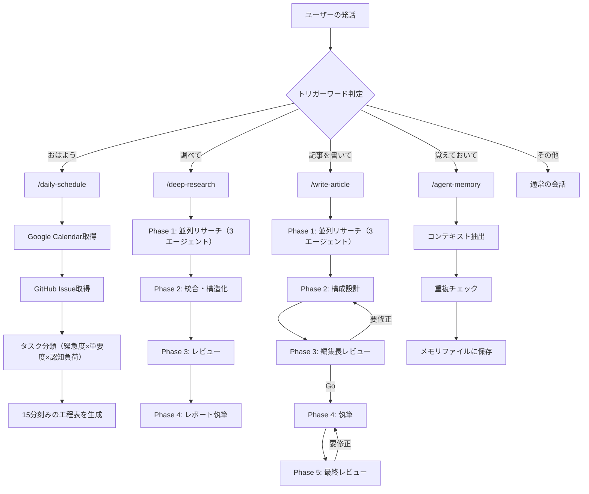
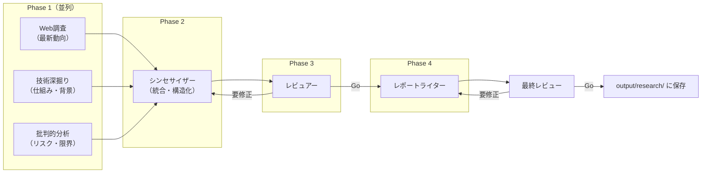

## はじめに

Claude Codeを使い始めた直後は感動します。自然言語でコードが書ける、テストも回してくれる、リファクタリングまでやってくれる。ところが1ヶ月ほど経つと、壁にぶつかります。

- 「前にも同じ指示を出したのに、また違うスタイルで書いてくる」
- 「プロジェクトのルールを毎回説明するのが面倒」
- 「サブエージェントを使いたいけど、どう設計すればいいかわからない」

この壁を越えるカギが `CLAUDE.md` の設計です。

筆者は本業・副業・個人開発を並行して進めており、Claude Codeを日常業務のパートナーとして使っています。最初は雑にCLAUDE.mdを書いていましたが、構造を設計し直してから、指示のやり直しが激減しました。この記事では、実際に運用しているCLAUDE.mdの設計と、それを軸にしたワークフローを公開します。

:::note info
この記事はClaude Code 2026年3月時点の機能に基づいています。サブエージェント、Agent Teams、Memory、Hooks等の機能を前提としています。

関連記事として、Claude Codeの基本的な使い方は「[Claude Codeベストプラクティス -- 成果を安定させる7つの鉄則](https://qiita.com/nogataka/items/392934f79e943e8b9228)」、コンテキスト管理の具体的なコマンド操作は「[Claude Codeのコンテキストを綺麗に保つ方法まとめ](https://qiita.com/nogataka/items/ce4921c7b8a74a408caa)」で解説しています。本記事はそれらを踏まえた上での実践的な設計・運用ノウハウです。
:::

## CLAUDE.mdの階層構造

Claude Codeは複数のCLAUDE.mdを階層的に読み込みます。どこに何を書くかを設計することが重要です。

```
~/.claude/CLAUDE.md              ← グローバル設定（全プロジェクト共通）
<project>/.claude/rules/*.md     ← プロジェクトルール（条件付きで適用）
<project>/CLAUDE.md              ← プロジェクト固有設定
```

:::note info
公式のmemory hierarchyは「Enterprise policy → Project memory (`./CLAUDE.md` or `./.claude/CLAUDE.md`) → User memory (`~/.claude/CLAUDE.md`)」です。`.claude/rules/*.md` は公式仕様ではなく、筆者が独自に運用しているルール分離の仕組みです。
:::

### グローバル設定（`~/.claude/CLAUDE.md`）

全プロジェクトに適用する「自分の仕事の進め方」を書きます。筆者の設定の構成は以下のとおりです。

```markdown
# グローバル設定

## 基本情報
- 名前 / GitHub ID
- 結論ファースト。挨拶・前置き・段階報告は不要
- 敬語（です/ます体）で統一

## 役割
1. 経営パートナー — 戦略立案・意思決定支援
2. 秘書・アシスタント — スケジュール管理・タスク整理
3. テックリード — 技術的な意思決定・コードレビュー

## ツール
| ツール | 用途 |
|--------|------|
| gog CLI | Gmail・Calendar・Drive操作 |
| gh CLI | Issue管理・コード管理 |
| Smart Edit | LSPベースのコード編集支援 |
| Codex CLI | セカンドオピニオン・レビュアー |

## 行動原則
### コア
- シンプル第一。影響するコードを最小限にする
- 手を抜かない。一時的な修正は避ける
- 影響を最小化する

### 進め方
- 3ステップ以上のタスクは必ずPlanモードで開始する
- リサーチ・調査はサブエージェントに任せる
- サブエージェント1つにつき1タスク

### 検証
- 動作を証明できるまで完了としない
- テストを実行し、ログを確認する
```

ポイントは「AIに何をさせたいか」ではなく「自分がどう仕事を進めたいか」を書くことです。Claude Codeはこの設定を読んで、あなたの仕事の流儀に合わせた振る舞いをします。

:::note warn
グローバル設定にプロジェクト固有の情報（ディレクトリ構造やビルドコマンド等）を書かないでください。全プロジェクトに影響します。
:::

### プロジェクト設定（`<project>/CLAUDE.md`）

プロジェクトごとの固有情報を書きます。筆者が業務管理リポジトリで使っている設定の構成です。

```markdown
# プロジェクト設定

## ディレクトリ構造
| ディレクトリ | 役割 |
|-------------|------|
| 00_context/ | プロフィール・経歴・AIメモリ |
| 01_strategy/ | 事業戦略・方針 |
| output/ | AI出力ファイル |

## ワークフロー
### スキル発火条件
| トリガーワード | 発動スキル | 動作 |
|--------------|-----------|------|
| 「おはよう」 | /daily-schedule | 今日の工程表を作成 |
| 「調べて」 | /deep-research | リサーチチーム起動 |
| 「記事を書いて」 | /write-article | 記事執筆チーム起動 |

## AIメモリ（00_context/memories/）
| ファイル | 内容 | 参照タイミング |
|---------|------|--------------|
| preferences.md | 文体の好み、常用ツール | 記事執筆時 |
| decisions.md | 意思決定の記録 | 類似の判断時 |
| context-log.md | 進行中プロジェクト | セッション開始時 |
```

「スキル発火条件」のテーブルは、筆者が実際に運用している仕組みです。特定のキーワードを発話すると、対応するSkillが自動的に起動します。CLAUDE.mdにこのマッピングを書いておくと、Claude Codeが自然言語のトリガーを認識してくれます。

### プロジェクトルール（`.claude/rules/*.md`）

特定の条件でのみ適用するルールを分離します。これは筆者の独自運用であり、Claude Codeの公式機能ではありません。

```
.claude/rules/
├── codex-guidelines.md    # Codex CLIの活用ルール
└── plan-template.md       # Plan mode の計画テンプレート
```

たとえば `plan-template.md` には、計画を作成する際の固定フォーマットを定義しています。

```markdown
## 必須セクション
| # | セクション | 形式 |
|---|-----------|------|
| 1 | なぜやるか | 散文（3行以内） |
| 2 | 何を変えるか | テーブル |
| 3 | どう実装するか | 番号付きリスト |
| 4 | 検証方法 | チェックリスト |
| 5 | リスク・注意点 | 箇条書き |
```

このテンプレートがあることで、Planモードの出力が毎回同じ構造になります。レビューしやすく、抜け漏れに気づきやすくなります。

## ワークフローの全体像

筆者が日常的に回しているワークフローの全体像です。



## サブエージェント設計

サブエージェントは `.claude/agents/*.md` にMarkdownファイルとして定義します。YAML frontmatterで設定を記述し、本文がシステムプロンプトになります。

### リサーチチームの例

`/deep-research` スキルで起動するリサーチチームは6エージェント構成です。



設計のポイントは3つあります。

1. **Phase 1を並列実行する** — 3つのリサーチエージェントを同時に起動します。直列だとコンテキストが偏りますが、並列にすることで多角的な視点が得られます
2. **レビュアーが差し戻せる** — 構成案と最終レポート