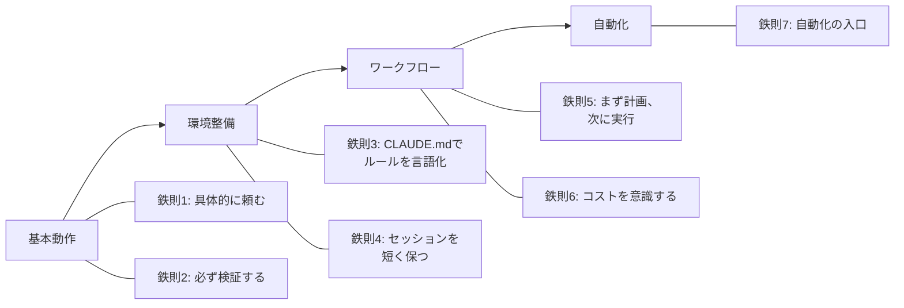
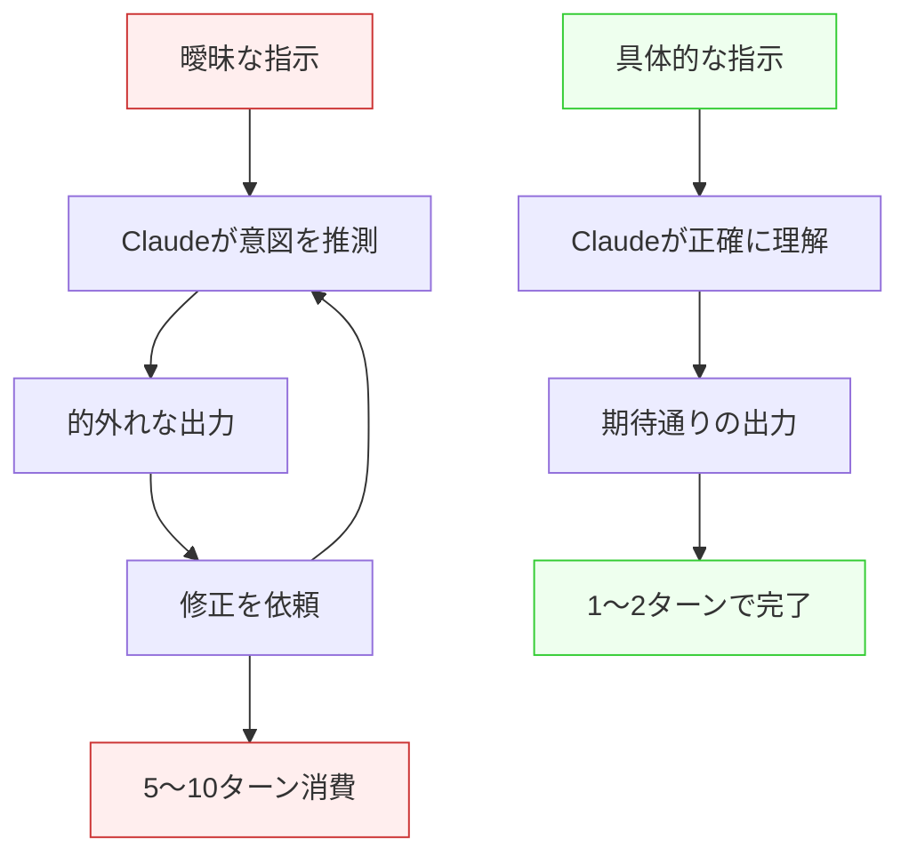
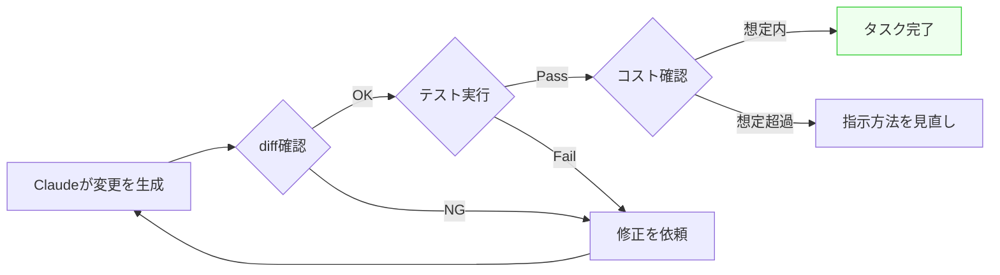
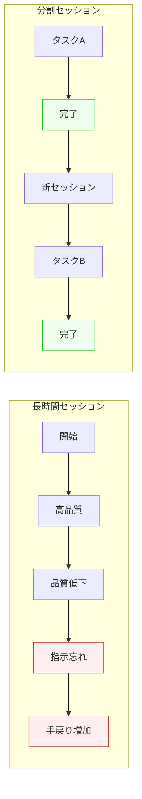

Claude Codeの[公式ベストプラクティス](https://code.claude.com/docs/ja/best-practices)には、成果を安定させるためのパターンが数多く掲載されている。ただ、情報量が多く、どこから手をつければよいか迷う人も多いのではないだろうか。

本記事では、公式ドキュメントの内容を参考に、特に押さえておきたいポイントを7つの鉄則として整理した。基本動作から自動化まで、4つのカテゴリに分類している。



---

## 鉄則1: 具体的に頼む

Claude Codeの出力品質は、指示の具体性で決まる。曖昧な指示は何度もやり取りが発生し、時間もトークンも消費する。

### Bad / Good 比較

| Bad（曖昧） | Good（具体的） |
|---|---|
| 「このコードを直して」 | 「`src/auth.ts`の`login`関数で、パスワード未入力時にnullが返る。空文字チェックを追加して`ValidationError`を投げるように修正して」 |
| 「テストを書いて」 | 「`src/utils/format.ts`の`formatDate`関数に対して、Vitestで正常系3パターンとエッジケース2パターンのテストを書いて」 |
| 「パフォーマンスを改善して」 | 「`/api/users`エンドポイントのレスポンスが2秒かかる。SQLクエリのN+1問題を解消して500ms以下にして」 |

### 指示出しの5項目チェックリスト

指示を出す前に、次の項目を確認する。

- **何を**: 対象のファイル・関数・コンポーネント
- **どこを**: 変更すべき箇所の特定
- **なぜ**: 変更の目的・背景
- **どこまで**: 期待する完了条件
- **制約**: 使うライブラリ、コーディング規約、互換性

すべてを毎回埋める必要はない。しかし「何を」「どこまで」の2つは常に含めたい。



具体的な指示が身につくと、ターン数が大幅に減る。結果としてコストも下がる。

:::note info
コンテキストエンジニアリングの詳細は「[コーディングエージェント時代のコンテキストエンジニアリング実践ガイド](https://qiita.com/nogataka/items/15206e0c01426e953026)」を参照。
:::

---

## 鉄則2: 必ず検証する

Claude Codeは高い精度でコードを生成する。しかし、100%正しいわけではない。「生成したら検証する」を徹底することで、問題を早期に発見できる。

### 3つの検証ポイント

**1. diffを確認する**

Claude Codeが変更を加えたら、まず差分を確認する。意図しない変更が混入していないかをチェックする。ターミナル上で`git diff`を実行するか、エディタの差分表示を使う。

**2. テストを実行する**

変更後は必ずテストを実行する。Claude Codeにテスト実行を依頼してもよい。既存テストが壊れていないことを確認する。

```text
テストを実行して、結果を報告して
```

**3. /cost で消費量を確認する**

`/cost`コマンドで、セッション中のトークン消費量を確認する。想定以上に消費している場合、指示の仕方を見直すサインになる。

### 30秒検証チェックリスト

タスク完了時に、次の3点を確認する。

- [ ] diff に意図しない変更がないか
- [ ] テストが通るか（または手動で動作確認したか）
- [ ] コスト消費が想定内か



:::note warn
テストなしで「動いたから大丈夫」と判断するのは危険。Claude Codeが生成したコードにも、エッジケースの考慮漏れはある。
:::

検証を徹底すると、手戻りが減り、結果的に開発速度が上がる。

:::note info
検証とデバッグの実践的な手法は「[デバッグ駆動コンテキストエンジニアリング実践ガイド](https://qiita.com/nogataka/items/b2d1e2a58f8276cc2f25)」で詳しく解説している。
:::

---

## 鉄則3: CLAUDE.mdでルールを言語化する

毎回同じ指示を繰り返していないだろうか。「TypeScriptで書いて」「テストはVitestで」「コミットメッセージは日本語で」。これらのルールはCLAUDE.mdに書いておけば、自動的に適用される。

### CLAUDE.mdとは

CLAUDE.mdは、プロジェクトルートに置く設定ファイルである。Claude Codeがセッション開始時に自動で読み込み、すべてのやり取りに反映する。

### スターターテンプレート

最初はシンプルに始める。次の4セクションで十分である。

```markdown:CLAUDE.md
# プロジェクト概要
- Node.js + TypeScriptのWebアプリケーション
- フレームワーク: Next.js 15（App Router）
- パッケージマネージャ: pnpm

# コーディング規約
- 変数名・関数名はcamelCase
- コンポーネントはPascalCase
- 1ファイル1コンポーネント

# テスト
- テストフレームワーク: Vitest
- テストファイルは __tests__/ ディレクトリに配置

# Git
- コミットメッセージは日本語
- 1コミット1機能
```

:::note info
CLAUDE.mdにはプロジェクトルート以外にも複数のスコープがあるが、まずはルートの1ファイルだけで十分。詳細なスコープの使い分けは「[Claude Code拡張機能活用ガイド](https://qiita.com/nogataka/items/eb51b0d250a9d1061e51)」を参照。
:::

### 使いながら育てる

CLAUDE.mdは最初から作り込む必要はない。Boris Cherny（『Programming TypeScript』著者）は、CLAUDE.mdの自己改善ループを提唱している。

1. Claude Codeを使う中で「また同じ指示をした」と気づく
2. その指示をCLAUDE.mdに追記する
3. 次回から自動的に適用される

この繰り返しで、CLAUDE.mdは自然と充実していく。2週間もすれば、プロジェクト固有のナレッジベースになる。

---

## 鉄則4: セッションを短く保つ

長時間のセッションでは、Claude Codeの出力品質が徐々に低下する。コンテキストウィンドウには上限があるためである。

### 「1タスク1セッション」ルール

1つのタスクが終わったら、新しいセッションを始める。これだけで品質は安定する。

- 「認証機能の実装」→ 新セッション →「テストの追加」
- 「バグ修正A」→ 新セッション →「バグ修正B」

### /compact コマンド

セッションの途中でコンテキストが膨らんだら、`/compact`コマンドを使う。会話履歴を要約して、コンテキストの空きを確保する。ただし、要約の過程で細かいニュアンスが失われる点は意識しておく。

### コンテキスト劣化の3つの兆候

次のサインが出たら、新しいセッションに切り替える。

1. 以前伝えた指示を忘れる（同じことを聞き返す）
2. コードの一貫性が崩れる（命名規則がブレる）
3. 関係のないファイルを編集し始める



:::note info
コンテキストウィンドウの仕組みと最適な管理方法は「[コンテキストウィンドウの処理フローと動作メカニズム完全解説](https://qiita.com/nogataka/items/14129852151ca9e788a7)」で解説している。
:::

---

## 鉄則5: まず計画、次に実行

複雑なタスクをいきなり実行させると、方向性がズレやすい。まず計画を立てさせ、確認してから実行に移る。

### 3ステップの流れ

```mermaid
graph LR
    A[1. 計画を依頼] --> B[2. 計画をレビュー]
    B --> C{承認?}
    C -->|OK| D[3. 実行を許可]
    C -->|修正| A
    D --> E[実装完了]

    style E fill:#