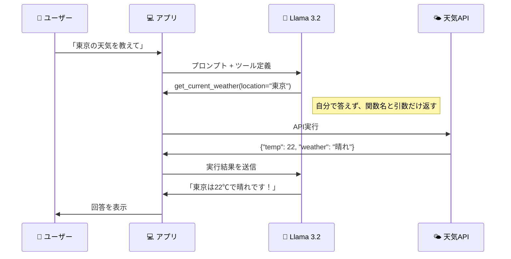
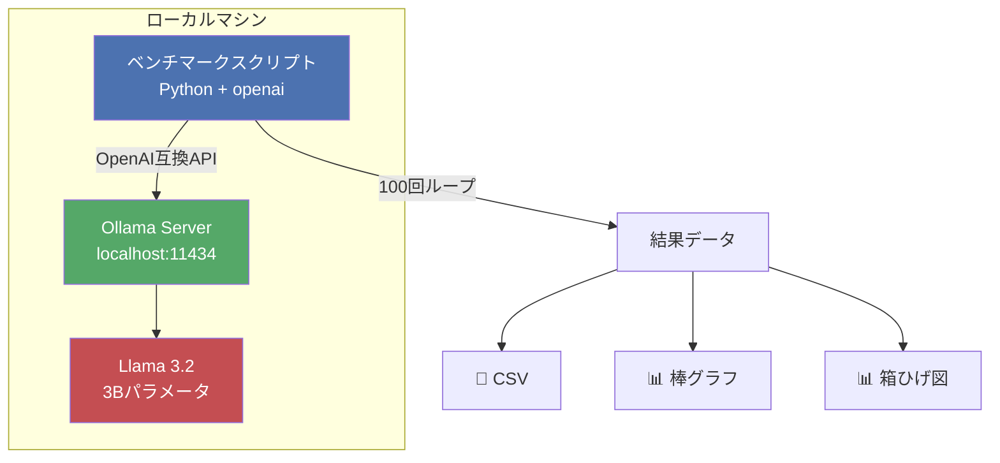
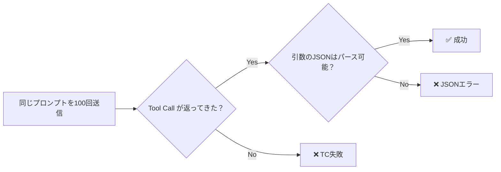

<!--
title: 「無料でAIエージェント作れるやん」→ ローカルLLMに100回ツール呼び出しさせたら"成功したはずの出力"がカオスだった話
tags: Ollama, Python, LLM, AI, 初心者
-->

## 前回「MCPなんていらない」って書いた人間が、もっと手前の問題に気づいた話

先日、こんな記事を書きました。私が。

> [**「MCPサーバー作るのもうやめていい？」〜CLIがMCPを圧倒する本当の理由〜**](https://qiita.com/toarusyakaijin/items/e7a6c34c75f4eaf54704)

「MCP はトークンの無駄遣い、CLI の方が35倍効率いい！」と勢いよく書き上げて、意気揚々と投稿したわけです。

……が、投稿ボタンを押した直後に気づいてしまった。

> **「……待てよ。MCP だろうと CLI だろうと、LLM が『ツールを呼ぶ』部分が壊れてたら、そもそも全部ダメじゃん」**

MCP vs CLI の議論は「ツール呼び出しがちゃんと動く前提」の話。でもその **前提** を、ローカル LLM で検証した人が誰もいなかった。

Claude や GPT-4o なら、ツール呼び出しは100発100中。当たり前。でもこれ、**自分の PC で無料で動くローカル LLM** だったら？ API 課金ゼロ、データ外部送信ゼロの Ollama 環境で、ちゃんと動くのか？

MCP 不要論を唱えた張本人が、もっと根本的な問題をスルーしていた。恥ずかしい。

**じゃあ100回ぶん回して計測するか。**

そうして始めた実験の結果が「**87%**」。この数字を見て、あなたは「意外と高い」と思うか、「本番では使えない」と思うか——。

読み進めると、印象がたぶん変わります。

---

## 先に結論を見せます

まず数字から。


| 指標 | 結果 |
|---|---|
| Tool Call 成功率 | **87%**（87 / 100） |
| JSON Parse 成功率 | **87%**（87 / 100） |
| 平均レスポンスタイム | **1.19秒** |
| 最小 / 最大 | 0.59秒 / 2.86秒 |


中央値は約 **1.0秒**。ほとんどのリクエストが **0.7〜1.5秒** に収まっています。3B パラメータのローカルモデルにしては、かなり速い。

ここまでは「へぇ、87% か」という感じかもしれません。でもこの後、成功した87回の JSON を1つずつ開けていったら、**予想外の世界**が見えてきました。

その前に、「そもそも Ollama って何？」「Function Calling って？」という方のために手短に解説します（知っている方は [検証の全体像](#検証の全体像) へどうぞ）。

---

## Ollama ってそもそも何？

**[Ollama](https://ollama.com/)** は、LLM（大規模言語モデル）を **自分の PC でワンコマンドで動かせるツール** です。

```bash
brew install ollama     # インストール
ollama pull llama3.2    # モデルをダウンロード（約2GB）
ollama serve            # サーバー起動 → localhost:11434 で待ち受け
```

たったこれだけで、あなたの Mac（や Linux）が **AI サーバー** になります。

| 観点 | ChatGPT API | Ollama |
|---|---|---|
| 費用 | 従量課金 | **完全無料** |
| データ | OpenAI に送信 | **PC から出ない** |
| ネット | 必要 | **オフラインOK** |
| 速度 | 速い | マシン性能に依存 |
| モデル | GPT-4o 等 | Llama, DeepSeek, Qwen 等 |

しかも、OpenAI 互換の API（`/v1/chat/completions`）を持っているので、**`openai` ライブラリのコードがほぼそのまま動く**。既存のコードの `base_url` を `localhost:11434/v1` に変えるだけ。

> MCP だ CLI だと [議論が白熱している](https://qiita.com/toarusyakaijin/items/e7a6c34c75f4eaf54704) 昨今ですが、いずれにしても **LLM がツールを正しく呼べるかどうか**（= Function Calling の信頼性）は根本の問題。CLI であっても「LLM が引数を正しい JSON で吐けるか」は変わらず重要です。この記事ではそこを **ローカル LLM で** 実測しました。

---

## Function Calling って何？——「嘘つき秀才」が「有能な司令塔」に変わる仕組み

LLM には致命的な弱点があります。**知ったかぶりの天才** だということ。

> 👤「東京の今日の天気は？」
> 🤖「東京は今日、晴れで気温は24℃です！」
> 👤「お、ありがとう」
> 👤（……いま外、雨降ってるんだけど）

LLM はインターネットに繋がっていないし、リアルタイムの情報を持っていません。でも聞かれたら **それっぽく答えてしまう**。これがいわゆる「ハルシネーション（幻覚）」です。

### Function Calling = 「自分で答えるな、専門家に電話しろ」方式

そこで登場するのが **Function Calling**。LLM にこう言い聞かせます。

> 「お前は天気を知らなくていい。でも **誰に聞けばいいか** は判断しろ」

すると LLM の振る舞いがこう変わります。

> 👤「東京の今日の天気は？」
> 🤖「私は天気を知りません。でも `get_current_weather` という関数に `"東京"` を渡せば分かるはずです」
> 📞 **→ 天気APIに電話 →** 「22℃、晴れ」という事実を取得
> 🤖「東京は22℃で晴れです！」（← 今度は本当）

**嘘つき秀才が、「適切な専門家に電話できる有能な司令塔」に進化した。** これが Function Calling の本質です。

### つまり AI エージェントの心臓部

MCP も、CLI ツール連携も、Cursor のツール実行も——裏側では全部この Function Calling が動いています。LLM が「**どの関数を、どんな引数で呼ぶべきか**」を JSON で返す。これが正しく動かないと、AI エージェントは何もできません。



今回の検証は、この「電話のかけ方」をローカル LLM が **100回中何回ちゃんとできるか** を測ったものです。

---

## 検証の全体像

### アーキテクチャ



### 検証フロー



| 項目 | 内容 |
|---|---|
| マシン | MacBook（Apple Silicon） |
| Ollama | v0.17.5 |
| モデル | `llama3.2`（3B、約 2GB） |
| プロンプト | `「東京の今日の天気を教えて」`（毎回同じ） |
| ツール定義 | `get_current_weather(location, unit)` |
| 試行回数 | **100回** |

ツール定義はシンプルな天気取得関数1つだけ。複雑なツールだともっと失敗するかもしれませんが、まずは最も基本的なケースで計測しました。

```python
TOOLS = [{
    "type": "function",
    "function": {
        "name": "get_current_weather",
        "description": "指定された場所の現在の天気を取得する",
        "parameters": {
            "type": "object",
            "properties": {
                "location": {
                    "type": "string",
                    "description": "都市名（例: 東京, 大阪）",
                },
                "unit": {
                    "type": "string",
                    "e