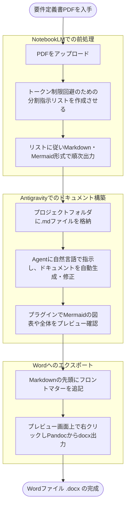

数日でこの記事の手法を大幅改良し、NotebookLMでの手動処理が完全に不要になったので別記事にしました。
新しく読む方は新しい記事をおすすめします。
→[【全自動に超進化】100ページ超のPDF要件定義書も余裕！Antigravityだけで一気に設計書に落とし込む！](https://qiita.com/hitotch/items/0e746edf66e123a7af81)

> 💡 **プレゼン資料を作りたい場合は以下の記事へ。**
> [実務レベルのパワポを1分で！Googleスライド/パワーポイント両対応のプレゼン自動生成エンジン「AI to Slides」](https://qiita.com/hitotch/items/47874e522d7bac9c2a80)

# AntigravityとNotebookLMで大規模PDF仕様書から大規模Wordドキュメントを作成するワークフロー

大規模な要件定義書や仕様書（数百ページのPDFなど）をAIに読み込ませ、そこからシステム設計書や提案書などの新規ドキュメントを自動生成させたい。

通常、これほど巨大なドキュメントはAIに一括処理させることはできません。しかし、ドキュメント特化型AI「NotebookLM」とAIネイティブIDE「Antigravity」を組み合わせることで、**巨大なPDFを効率よくMarkdownのプロジェクト群として再構築し、AIエージェントに仕様全体を把握させた上でドキュメントを作らせる**ことが可能です。

本記事では、「こんな大きなPDFドキュメントがあるんだけど、読み解いて、こんなドキュメントを作って」ができるようにします。おまけで、最終的な提出フォーマットであるWordファイル（.docx）を出力するまでの実践的なワークフローを解説します。



## ゴール

* 数百ページ規模のPDF仕様書を読み込み、Markdown形式でドキュメント化する。
* Antigravity内でプロジェクトとして統合管理し、AIエージェントにドキュメントの生成・修正を行わせる。
* 業務フローなどの図表をMermaid化する、または画像をシームレスに配置する。
* 作成したMarkdown（Mermaid図含む）を、Antigravity上からWord形式へ一発変換する。

## 前提

* Antigravityの基本的な操作ができる。
* NotebookLMの基本的な操作ができる。
* **Google AI Ultraの契約（推奨）**: 数十〜100ページ超のPDFを実務レベルで処理する場合、無料枠では出力トークンやコンテキストウィンドウの制限が厳しいため、有料枠の利用を推奨します。

今回のお題となるサンプルPDFとして、デジタル庁が公開している「[調達仕様書等の概要（2026年3月6日版）](https://www.digital.go.jp/assets/contents/node/basic_page/field_ref_resources/24d6cfea-9b50-4510-9365-64b29f9d5796/8edccaa3/20260306_procurement_public_notice_outline_02.pdf)」を使用します。（出典：デジタル庁ウェブサイト）

## 用語集

本記事で出てくる、ドキュメント管理の核となる2つの技術について簡単に触れておきます。

* **Markdown（マークダウン）**
  * **特徴**: プレーンテキストで手軽に見出しや箇条書きなどの構造を持たせることができる記述言語。
  * **必要な理由**: AIエージェントにとって最も読み書きがしやすく、プロジェクト内の複数ドキュメントを横断して理解・修正させるのに最適なフォーマットだからです。


* **Mermaid（マーメイド）**
  * **特徴**: テキストでコードを書くように、フローチャートやシーケンス図などの図表を生成できる記法・ツール。
  * **必要な理由**: 図を「画像」ではなく「テキスト（コード）」として扱えるため、AIに「この処理フローを図に追加して」と自然言語で指示するだけで図面の修正が完了し、保守性が飛躍的に高まるためです。

## 0. Antigravityと必須プラグインのインストール

まずはベースとなるIDE環境を整えます。

1. **Antigravityのインストール**
[Antigravityの公式サイト](https://antigravity.google/)から、お使いのOSに合ったインストーラーをダウンロードし、インストールを完了させてください。VS CodeベースのUIとなっているため、普段エディタを触っている方なら迷わず導入できます。
2. **必須プラグインの導入**
Antigravityを起動し、左側のメニューから「拡張機能（Extensions）」アイコンを開き、今回のワークフローで必要になる以下の2つのプラグインを検索してインストールします。
* **`Markdown Preview Mermaid Support` (作者: bierner)**
Antigravity標準のMarkdownプレビュー画面で、Mermaid形式のコードを美しい図表として直接レンダリングするために使用します。
* **`Markdown Preview Enhanced` (作者: shd101wyy)**
完成したMarkdownファイル（および生成されたMermaidの図表）を、一発でWordファイル（.docx）にエクスポートするために使用します。

## 1. NotebookLMでPDFを分割・Markdown化する

大規模なPDFをNotebookLMに読み込ませて一括でMarkdown化しようとすると、出力トークン数の上限に達して途中で切れてしまいます。そのため、AIに分割指示のリストを作らせてから順次処理します。

まずはNotebookLMにPDFをアップロードし、以下のプロンプトを実行します。

```text
内容を読み解いて、君がトークン制限に引っかからずMarkdownを出力できるよう、問題がない分量ごとに分割した「Markdown化指示のリスト」を作って。

```

出力されたリスト（例：「第1章〜第2章をMarkdownにする」「第3章を…」）に従って、順番にプロンプトを投げてMarkdownを出力させます。出力されたテキストは、Antigravityのプロジェクトフォルダ内に `.md` ファイルとして保存していきます。


中略


それぞれ出力の最後にあるコピーボタンを押して、Antigravityに作ったマークダウンファイルに貼り付けていく。


## 2. Antigravityでドキュメントを統合・編集する

Markdownファイル群をAntigravityのプロジェクトに配置したら、AntigravityのAgent機能を使ってドキュメントを構築していきます。

チャット欄から以下のように自然言語で指示を出します。

```text
この調達仕様書のディレクトリをベースに、ガバメントクラウド連携部分のAPI設計書を新規作成して。

```

Agentがプロジェクト全体を俯瞰し、矛盾のないドキュメントを自動生成・修正してくれます。人間は内容の精査とAgentへの指示出しに専念します。

ドキュメントは右クリックメニューからプレビューできます。


## 3. 図表の扱い（画像コピペとMermaid化）

PDF内の図表は、用途に合わせて2つの方法でAntigravityに取り込みます。

### 既存の図をそのまま使う場合

NotebookLMのPDFプレビュー画面で対象の図を右クリックしてコピーし、Antigravityのエディタ上に直接ペーストします。画像ファイルとして自動保存され、Markdown内にリンクが生成されます。

### 構造的な図をMermaid化する場合

業務フローやシーケンス図などは、保守性を高めるためにMermaid形式のコードに変換します。

1. NotebookLMで対象の図やテキストを指定し、「この業務フローをMermaid形式で書いて」と指示します。
2. 出力されたコードをAntigravity上のMarkdownに貼り付けます。
3. Antigravityの拡張機能から `Markdown Preview Mermaid Support` (作者: bierner) をインストールします。

これで、Antigravityのプレビュー画面にMermaid図がレンダリングされます。
図の修正が必要な場合は、Agentに「このMermaid図の認証シーケンスに、マイナンバーカードを用いたプロセスを追加して」と指示するだけで、コードを正確に書き換えてくれます。

![image.png](https://qiita-image-