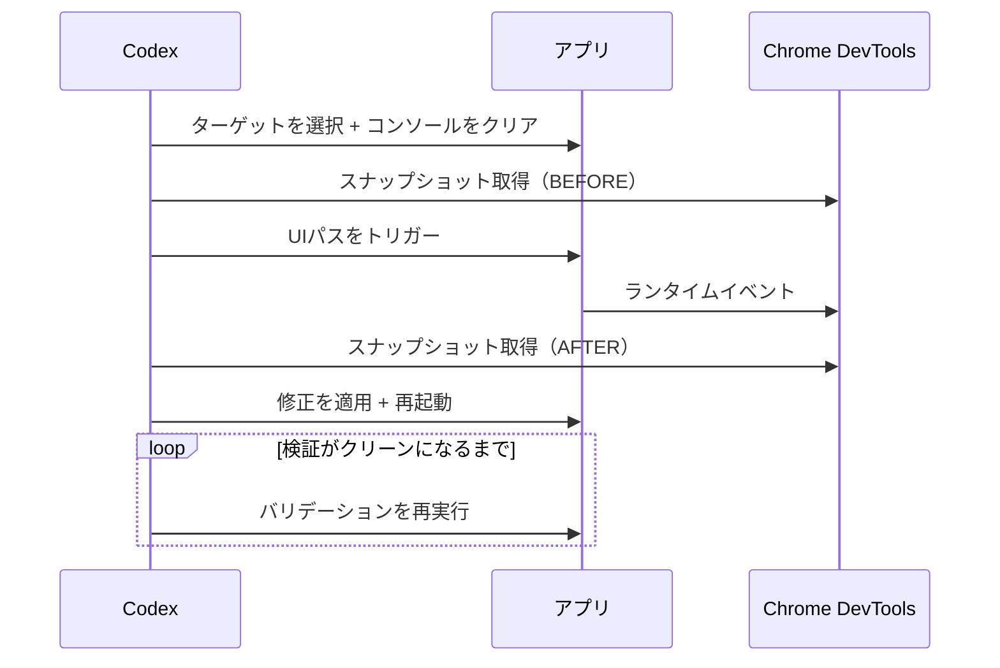
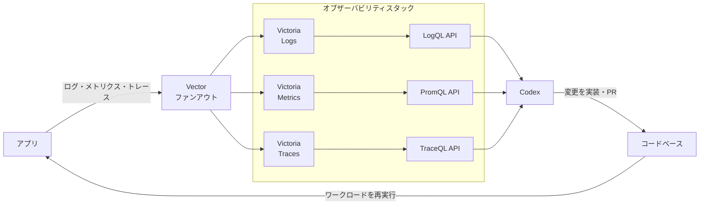

> 原文: [Harness engineering: leveraging Codex in an agent-first world | OpenAI](https://openai.com/index/harness-engineering/)
> 著者: Ryan Lopopolo（OpenAI テクニカルスタッフメンバー）
> 公開日: 2026年2月11日

OpenAIのエンジニアリングチームが、「人間はコードを1行も書かない」という縛りで5ヶ月間プロダクトを作り続けた。結果は100万行のコード、1,500件のPR、手作業比で約1/10の開発時間。しかも社内数百名が日常的に使うプロダクトとして動いている。

その過程で見えてきた方法論が「ハーネスエンジニアリング」だ。馬具（ハーネス）が馬の力を制御して有用な仕事に変えるように、エンジニアがAIエージェントの力を制御して信頼性の高いソフトウェアに変換する、というコンセプトである。

この記事では、原文の内容を7つのテーマに再構成して紹介する。

## この記事でわかること

- ハーネスエンジニアリングとは何か
- AIエージェントで開発を回すために、OpenAIのチームが実際にやったこと
- うまくいったこと、失敗したこと、まだわかっていないこと

---

## 全体サマリー

チーム構成は最初3人、のちに7人。AIコーディングエージェント Codex だけを使い、1人あたり1日平均3.5件のPRを出し続けた。

核心のメッセージはこれだ。

> 人間が舵を取り、エージェントが実行する（Humans steer, agents execute）。

エンジニアの仕事は「コードを書くこと」から「エージェントが正しく動ける環境を作ること」に変わった。この環境設計の方法論がハーネスエンジニアリングである。

---

## 1. エンジニアの役割が変わる

### 何が起きたか

空のgitリポジトリに、最初のコミットからCodexがコードを書いた。CI設定、フォーマットルール、アプリケーションフレームワーク、AGENTS.mdまで全部エージェント生成だ。

ただし、最初はうまくいかなかった。進捗が想定より遅い。原因はCodexの能力不足ではなく、環境の仕様が足りなかったことにある。エージェントに必要なツールや抽象化が欠けていて、高レベルの目標に向かって進めなかった。

ここから、エンジニアの仕事が変わった。

| 従来の開発 | ハーネスエンジニアリング |
|-----------|----------------------|
| コードを書く | 環境を設計する |
| バグを直接修正する | 「なぜエージェントが失敗したか」を分析して環境を改善する |
| レビューは人間がやる | エージェント間で処理させ、人間は例外だけ対応 |

何かが失敗したとき、「もっと頑張る」では解決しない。問いかけるのは常に「何の能力が欠けているのか、それをどう読みやすく・強制可能にするか」だった。

### ここがおもしろい

エンジニアはプロンプトでシステムとやり取りし、タスクを記述し、エージェントを走らせ、PRの作成を許可する。レビュー作業すらエージェント間で回す方向に進んでいる。実質的に「Ralph Wiggumループ」（Codexが自分のPRを自分でレビューし、満足するまで修正を繰り返す）で動いているという表現が原文にある。

つまり、コードを書く力よりも、「何を作るか」「なぜ作るか」を言語化する力の方が重要になる。コーディングスキルが不要になるわけではないが、重心が明確に移動している。

---

## 2. エージェントに「目」を与える

### 何が起きたか

コードの処理量が増えるにつれ、ボトルネックは人間のQA能力になった。エージェントがコードを大量に書いても、人間がその動作を確認しきれない。

そこで、エージェント自身がアプリの動作を「見て」検証できるようにした。

具体的には2つのアプローチがある。

**1. Chrome DevTools MCPによるUI操作**

アプリをgitワークツリーごとに起動可能にし、Chrome DevToolsプロトコルを接続した。Codexがスクリーンショットを撮り、DOMを読み、UIを操作して、バグの再現と修正の検証を自力で行う。



**2. フルオブザーバビリティスタック**

ログ・メトリクス・トレースを提供するローカルのオブザーバビリティスタックも構築した。CodexがLogQLやPromQLでクエリを実行し、「サービスの起動を800ms以内にする」「この4つのユーザージャーニーのスパンが2秒を超えないようにする」といったパフォーマンス要件を直接扱える。



各ワークツリーに対してエフェメラル（一時的）なスタックが立ち上がり、タスクが終わったら破棄される。エージェント同士が互いの環境を汚染しない設計だ。

### ここがおもしろい

単一のCodex実行が6時間以上かけて1つのタスクに取り組む、というケースが日常的にあるらしい。人間が寝ている間にエージェントが黙々と作業している。

人間の開発者がブラウザで動作確認し、ログを読み、パフォーマンスを計測するのと同じことを、エージェントにもやらせている。「コードを書く能力」だけでは足りなくて、「見る」「計測する」「検証する」能力をセットで渡す必要がある、というのが実感として伝わってくる。

---

## 3. 知識管理 ― 地図を渡せ、マニュアルではなく

### 何が起きたか

エージェントを大規模タスクに使う上で、コンテキスト管理が最大の課題の1つだった。チームが最初に学んだ教訓がこれだ。

> Codexには地図を渡せ、1,000ページの取扱説明書ではなく。

最初は「1つの大きなAGENTS.md」に全部書くアプローチを試した。予想通り失敗した。

- コンテキストウィンドウは有限なので、巨大な指示ファイルがタスクやコードを押し出してしまう
- 全部「重要」だと何も重要じゃなくなる
- モノリシックなマニュアルはすぐ古くなる
- 1つの塊だと鮮度やカバレッジの自動チェックが難しい

Confluenceの巨大なドキュメントが誰にも読まれなくなるのと同じ構造だ。

解決策は、AGENTS.mdを「目次」にして、構造化された`docs/`を正式な記録システムにすること。

```
AGENTS.md          ← 目次（約100行）
ARCHITECTURE.md    ← ドメインとパッケージ階層のトップレベルマップ
docs/
├── design-docs/   ← 設計ドキュメント（索引付き）
│   ├── index.md
│   ├── core-beliefs.md
│   └── ...
├── exec-plans/    ← 実行計画（アクティブ/完了/技術的負債）
│   ├── active/
│   ├── completed/
│   └── tech-debt-tracker.md
├── generated/     ← 自動生成ドキュメント
│   └── db-schema.md
├── product-specs/ ← プロダクト仕様
│   ├── index.md
│   └── ...
├── references/    ← 外部ライブラリのLLM向けドキュメント
│   ├── design-system-reference-llms.txt
│   └── ...
├── DESIGN.md
├── FRONTEND.md
├── PRODUCT_SENSE.md
├── QUALITY_SCORE.md
├── RELIABILITY.md
└── SECURITY.md
```

「段階的開示（progressive disclosure）」のパターンで、エージェントは短いAGENTS.md（約100行）から始まり、必要に応じてより深いドキュメントをたどる。

### ここがおもしろい

計画をファーストクラスのアーティファクトとして扱っている点が興味深い。小さな変更にはエフェメラルな軽量計画を、複雑な作業には進捗と意思決定ログを含む実行計画をリポジトリにチェックインする。アクティブな計画、完了した計画、技術的負債がすべてバージョン管理されている。

ドキュメントの鮮度を保つ仕組みもある。専用のリンターとCIジョブが知識ベースの整合性を検証し、定期的に「ドキュメント整備（doc-gardening）」エージェントが実際のコードと乖離したドキュメントをスキャンして修正PRを自動作成する。ドキュメントをコードの一部として扱い、陳腐化を自動検出・修正するわけだ。

---

## 4. エージェントの可読性を最優先にする

### 何が起きたか

リポジトリが完全にエージェント生成なので、まずCodexの可読性のために最適化されている。

ポイントは、エージェントの観点からは「実行中にコンテキスト内でアクセスできないものは存在しない」ということ。Google Docs、Slackスレッド、人の頭の中にある知識――これらはエージェントから見えない。

```mermaid
graph TB
    subgraph visible["エージェントが見える知識"]
        KNOWLEDGE["リポジトリ内のコード<br/>Markdown・スキーマ・実行計画"]
    end

    ENCODE["コードベースにMarkdownとして<br/>エンコードする"] -->|取り込み| visible

    subgraph invisi