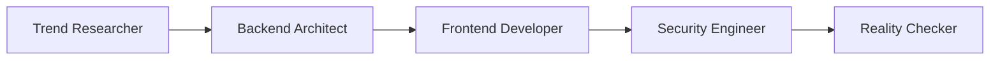

## agency-agentsとは何か

[agency-agents](https://github.com/msitarzewski/agency-agents)は、144個のAIエージェント定義をMarkdownファイルで提供するOSSです。Claude Code、Copilot、Cursor、Gemini CLIなど10以上のツールに対応しています。

「開発者として機能して」のような汎用プロンプトとの違いは、専門領域ごとの知識体系が構造化されている点です。Frontend Developerエージェントなら、Core Web Vitalsの最適化手法やアクセシビリティ基準まで含みます。汎用プロンプトでは抜け落ちがちな観点を補完します。

2025年10月にリポジトリが作成されました。2026年3月14日時点でスター数40,889、フォーク数6,172です。コントリビューターは36名以上に成長しています。

## インストール

### 基本手順

リポジトリをクローンし、インストールスクリプトを実行します。

```bash
git clone https://github.com/msitarzewski/agency-agents.git
cd agency-agents
```

### Claude Code向け

`--tool claude-code` を指定すると、`~/.claude/agents/` にエージェントファイルがコピーされます。

```bash
./scripts/install.sh --tool claude-code --no-interactive
```

### Copilot / Cursor向け

Copilotの場合は `~/.github/agents/` と `~/.copilot/agents/` に配置されます。

```bash
./scripts/install.sh --tool copilot --no-interactive
```

Cursorの場合は `.cursor/rules/` にルールファイルが配置されます。

```bash
./scripts/install.sh --tool cursor --no-interactive
```

### 手動コピー

特定カテゴリだけ導入したい場合は、手動でコピーできます。

```bash
cp agents/engineering/*.md ~/.claude/agents/
```

:::note info
全カテゴリを一括導入するとコンテキストの選択肢が増えすぎる場合があります。まずは自分の業務に近いカテゴリから始めることをおすすめします。
:::

### 対応ツール一覧

install.shは以下のツールに対応しています。

| ツール | インストール先 |
|--------|--------------|
| claude-code | `~/.claude/agents/` |
| copilot | `~/.github/agents/` , `~/.copilot/agents/` |
| cursor | `.cursor/rules/` |
| gemini-cli | `~/.gemini/extensions/agency-agents/` |
| aider | カレントディレクトリに `CONVENTIONS.md` |
| windsurf | カレントディレクトリに `.windsurfrules` |

## エージェントの選び方

### カテゴリ一覧

144個のエージェントは12のカテゴリに分類されています。

| カテゴリ | エージェント数 | 代表例 |
|---------|:---:|-------|
| Marketing | 26 | Growth Hacker, Content Creator |
| Engineering | 23 | Frontend Developer, Backend Architect |
| Specialized | 23 | MCP Builder, Compliance Auditor |
| Design | 8 | UX Researcher, Brand Guardian |
| Testing | 8 | API Tester, Reality Checker |
| Sales | 8 | Outbound Strategist |
| Paid Media | 7 | PPC Strategist |
| Project Management | 6 | Sprint Prioritizer |
| Support | 6 | Support Responder |
| Spatial Computing | 6 | XR Interface Architect |
| Game Development | 複数 | Unity / Unreal / Godot / Blender |
| Product | 4 | Trend Researcher |

### おすすめ3エージェント

開発者が最初に試すなら、以下の3つをおすすめします。

**1. Frontend Developer**

React、Vue、Angularに対応し、パフォーマンス最適化の観点を含みます。LCP・CLS・INPといったCore Web Vitalsの改善提案まで踏み込んだ回答を返します。

**2. Security Engineer**

セキュリティ観点のレビューを補完します。依存パッケージの脆弱性チェック、入力バリデーション、認証フローの検証など、開発中に見落としやすいポイントを指摘します。

**3. Reality Checker**

品質ゲートとして機能します。各マイルストーンで「本当に要件を満たしているか」を検証し、見落としや過剰な実装を指摘します。PRレビュー前のセルフチェックに使えます。

## 実際に使ってみる

### Claude Codeでのエージェント指定

インストール後、Claude Codeのプロンプト入力時に `/agents` と入力すると、利用可能なエージェント一覧が表示されます。使いたいエージェントを選択するだけで、そのセッションに専門知識が適用されます。

### 使用例: Reactコンポーネントのパフォーマンス改善

Frontend Developerエージェントに「商品一覧コンポーネントの描画が遅い。改善したい」と依頼した場合の出力の違いを見てみます。

**汎用プロンプトの場合:**

```text
- React.memoでメモ化してください
- useCallbackを使ってください
- 仮想スクロールを検討してください
```

一般的なアドバイスが並びますが、具体性に欠けます。

**Frontend Developerエージェントの場合:**

```text
1. プロファイリング
   - React DevTools Profilerで再レンダリング原因を特定
   - Lighthouse でLCP/CLSを計測（現状値を記録）

2. レンダリング最適化
   - 商品カードをReact.memoでラップ（propsの比較関数を指定）
   - フィルタ/ソート処理をuseMemoで囲む（依存配列を明示）

3. データ取得
   - Intersection Observer APIで画像の遅延読み込みを実装
   - 50件以上の場合はreact-windowで仮想スクロール化

4. アクセシビリティ
   - 商品カードにaria-labelを追加
   - キーボードナビゲーションの動作確認

5. 検証
   - Lighthouse Performance スコアの改善値を記録
   - Core Web Vitals（LCP < 2.5s, CLS < 0.1）を満たすか確認
```

エージェント定義に含まれる専門知識が反映され、計測→改善→検証のサイクルが具体的に提示されます。アクセシビリティの観点も含まれている点が大きな違いです。

:::note info
出力品質はベースモデルの能力にも依存します。エージェント定義は「何を考慮すべきか」のガイドラインであり、モデルの知識を引き出すためのフレームワークとして機能します。
:::

## カスタマイズ

### Markdownファイルの直接編集

エージェント定義はMarkdownファイルなので、テキストエディタで自由に編集できます。

たとえば、Frontend Developerエージェントにプロジェクト固有のルールを追加する場合は以下のようにします。

```markdown
## プロジェクト固有ルール

- UIフレームワーク: shadcn/ui を使用
- スタイリング: Tailwind CSS v4
- テスト: Vitest + Testing Library
- 状態管理: Zustand（Reduxは使わない）
```

この内容をエージェントファイルの末尾に追記します。

### 自作エージェントの作成

リポジトリのCONTRIBUTING.mdにテンプレートが用意されています。自社の業務に特化したエージェントを作成する流れは以下のとおりです。

1. 既存エージェントファイルをコピーしてベースにする
2. 役割（Role）と専門領域を書き換える
3. チェックリストや判断基準をプロジェクトに合わせて調整する
4. `~/.claude/agents/` に配置して動作を確認する

:::note warn
カスタマイズしたファイルは `git pull` で上書きされる可能性があります。変更したエージェントは別ディレクトリにコピーして管理することをおすすめします。
:::

## マルチエージェントワークフロー

### スタートアップMVPの例

リポジトリの `examples/workflow-startup-mvp.md` には、複数エージェントを組み合わせたワークフローが紹介されています。



このワークフローでは、以下の流れでMVP開発を進めます。

1. **Trend Researcher** が市場調査と技術選定を行う
2. **Backend Architect** がAPI設計とDB設計を担当する
3. **Frontend Developer** がUI実装を進める
4. **Security Engineer** がセキュリティレビューを実施する
5. **Reality Checker** が全体の整合性と品質を検証する

各エージェントの出力を次のエージェントへの入力として渡すことで、専門性の高いレビューチェーンを構築できます。

:::note info
現時点ではエージェント間の自動連携機能はありません。手動でエージェントを切り替えながら進める運用です。将来的にオーケストレーション機能が追加される可能性はあります。
:::

### 組み合わせの考え方

マルチエージェントワークフローを設計するときは、「作る人」と「チェックする人」を分けることが基本です。Frontend DeveloperとReality Checkerのように、