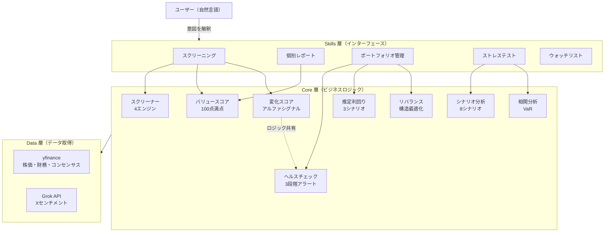

> **📘 この記事はシリーズ第1回です**
> [Vol.2: Claude Code Skills で「使うほど賢くなる」投資分析AIを作った話](https://qiita.com/okikusan-public/items/405949f83e8a39a49566)
> [Vol.3: Claude Code Skills × 投資分析 Vol.3 — 処方箋エンジン・逆張り検出・銘柄クラスタリング](https://qiita.com/okikusan-public/items/1765d6afb8c548f019f1)

## なぜ投資分析の自動化が必要だったのか

Claude Code Skills と yfinance を使って、株式スクリーニングからポートフォリオ管理まで投資分析を自動化するシステムを作りました。Python × バイブコーディングで、個人投資家の投資ワークフロー全体を5つのスキルでカバーしています。

個人投資家として日本株や米国株を触っていると、「割安な銘柄を探す」という作業が地味に面倒です。証券会社のスクリーナーでフィルタして、出てきた銘柄を一つずつ確認して、ポートフォリオ全体のバランスを考えて――この繰り返しを何とかしたいと思っていました。

ChatGPT や Claude の Web 版に「割安株を探して」と頼めば、ある程度のことはやってくれます。ただ、投資判断のワークフローに組み込もうとすると、4つの壁にぶつかりました。

- **レスポンスとソースの不安定さ** ── Web検索で1銘柄数十秒、参照記事も毎回変わり定点観測に使えない
- **コンテキストの消失** ── 先週のスクリーニング結果も売買根拠も、次のセッションでは忘れ去られている
- **再現性の欠如** ── セッションごとにPERの閾値やスコアリングが微妙に変わる。再現性のない仕組みで投資判断は積み重ねられない
- **処理量の壁** ── 10銘柄のヘルスチェックを頼んでも3〜4銘柄で出力が途切れる。全銘柄を漏れなくチェックすることに意味があるのに

Claude Code の **Skills** はこの4つの問題をすべて解決しました。

- レスポンスと情報ソース → ロジックを Python スクリプトに固定し、yfinance API で統一的にデータを取得。毎回同じソースから同じ方法でデータを取る。
- コンテキスト消失 → ポートフォリオは CSV、閾値は YAML、設計判断は CLAUDE.md に永続化。セッションをまたいでも文脈が引き継がれる。
- 再現性 → スクリーニングロジックがスクリプトとして固定されているので、同じ入力に対して同じ処理が走る。
- 処理量 → LLM の出力トークンではなく Python プロセスとして実行されるため、制約なし。東証の全上場銘柄（プライム・スタンダード・グロース合わせて約1,000〜2,000銘柄）を一括スクリーニングしても数十秒で完了。

最初はスクリーニングだけのつもりでした。それが「レポートも欲しい」「ポートフォリオの管理も」「ヘルスチェックも」「ストレステストも」と膨らんでいき、気がつけば5つのスキルからなるシステムになっていました。

本記事では、このシステムのアプローチと設計思想、技術選定の判断を中心に紹介します。

## Claude Code Skills とは

Claude Code にはスラッシュコマンドを自作できる **Skills** という仕組みがあります。スキル定義ファイル（SKILL.md）にスキルの名前・説明・引数ルール・許可するツールを書いておくと、Claude が自然言語の入力を解釈してスクリプトを実行してくれます。

ポイントは、**ユーザーは自然言語で話しかけるだけでいい** ということです。スラッシュコマンドすら打つ必要はありません。Claude はユーザーの意図を理解して、適切なスキルを自動で選択し実行してくれます。

例えば「日本株で高配当のやつを探して」と普通に話しかけると、Claude が文脈からスクリーニングスキルを判断し、地域やプリセットを適切に設定してスクリプトを実行する。「ポートフォリオの調子はどう？」と聞けばヘルスチェックが走る。「トヨタのレポートを見せて」と言えば個別銘柄レポートが生成される。

つまり Skills は「コマンドラインツール」ではなく、**Claude が状況に応じて使い分ける道具箱** です。ユーザーはコマンド体系を覚える必要がなく、投資の文脈で自然に会話するだけで、裏側で適切なスクリプトが動く。この「自然言語 → スキル選択 → スクリプト実行 → 結果の解釈」という一連の流れは、まさにバイブコーディングの体験そのものであり、従来の CLI ツールとの決定的な違いです。

もう一つ重要なのが **再現性** です。ロジックが Python スクリプトとして固定されているため、今日と先月のスクリーニングが同じ基準で実行されていることが保証されます。

## 投資分析を自動化する5つの Skills

今回作ったスキルは5つです。

| # | スキル | 役割 |
|:--|:------|:-----|
| 1 | スクリーニング | 割安株の検索（4エンジン、7プリセット、yfinance EquityQuery の60+取引所に対応） |
| 2 | 個別レポート | ティッカー指定で財務分析レポートを生成 |
| 3 | ポートフォリオ管理 | 売買記録・損益表示・構造分析・ヘルスチェック・推定利回り・リバランス提案 |
| 4 | ストレステスト | 8シナリオでポートフォリオの弱点を検証（集中度・相関・VaR） |
| 5 | ウォッチリスト | 気になる銘柄のリスト管理 |

「スクリーニングで銘柄を見つける → レポートで詳細確認 → ウォッチリストに登録 → ポートフォリオで売買記録 → ヘルスチェックで継続監視 → ストレステストでリスク把握」という投資ワークフローの全体をカバーしています。

## システム設計：3層アーキテクチャとデータ永続化

### 3層に分けた理由

システムは **Skills 層（インターフェース）→ Core 層（ビジネスロジック）→ Data 層（データ取得）** の3層に分離しています。

- **Skills 層** はインターフェースのみ。引数を解釈してスクリプトを呼び出すだけの薄いレイヤーです。
- **Core 層** にビジネスロジックを集約。スクリーニングエンジン、スコアリング、ヘルスチェック、シナリオ分析など17モジュールを配置し、5つのスキル間でロジックを共有しています。例えば「変化スコア」の計算ロジックは、スクリーニング（アルファプリセット）とヘルスチェックの両方から呼ばれています。
- **Data 層** はデータ取得を一元化。yfinance を直接呼ばず、必ずラッパー経由にすることで、キャッシュ（24時間TTL）・レート制限（API間1秒ディレイ）・異常値サニタイズ（配当利回り>15%や PBR<0.1 等の除外）を統一しています。

この分離により、「新しいスキルを追加する」ときにはCoreのロジックを再利用でき、「データソースを変更する」ときにはData層だけを差し替えればよい設計になっています。

### データの永続化戦略

Web版の「コンテキストが消える」問題に対して、3種類のデータを適切な形式で永続化しています。

| データ | 形式 | 理由 |
|:------|:-----|:-----|
| ポートフォリオ（保有銘柄・売買履歴） | CSV | 人間が直接編集・確認しやすい |
| スクリーニング閾値・取引所定義 | YAML | 構造化された設定を可読性高く管理 |
| 設計判断・アーキテクチャ | CLAUDE.md | Claude Code が新しいセッションでもプロジェクト文脈を理解できる |
| 銘柄データキャッシュ | JSON | APIレスポンスをそのまま保存（24時間TTL） |

特に CLAUDE.md は重要で、スクリーニングエンジンの動作仕様、ETF判定のルール、データ取得パターンまで詳細に記述しています。これにより、新しいセッションで Claude Code を開いても、プロジェクトの文脈を理解した状態で開発を続けられます。

## 技術選定とロジック

### データソース：yfinance

このシステムの土台は **yfinance**（Yahoo Finance の Python ライブラリ）です。無料かつ API キー不要で、個人投資家が必要とするデータのほとんどを取得できます。

| データ種別 | 取得できるもの | 活用先 |
|:----------|:-------------|:------|
| 株価・バリュエーション | PER（株価収益率）, PBR（株価純資産倍率）, 配当利回り, 時価総額, 52週高値/安値 | スクリーニング、レポート |
| 財務諸表 | 損益計算書, 貸借対照表, キャッシュフロー計算書 | 変化スコア（アルファ）、ヘルスチェック |
| アナリストコンセンサス | 目標株価（High/Mean/Low）, レーティング, アナリスト数 | 推定利回り（3シナリオ） |
| 価格ヒストリー | 日次/週次/月次 OHLCV（最大数十年分） | テクニカル分析、VaR、相関分析 |
| ニュース | 公式メディアのニュース記事（タイトル・URL・要約） | 推定利回りの定性情報 |