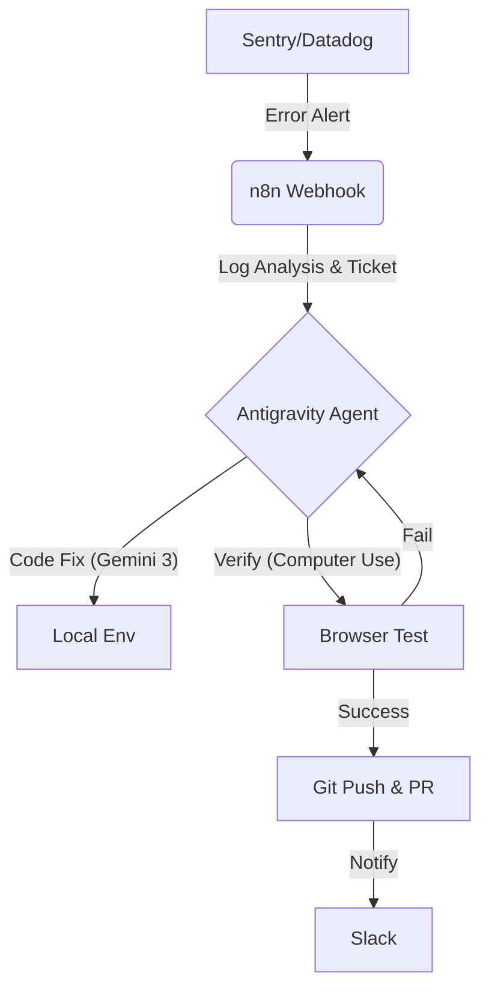

## はじめに：プロにとって「Vibe Coding」は恐怖でしかない

2025年11月のリリース以来、Antigravity（アンチグラビティ）界隈では「Vibe Coding（バイブコーディング）」という言葉が流行しています。
「コードが読めなくても、AIとノリで対話していればアプリができる」
これは素晴らしい民主化ですが、我々プロのエンジニア、特に経営も担う人間からすると、 **「保守不可能なスパゲッティコードが量産される未来」** への恐怖しかありません。

私は現在、自社の開発フローにおいて、Antigravityを「コードを書かせるツール」としてではなく、**「自律的にバグを修正し、品質を担保させるツール」** として運用しています。

本記事では、**Antigravityの真価である「Computer Use（ブラウザ操作）」と「n8n」を連携させ、寝ている間にシステムが勝手に自己修復するDevOpsアーキテクチャ** を解説します。

## なぜ Cursor ではなく Antigravity なのか？

AIエディタとして先行する Cursor や Windsurf と、Antigravity の決定的な違い。
それは **「ブラウザを操作できるか（Computer Use）」** の一点に尽きます。

* **Cursor:** コードを書くのが得意。「実装」を加速する。
* **Antigravity:** ブラウザで実行結果を見て、クリックして検証できる。「E2Eテストと修正」を完結できる。

この特性を活かせば、人間が介在せずに **「エラー検知 → コード修正 → ブラウザで動作確認 → デプロイ」** までを自動化できます。

## アーキテクチャ：自律修復パイプライン

私が構築した「Shadow DevOps」の全体像です。n8nを司令塔として、監視ツールとAIエージェントを接続します。



1. **監視:** Sentryが本番環境のエラーを検知。
2. **指令:** n8nがエラーログを整形し、AntigravityのエージェントAPIを叩く。
3. **修正:** Gemini 3.1 Proがコードを修正。
4. **検証:** **Gemini 2.5 Computer Useがローカルサーバーを立ち上げ、ブラウザで該当箇所をクリックして直ったか確認する。**
5. **報告:** 直っていればPRを作成し、Slackに「直しておきました」と通知。


## 実装ステップ 1：n8nで「指令書」を作る

エラーログをそのまま投げてもAIは混乱します。n8nを使って「構造化された指令書（Prompt）」に変換します。

**n8nの構成:**

* **Trigger:** Sentry (Webhook)
* **Code Node:** エラーのスタックトレースから「関連ファイル」を推測。
* **HTTP Request:** Antigravity Agent APIへPOST。

**指令プロンプトの例:**

```text
【任務: バグ修正】
以下のエラーが発生しました。
Error: Unhandled Runtime Error (Hydration failed)
File: src/components/Header.tsx

【手順】
1. Planning: エラー原因を特定し、修正計画を立ててください。
2. Fixing: コードを修正してください。
3. Verification: ブラウザを開き、ヘッダー要素が表示されるか目視確認（screenshot判定）してください。
4. Reporting: 修正内容を簡潔にまとめ、PRを作成してください。

【環境トラブル対応】
もし "Dev Container Error 1006" に遭遇した場合は、`.devcontainer/devcontainer.json` に `"privileged": true` を追加し、コンテナをリビルドしてください。

```

## 実装ステップ 2：Antigravity側の「Planning」ルール

Antigravityが「Vibe（ノリ）」で適当な修正をしないよう、プロジェクトルートに `.antigravity/rules` を配置し、厳格なルールを課します。

```markdown
# .antigravity/rules

## Quality Control
- コードを修正する際は、必ず既存の型定義（TypeScript）を遵守すること。
- `any` 型の使用は禁止。
- 修正後は必ず `npm run type-check` を通過させること。

## UI & Assets (Nano Banana)
- UI変更に伴いアイコン等の画像リソースが必要な場合は、プレースホルダーを使わず、統合された画像生成モデル「Nano Banana」を呼び出して適切なアセットを生成・配置すること。

## Computer Use Guidelines
- ブラウザでの検証時、修正箇所が表示されるまで `waitForSelector` 相当の待機を行うこと。
- エラーが解消されない場合、最大3回まで試行錯誤（Retry）を許可する。

```

これにより、AIエージェントは「とりあえず動くコード」ではなく「プロジェクトの規約を守ったコード」を書くようになります。

## 実際の挙動（デモ）


この一連の流れにおいて、私は**1行もコードを書いていませんし、エディタすら開いていません。**
これが、2026年のエンジニアリングです。

## 技術的ハマりポイントと解決策

実装にあたり、いくつか壁がありました。

### 1. Dev Container エラー 1006 問題

AntigravityのエージェントがDocker環境を操作する際、権限周りでエラーが出ることがあります。
**解決策:** 前述の通り、プロンプトに「特権モード（privileged）」の付与を指示することで、エージェントが自律的に設定ファイルを書き換えて解決します。手動対応は不要です。

### 2. ブラウザ検証の無限ループ

AIが「直った」と誤認して無限に修正を続けるケースがありました。
**解決策:** n8n側で「同一エラーの再通知は1時間ミュートする」ロジックを組み込み、暴走を防いでいます。

---

## まとめ：エンジニアは「書く」から「統制する」へ

Antigravityを単なる「すごい補完機能付きエディタ」として使うのはもったいないです。
n8nと組み合わせ、Computer Use機能を活用することで、それは **「24時間働く優秀な保守チーム」** になります。

PoC（概念実証）のスピード感と、本番運用の品質。
この相反する2つを両立させる鍵は、「Vibe」ではなく、冷徹なまでの **「システム化（自動化）」** にあります。

この記事が、AIエージェントの「飼い慣らし方」に悩むエンジニアの一助になれば幸いです。


---


:::note
**この記事を書いた人✏️@YushiYamamoto** 
株式会社プロドウガ CEO / AIアーキテクト
Next.js / TypeScript / n8nを活用した自律型アーキテクチャ設計を専門としています。
日々の自動化の検証結果や、ビジネス側の視点（ROI等）に関するより深い考察は、以下の公式サイトおよびnoteで発信しています。
:::

https://itprodx.com

https://note.com/prodouga
