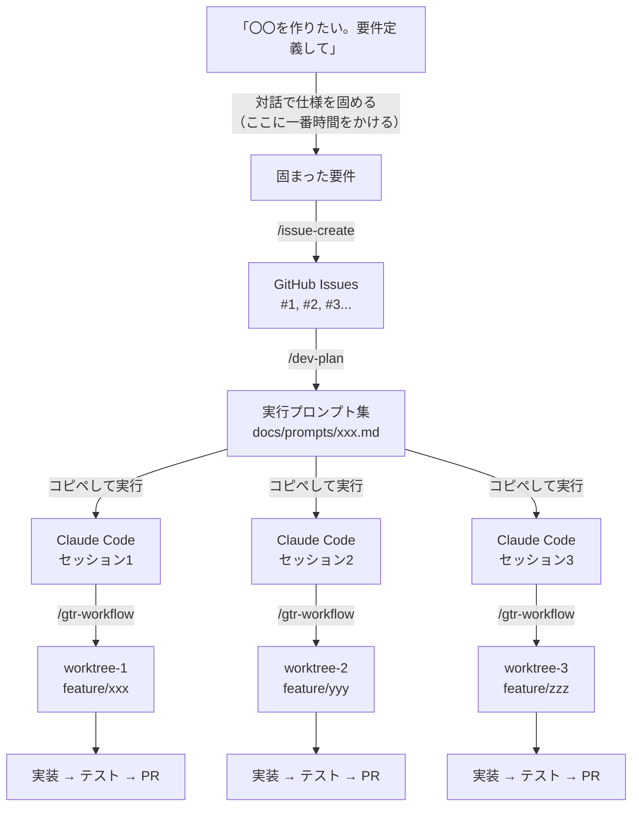
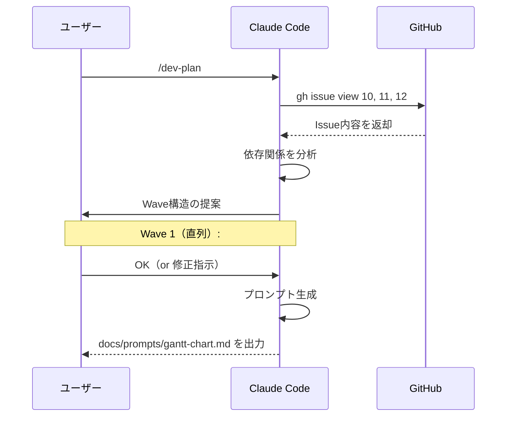

## はじめに

「Claude Codeで開発してるけど、1つずつ順番にIssueを片付けるのが遅い…」

そんな悩みを解決するために、**Issue起票から並列開発、PR作成までを一気通貫で自動化するワークフロー**を構築しました。

具体的には、Claude Codeの**Skills**を組み合わせて、以下を実現しています：

1. **要件定義** — Claude Codeに「〇〇を作りたい。要件定義して」と伝え、対話しながら仕様を固める
2. **`/issue-create`** — 固まった要件からGitHub Issueを構造化して起票
3. **`/dev-plan`** — Issue群から依存関係を分析し、並列開発用の実行プロンプトを自動生成
4. **`/gtr-workflow`** — git worktreeで隔離された環境を作り、複数のClaude Codeセッションで同時に実装

**このワークフローで一番大事なのは、実は最初の「要件定義」です。**

実装・テスト・PR作成を自動化したことで、人間が本当に時間をかけるべき「何を作るか」の部分に集中できるようになりました。要件が曖昧なままIssueを作っても、AIは曖昧なまま実装してしまいます。逆に、要件さえしっかり固まっていれば、あとはプロンプトをコピペするだけで実装が完了します。

**実行を自動化することで、思考に集中できる。** これがこのワークフロー最大のメリットです。

この記事では、各スキルの仕組みと実際の使い方を、プロダクト開発での実例とともに紹介します。

### 対象読者

- Claude Codeを日常的に使っている開発者
- 複数機能を効率よく並列開発したい人
- Claude CodeのSkills機能に興味がある人

### この記事で得られること

- Issue駆動 × AI並列開発の具体的なワークフロー設計
- Claude Code Skillsの実践的な活用パターン
- git worktreeを活用した安全な並列開発の仕組み

## 目次

| 章 | 内容 |
| --- | --- |
| 1 | 全体像 — 3つのスキルが繋がるパイプライン |
| 2 | `/issue-create` — 雑メモからIssueを構造化 |
| 3 | `/dev-plan` — Issue群をWave構造に分解 |
| 4 | `/gtr-workflow` — worktreeで並列開発 |
| 5 | 実例 — 10個のIssueを4Waveで並列開発した話 |
| 6 | 動作確認 — worktree環境での開発サーバー起動 |
| 7 | Skills の作り方 |
| 8 | まとめ |

## 1. 全体像 — 3つのスキルが繋がるパイプライン

まずワークフロー全体の流れです。



**ポイントは「人間がやるのはプロンプトのコピペだけ」** ということです。

Issue起票の構造化も、依存関係の分析も、ブランチ作成も、実装も、PR作成も、すべてClaude Codeが自律的に実行します。人間は各ステップの出力を確認して、次のステップに進む判断をするだけです。

## 2. 要件定義 → `/issue-create` でIssueを構造化

### まず要件定義に時間をかける

実際の開発では、いきなり `/issue-create` を使うことは少ないです。まずClaude Codeに「〇〇を作りたい。要件定義して」と伝え、対話しながら仕様を固めます。

```
> タスクのガントチャート表示機能を作りたい。要件定義して。
```

Claude Codeが質問してくるので、それに答えながら要件を詰めていきます。「表示単位は日/週/月？」「ドラッグで期間変更できる？」「依存関係の矢印は表示する？」——この対話が一番重要で、一番時間をかけるところです。

要件が固まったら `/issue-create` でIssueにします。

### `/issue-create` は何をするスキルか

固まった要件をGitHub Issueとして構造化して起票してくれます。

### 使い方

Claude Codeで `/issue-create` と打ち、要件を伝えるだけです。

```
> /issue-create

タスク一覧画面に優先度カラムを追加したい。
あと操作列のUIがごちゃごちゃしてるから整理したい。
```

これだけで、以下のような構造化されたIssueが作成されます：

```markdown
## 背景・目的
タスク一覧画面の優先度表示が不足しており、操作列のUIに改善の余地がある。

## 要件
### やること
- タスク一覧テーブルに優先度カラムを追加
- 操作列のUI整理（ボタン配置の見直し）

### やらないこと
- 優先度の自動算出ロジックの実装

## 完了条件（DoD）
- [ ] 優先度カラムがタスク一覧テーブルに表示される
- [ ] 操作列のボタンが整理され、主要操作が明確になる
- [ ] 既存のE2Eテストが通る

## 未確定事項・要確認事項
- 優先度の選択肢（High/Medium/Low の3段階 or 数値指定か）
```

### 設計のこだわり

このスキルの最大の特徴は**「推測しない」** ことです。

メモに書かれていない仕様は絶対に推測せず、不明点があれば `AskUserQuestion` で質問します。「たぶんこうだろう」でIssueを作ると、実装時に手戻りが発生するからです。

## 3. `/dev-plan` — Issue群をWave構造に分解

### 何をするスキルか

複数のIssue番号を渡すと、**依存関係を分析してWave（実行順序）構造を決定**し、各IssueをClaude Codeで実行可能なプロンプトとして出力します。

### 使い方

```
> /dev-plan #10-12
```

すると以下の流れで対話的に計画が作られます：



### Wave構造の判断基準

スキルは以下のルールで依存関係を判断します：

| パターン | 判断 |
| --- | --- |
| DBスキーマ変更を含む | 最初のWaveに配置 |
| UI基盤（ナビ、レイアウト）の変更 | 早いWaveに配置 |
| 独立した画面・機能 | 並列可能 → 同じWaveに配置 |
| 明示的な依存（「〜の上に追加」） | 後のWaveに配置 |

### 出力例

実際に生成されるプロンプトファイルはこんな形式です：

````markdown
# ガントチャート機能 — Claude Code 実行プロンプト

## 実行順序

```
Wave 1（直列）: #10 → #11 → #12
```

各WaveのPRがdevelopにマージ済みであること。

---

## Wave 1（直列）

### #10 タスクに開始日・終了日フィールドを追加

```
/gtr-workflow で develop ブランチから feature/task-date-fields
ブランチを作成して作業して。

まず gh issue view 10 でIssue内容を読んで。
既存の prisma/schema/models/Task.prisma を確認して。

Issue #10 の完了条件（DoD）を全て満たすように実装して。
確認できたら /pull-request スキルを使って develop に向けてPRを作成して。
コミットメッセージに "closes #10" を含めて。
```

### #11 ガントチャートUIコンポーネント

```
/gtr-workflow で develop ブランチから feature/gantt-chart-ui
ブランチを作成して作業して。
...
```
````

**このプロンプトをClaude Codeにコピペするだけで、Issue読み込み → 実装 → テスト → PR作成が全自動で走ります。**

### 補足ドキュメントの自動検出

Issue本文に `docs/SPEC-xxx.md` への参照や、既存コードへの言及がある場合、プロンプトに自動的に参照指示が追加されます。

```
補足として docs/SPEC-gantt-chart.md を参照して。
既存の src/app/projects/[id]/tasks/ のコードを参考にして。
```

これにより、Claude Codeが必要なコンテキストを漏れなく取得できます。

## 4. `/gtr-workflow` — worktreeで並列開発

### なぜ git worktree なのか

通常のgitブランチ運用では、1つのディレクトリに1つのブランチしかチェックアウトできません。

複数のClaude Codeセッションが同じディレクトリで同時に作業すると、**ファイルの競合が発生**します。

git worktreeを使うと、**ブランチごとに独立したディレクトリ**を作成できます。

```
~/dev/myapp/                          ← 本体 (develop)
~/dev/myapp-worktrees/featu