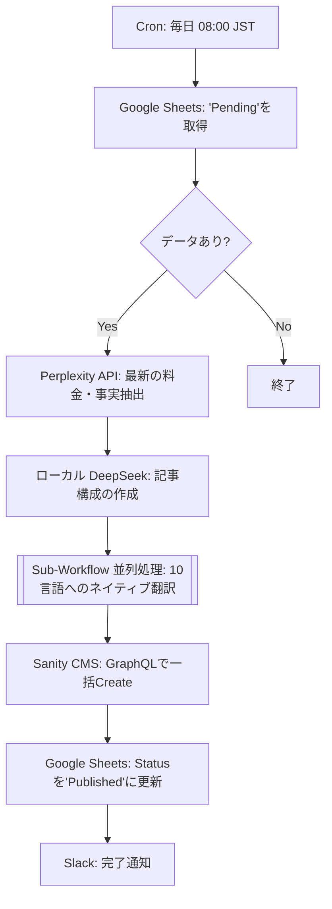

## 「魂の欠如」からの逆襲

前回の記事[『n8nで記事自動生成パイプラインを作ったら、1週間で40本→0本になった話』](https://qiita.com/YushiYamamoto/items/c937af562c4d40c24e42)では、多くの反響をいただいた。

https://qiita.com/YushiYamamoto/items/c937af562c4d40c24e42


AIに完全丸投げした記事には「人間の体験（魂）」がなく、読む価値がゼロであること。そして、手動で人間の泥臭い体験談を追記するフローに戻した結果、生産性は週40本から週3本に激減したこと。

しかし、私はエンジニアであり、経営者だ。
「japanlifestart.com」という日本在住の外国人向けライフサポートメディアを運営し、彼らのペインを解決しながら、同時に**アフィリエイト収益（ROI）** を最大化しなければならない。

週3本の手動更新で「魂」は守れた。だが、ビジネスとしての「スケール」は死んだ。

**「人間の体験（魂）を担保したまま、システムを10言語で限界までスケールさせることは本当に不可能なのか？」**

その問いへの、現時点での私の「完全解答」が完成した。


現在、私のメディアでは毎日朝8:00、私がコーヒーを飲んでいる間に、人間の血が通った高品質なアフィリエイト記事が10言語に翻訳され、Sanity CMSへ自動で公開され続けている。

今回は、「ポエム」ではなく、エンタープライズの商用環境で実弾（利益）を撃ち出すアーキテクチャの全容を公開する。

---

## 突破口：「魂」をJSONの必須パラメータにする

前回の敗因は「AIにゼロから記事を書かせたこと」だ。
だから今回は、AIの役割を **「ライター」から「優秀な編集者・翻訳家」へ** と最適化した。

記事の核となる「体験」や「一次情報」は、人間（私）が書く。
しかし、それをブログ記事として清書するのではなく、スプレッドシートに **「JSONライクなパラメータ」** として放り込むだけにしたのだ。

### データソース（Google Sheets）の構造
私が用意したカラムは以下の通りだ。私がやることは、スマホから「生々しい失敗談」と「アフィリエイトリンク」をメモすることだけ。所要時間は1記事あたり2分。

| Target_Keyword | Human_Experience (魂の変数) | Affiliate_Link | Status |
| :--- | :--- | :--- | :--- |
| 楽天モバイル 外国人 審査 | 在留カードの残り期間が1年未満だと審査で落とされた。マジで絶望したけど、店舗で英語対応できるスタッフに泣きついたら例外処理で通った。ネット完結は罠。 | `https://af.moshimo...` | Pending |

---

## アーキテクチャの全体像：完全自律型パイプライン

スプレッドシートにデータが蓄積されれば、あとはn8nがすべてを片付ける。



### 1. 毎日朝8時のトリガーと最新情報のグラウンディング

n8nの `Schedule Trigger` が朝8時に発火。
ただ記事を書く前に、Perplexity API（sonarモデル）を叩き、対象商材の **「今日の最新の料金プランとキャンペーン」** を抽出させる。アフィリエイト記事において、古いキャンペーン情報を載せることはCVR（成約率）の致命傷になるからだ。

### 2. LLMによる「魂」の拡張（プロンプト設計）

ここで、Perplexityが拾ってきた「最新の事実データ」と、私が入力した「魂の変数（Human_Experience）」をローカルのM4 Maxで動くDeepSeek-R1に渡す。

**【プロンプトの設計思想】**

> あなたはプロの編集者です。以下の「事実データ」と「筆者の生々しい体験談」を融合させ、読者の共感を呼ぶ記事を構成してください。

AIは私の「2分のメモ」を膨らませ、SEOに最適化された見出し構造を作り上げる。

### 3. 魔の「10言語並列翻訳（Parallel Processing）」

ここがn8nの真骨頂だ。
10言語を直列（順番）で翻訳するとタイムアウトのリスクがある。そこで、n8nの `Execute Workflow` ノードの設定で **"Run once for each item" をオンにし、"Wait for Sub Workflow Completion" をオフにする** ことで、10言語の翻訳処理を「完全な並列（Parallel）」で実行させている。

### 4. 【重要】アフィリエイトリンクの安全な渡し方とCMSデプロイ

多言語翻訳において最も危険なのが、**「LLMが勝手にURLのトラッキングIDまで翻訳・改変してしまい、リンク切れを起こす」** ことだ。

これを防ぐため、本アーキテクチャでは**URLをLLMのテキスト生成処理には一切通さない。**
スプレッドシートから取得した生のアフィリエイトリンク（URL）は、翻訳されたテキストデータとは別の「独立した変数」としてそのまま保持し、Sanity CMSのAPIへ一斉にPOSTする。

Sanity側では、以下のような `localeString` スキーマ（Field-level translation）と、独立したURLフィールドを定義している。

```javascript
// Sanity Schema (article.js)
const supportedLanguages = [
  { id: 'en', title: 'English', isDefault: true },
  { id: 'ja', title: 'Japanese' },
  { id: 'vi', title: 'Vietnamese' },
  // ...計10言語
];

export default {
  name: 'article',
  type: 'document',
  fields: [
    {
      name: 'title',
      title: 'Title',
      type: 'localeString' // 10言語分のタイトル
    },
    {
      name: 'content',
      title: 'Content',
      type: 'localeText' // 10言語分の本文（URLは含まない）
    },
    {
      name: 'affiliateUrl',
      title: 'Affiliate Link URL',
      type: 'url' // 生のURLを独立して保持
    }
  ]
}

```

フロントエンド（Next.js）側で、この独立した `affiliateUrl` を読み込み、CTAボタンとしてレンダリングする。これにより、URLの破損リスクを0%に抑えつつ、世界中の「日本の複雑な手続きで困っている外国人」に向けて確実に収益化の導線を引くことができる。

### 5. 堅牢性の担保：Error Triggerによる中央監視

完全自律型パイプラインにおいて最も恐ろしいのは「システムがひっそりと停止し、機会損失（記事が投稿されないこと）に気づかないこと」だ。

そのため、本システムではn8nの `Error Trigger` ノードを用いた「中央エラーハンドリングワークフロー」を別途構築している。
もしPerplexity APIがレートリミットで弾かれたり、Sanity側でURLのバリデーションエラー（`validation: Rule => Rule.uri()`）が発生して処理が止まった場合、即座に私のSlackに以下のような通知が飛ぶようになっている。

```text
🚨 [Error Alert] Workflow Failed
Workflow: 10言語記事生成パイプライン
Error Node: Sanity CMS
Message: Invalid URL format provided for Affiliate_Link.

```

「自動化して放置」ではなく、「止まった時に1秒で気づける監視網」を張ってこそ、エンタープライズで通用するアーキテクチャだ。

---

## 結論：自動化とは「人間の拡張」である


前回の記事で、私は 「バイブコーディング（丸投げ）の果てには、魂の欠如した骸骨しか残らない」 と書いた。

しかし今回のシステムはどうだろうか。
私がシステムに投下しているのは、紛れもなく私自身の「血の通った体験」だ。n8nとLLMは、その体験を最新の事実で補強し、世界中の言葉に翻訳し、収益化の導線（アフィリエイト）を整え、最も読まれる朝8時に届けてくれる **「最強の拡声器」** となった。

結果として、私の作業時間は「1記事2分のメモ」だけになった。
週に1時間もスプレッドシートに向かえば、あとは毎日朝8時に、月間数十本の多言語記事が完全自動でデプロイされ、チャリンチャリンと収益を生み出し続ける。

「人間らしさ（魂）」を担保したまま、無限にスケールさせる。

これこそが、APIを叩くだけの「ツール遊び」を抜け出し、エンタープライズ級のROIを生み出す **「AIアーキテクト」** の仕事だと私は確信している。

---

### 最後に

「AIで記事を量産したけど、全く読まれないし稼げない」と嘆いている方へ。

AIに「ゼロから考えて書け」と指示するのをやめてみてください。
あなたが過去に経験した「怒り」「失敗」「救われた経験」をテキストデータの変数（JSON）としてシステムに組み込んだ瞬間、あなたのパイプラインは **「ただのスパム生成機」から「価値の自動配給システム」へと進化** します。

n8nは依然として、素晴らしい奴