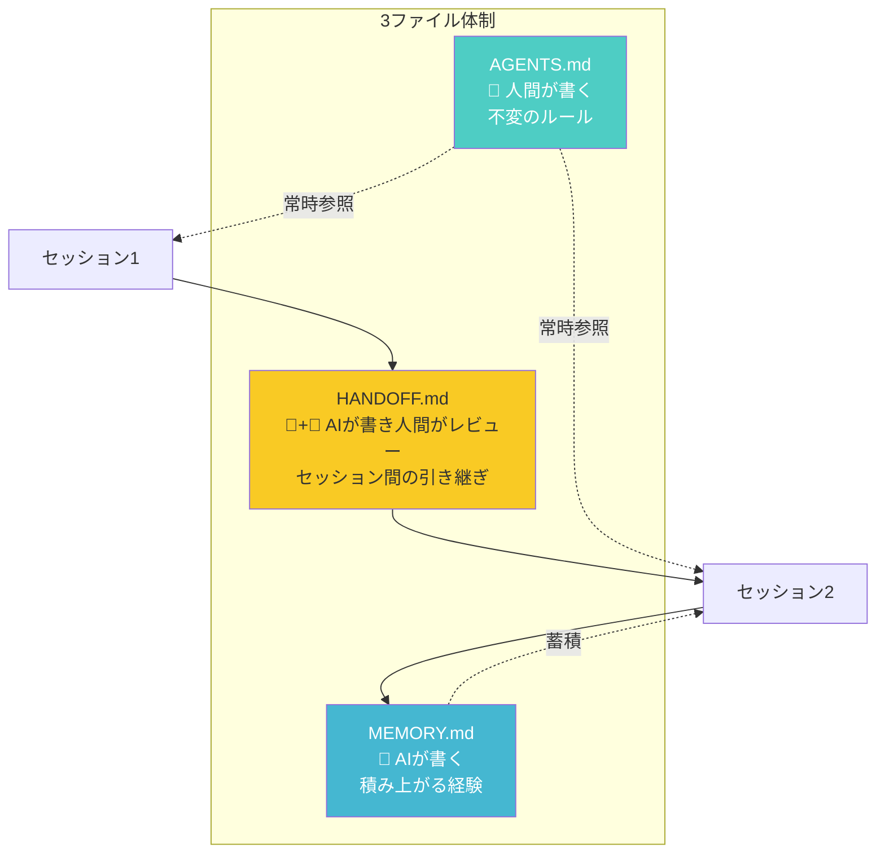
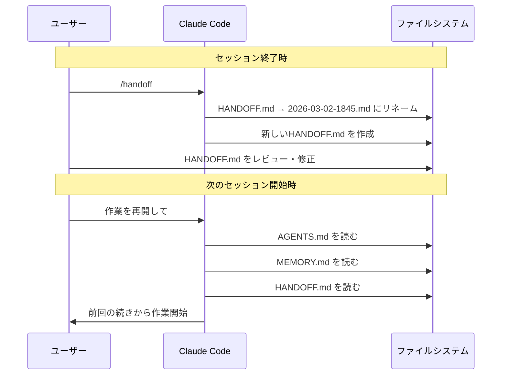

## はじめに

Claude Codeを使い始めてしばらく経つと、誰もがぶつかる壁があります。

**「さっきまで完璧に理解してくれていたのに、新しいセッションを開いたら全部忘れている」**

プロジェクトの背景を説明し直す。コーディング規約を再度伝える。さっき試して失敗したアプローチをまた提案される。この繰り返しに心当たりはないでしょうか。

> MEMORY.mdの仕組みも最近追加されましたが、後で述べますが色々と課題があります。


私も最初はこの「記憶喪失ループ」に悩まされていました。CLAUDE.mdにルールを書く。MEMORY.mdに経験を蓄積させる。それでもセッションをまたぐと文脈が途切れる。

また私の場合、日中は会社のPC、夜間は自宅のPCで作業を継続しますが、Claude CodeのMEMORY.mdはリポジトリ内にないためメモリを引き継げません。さらにはCodexなど別のCLIやIDEに作業を切り替えたい場合も同様です。

これらの問題を解決しようと試行錯誤を続けた結果、**設定ファイルの分業体制**、**CLI\/IDE中立設計**、**仕様駆動開発**、そして**スキルによる開発環境構築の自動化**という一連の仕組みが出来上がりました。記憶喪失の解決から始まった取り組みが、気づけば開発ワークフロー全体を変えていたのです。

この記事では、その設計思想と具体的な実装方法を、実際のスキルファイル付きで共有します。

---

## 1. MEMORY.mdの功罪

### そもそもMEMORY.mdとは

Claude Codeには2種類の設定ファイルがあります。CLAUDE.mdは「人間が書く指示書」、MEMORY.mdは「AIが自分で書く記憶」です。MEMORY.mdはセッション中にAIが学んだ教訓やパターンを自動で記録してくれる仕組みで、使い込むほど賢くなるという理想的な設計に見えます。

しかし、実際に運用してみると4つの問題が浮き彫りになりました。

### 問題① 200行ハードリミット

MEMORY.mdは200行を超えるとトランケートされます。このハードリミットはClaude Code側の制約で、ユーザーが変更することはできません（2026年3月時点）。

AIが経験を書き続けると、重要な記憶が末尾に追いやられて切り捨てられるという逆説が起きます。「記憶を蓄積するための仕組みが、記憶を失う原因になる」という皮肉な状況です。

### 問題② CLAUDE.mdとの重複

MEMORY.mdにはCLAUDE.mdと同じ内容が重複して書き込まれることがよくあります。これにより：

- AIが「どちらが正しいか」と迷う **注意の分散**
- 200行の枠を重複で消費する **行数の浪費**
- 片方だけ更新されて矛盾が生まれる **更新の不整合**

の4つの問題が同時に発生します。

### 問題③ コンパクション後の劣化

Claude Codeはコンテキストが95%を超えると自動圧縮（Auto-compact）が走ります。これは会話履歴をAIが要約して置き換える処理ですが、圧縮を繰り返すと「要約の要約の要約」になり、細部が失われていきます。

MEMORY.mdも「自律的にゴミを量産する」状態に陥ることがあり、AIの行動品質が明確に劣化するケースが報告されています。

### 問題④ マルチPC、マルチCLI\/IDEに対応不可

現在Claude CodeのMEMORY.mdはリポジトリとは別管理です。そのため作業するPCが代わるとメモリや作業セッションが引き継げません。同様にツールをCodexやAntiGravityに切り替えた際も、セッションの状況説明が都度必要となります。

:::note info
**この章のポイント**: MEMORY.mdは便利だが、放置すると記憶の質が劣化するジレンマを内包している。「AIに自由に書かせすぎない」仕組みが必要。
:::

---

## 2. 3ファイル体制の設計

### 記憶喪失問題の根本原因

問題の本質は「1つのファイルに複数の役割を詰め込んでいること」でした。CLAUDE.mdにルールも経験も引き継ぎも書いてしまうと、情報が混在して管理できなくなります。

そこで辿り着いたのが、**役割を明確に分離した3ファイル体制**です。

| ファイル   | 書き手               | 性質                   | 内容                             |
| ---------- | -------------------- | ---------------------- | -------------------------------- |
| AGENTS.md  | 人間                 | 不変のルール           | プロジェクト規約・振る舞いの指示 |
| MEMORY.md  | AI                   | 積み上がる経験         | 学習した教訓・経験知             |
| HANDOFF.md | AI（人間がレビュー） | セッション間の引き継ぎ | 今やっていたことの引き継ぎ       |



### なぜこの3つなのか

**AGENTS.md（不変のルール）** は人間が書いて管理します。プロジェクトのコーディング規約、使用言語、AI への振る舞い指示など、セッションをまたいでも変わらない情報を置きます。AIは読むだけで、書き換えません。

**MEMORY.md（積み上がる経験）** はAIが自動で書く学習記録です。ただし、200行制限への対策として以下のルールを設けました：

- AGENTS.mdと重複する内容は書かない
- 更新前に日付アーカイブを作成する（`YYYY-MM-DD.md`）
- インデックス（目次）として使い、詳細は必要に応じて別ファイルに分離する

**HANDOFF.md（セッション間の引き継ぎ）** がこの設計の要です。MEMORY.mdとの決定的な違いは、**人間がレビューしてキュレーションできる**点にあります。

AIが自動で書くMEMORY.mdは内容が汎用的・冗長になりがちですが、HANDOFF.mdは「本当に必要な引き継ぎ情報だけ」を人間がフィルタリングできます。セッション終了前にAIが作成し、人間がレビューして不要な情報を削ぎ落とす。この「人間がキュレーションする」プロセスが、記憶の質を維持する鍵です。

### 運用ルール

HANDOFF.mdは固定名で常に最新版を保持し、作成時に前回のファイルをタイムスタンプ付きでアーカイブします：

```
.agent/handoff/
├── HANDOFF.md              ← 常に最新（AIが読む）
├── 2026-03-02-1845.md      ← アーカイブ（人間が経緯確認用）
└── 2026-03-01-0930.md
```

AIへの指示：

- 現在のPCやCLI\/IDEでの作業終了時に`/handoff`コマンドを実行すると今回のセッションで行ったことをHANDOFF.mdに保存
- 再開時は「セッションを再開して」の一言でHANDOFF.mdを自動的に読み出し
 
HANDOFF.mdやアーカイブは、人間がAIの実行内容や「なぜその判断をしたか」などを追跡するための資産になります。



---

## 3. マルチPC・マルチCLI\/IDE対応

### なぜ `.agent/` フォルダなのか

ここまでの設計をさらに進めると、次の疑問が生まれます：

- **会社PCと自宅PCで作業を継続したい**（マルチPC）
- **CLIやIDEを切り替えても自動的に作業を継続したい**（マルチCLI\/IDE）

MEMORY.mdとHANDOFF.mdを `.claude/` フォルダに置くと、Claude Code固有のディレクトリになってしまいます。Codex CLIやAntiGravity、Gemini CLI等は `.claude/` を読みにいきません。

そこで、**`.agent/` というCLI中立なフォルダ**にMEMORYとHANDOFFを配置する設計にしました。

```mermaid
graph TB
    subgraph "プロジェクトルート"
        C[CLAUDE.md<br/>Claude Code用]
        A[AGENTS.md<br/>Codex CLI用]
        G[GEMINI.md<br/>Gemini CLI用]

        subgraph ".agent/"
            M[memory/MEMORY.md]
            H[handoff/HANDOFF.md]
            S[skills/]
            W[workflows/]
        end
    end

    C -->|参照| M
    C -->|参照| H
    A -->|参照|