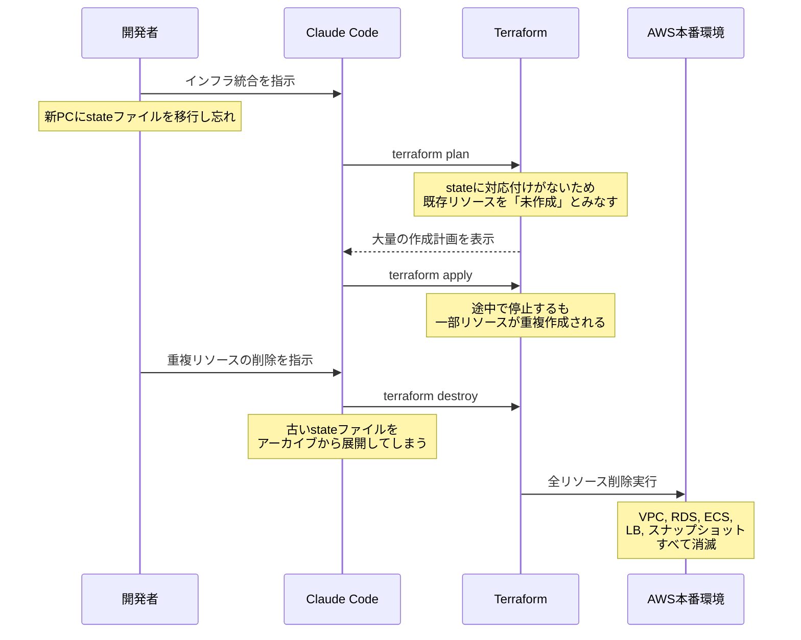
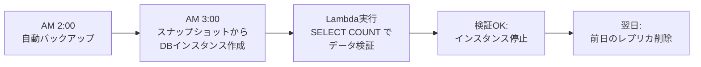

## はじめに

2026年2月末、オンライン学習コミュニティの運営者がClaude Codeを使ってTerraformを操作した結果、本番環境のRDSデータベースとすべてのスナップショットが削除されました。2.5年分のコース運営データ（課題提出テーブルだけで約194万行）が一瞬で消えた事故です。

https://alexeyondata.substack.com/p/how-i-dropped-our-production-database

この記事を読んで、率直に怖いと思いました。自分もClaude Codeを日常的に使っていて、似たような状況はいつでも起こり得ます。事故の経緯を整理しつつ、当たり前だけど見落としがちな基本を改めて確認しておきたいと思います。

## 何が起きたのか

### 背景

被害を受けたのは、DataTalks.Clubというオンライン学習コミュニティの本番環境です。運営者のAlexey Grigorevさんは、別のサイドプロジェクト（AI Shipping Labs）を同じAWSインフラに統合しようとしていました。月$5〜10の節約のためです。

### 事故の流れ



事故のポイントは以下の通りです。

1. PCを乗り換えた際にTerraformのstateファイルを移行し忘れた
2. stateに対応付けがないため、Terraformが既存リソースを「未作成」とみなし、`apply`で重複リソースが作られた
3. 重複の整理を指示したところ、Claude Codeが古いstateファイルを展開して`terraform destroy`を実行し、本番環境ごと削除された

結果、VPC、RDS、ECS、ロードバランサー、踏み台サーバー、そして自動スナップショットまで全滅しました。

### 復旧

AWSのBusiness Supportにアップグレードし（彼のケースではクラウド費用が約10%増）、コンソールには表示されていなかったスナップショットをAWS側で発見してもらい、約24時間後にデータを復旧できました。不幸中の幸いです。

## 読んで感じたこと

この事故を「AIにインフラを任せるなんて無謀だ」と片付けるのは簡単です。ただ、正直なところ、自分の環境を振り返ると似たようなリスクが見つかります。

毎日Claude Codeを使っていると、成功体験が積み重なって承認のハードルが下がっていく感覚があります。コード生成、テスト実行、git操作。うまくいく回数が増えるほど、確認がおろそかになる。Terraformの`plan`や`apply`も「いつもの延長」に感じてしまう瞬間がありそうで、それが怖いところです。

Grigorevさんがインフラを統合しようとした動機は月$5〜10の節約でした。「たったそれだけのために」と思うかもしれませんが、「この程度の変更なら大丈夫だろう」という判断は、金額の大小に関係なく誰でもやってしまいます。

## 改めて確認しておきたいこと

ここから書く内容は、どれも目新しいものではありません。インフラを扱う人なら知っていることばかりです。ただ、「知っている」と「実際にやっている」の間には意外と距離があります。この事故をきっかけに、自分の環境を点検してみました。

### 破壊的コマンドをAIに実行させていないか

Grigorevさんも事故後に「破壊的コマンドはAIに委任しない」と決めています。`terraform destroy`、`terraform apply`、`rm -rf`、`DROP TABLE`のような操作は、結果を取り消すことが困難です。

Claude Codeであれば、設定で制限をかけられます。

```json:settings.json
{
  "permissions": {
    "deny": [
      "Bash(terraform destroy *)",
      "Bash(terraform apply *)",
      "Bash(rm -rf *)"
    ]
  }
}
```

`plan`の生成までは任せて、`apply`は自分の目で確認してから手動で実行する。この仕組みがあるかどうか、一度確認しておく価値はあります。

:::note warn
`deny`ルールは万能ではなく、バイパスされる可能性もあります。チーム利用の場合は`disableBypassPermissionsMode`の設定も併せて確認しておくと安心です。
:::

### Terraformのstateはリモートにあるか

今回の事故の根本原因は、stateファイルがローカルにあったことです。PC移行で失われ、Terraformが既存インフラを認識できなくなりました。

```hcl:backend.tf
terraform {
  backend "s3" {
    bucket       = "my-terraform-state"
    key          = "production/terraform.tfstate"
    region       = "ap-northeast-1"
    encrypt      = true
    use_lockfile = true
  }
}
```

:::note info
従来は`dynamodb_table`によるロックが定番でしたが、現在は`use_lockfile = true`が推奨されています。
:::

「そのうちやろう」と思いつつ後回しになっていないか。自分も改めて確認しました。

### 削除保護は有効になっているか

RDSには`deletion_protection`という設定があります。

```hcl:rds.tf
resource "aws_db_instance" "production" {
  # ...
  deletion_protection = true

  lifecycle {
    prevent_destroy = true
  }
}
```

`deletion_protection`はAWS側の設定で、有効な間はDBインスタンスの削除がブロックされます。`prevent_destroy`はTerraform側のガードで、この設定がある限り`terraform destroy`の計画自体が拒否されます。仕組みは異なりますが、両方設定しておくことで意図しない削除を二重に防げます。ただし、どちらも設定を変更すれば解除可能なので万能ではありません。設定したつもりで外れていた、ということもあるので、実際の値を確認しておくと安心です。

### バックアップは「復元できる」状態か

Grigorevさんの事故後の対策で印象的だったのは、毎晩バックアップの復元テストを自動実行する仕組みを作ったことです。



バックアップが「存在する」ことと「復元できる」ことは別の話です。RDSの自動バックアップ（automated backups）はDBインスタンス削除時に一緒に削除されます。手動スナップショット（manual snapshots）は残りますが、今回の事故ではそれも取得されていませんでした。バックアップがあるから大丈夫、と思い込んでいると、いざという時に復元できないことがあり得ます。

自分もバックアップは取っていますが、復元テストまでは正直やっていませんでした。

### 本番と開発は分離されているか

同一アカウントに本番と開発が同居していると、事故の影響範囲が広がります。AWS Organizationsを使えばアカウント分離のコストはほぼゼロですが、「既に動いている環境を分離する」のは腰が重い作業です。

新規で環境を作るタイミングがあれば、最初から分けておくのが楽です。

## 「承認」が形骸化していないか

この事故で一番考えさせられたのは、「承認した」という行為についてです。

Claude Codeはコマンドを実行する前にユーザーに確認を求めます。Grigorevさんも`terraform destroy`の実行を承認しています。しかし、その時点で「何が破壊されるか」を正確に理解していたわけではなかったようです。

AIエージェントが提示する操作が複雑になるほど、承認が形式的なものになるリスクがあります。特にインフラ操作では、1つのコマンドの影響範囲が広く、元に戻すことが困難です。

自分は最近、承認ボタンを押す前に「これは何を壊し得るか」を一文で言えるか、という確認をするようにしています。言えないなら、まだ理解が足りていないサインです。

## おわりに

改めて振り返ると、この事故の教訓はどれも基本的なことです。

| 確認ポイント | 自分の環境は大丈夫か |
|---|---|
| 破壊的コマンドのAI実行制限 | 設定済みか |
| Terraform stateのリモート管理 | S3等に移行済みか |
| RDS削除保護 | 有効になっているか |
| バックアップの復元テスト | 実際に復元できるか |
| 本番/開発の環境分離 | 分離されているか |

知っていることと、やっていることは違います。自分もこの事故をきっかけに、久しぶりに自分の環境を棚卸ししました。読んでくださった方にとっても、自分の環境を見直すきっかけになれば幸いです。

## 参考

- [How I Dropped Our Production Database and Now Pay 10% More for AWS - Alexey Grigorev](https://alexeyondata.substack.com/p/how-i-dropped-our-production-database)
- [Clau