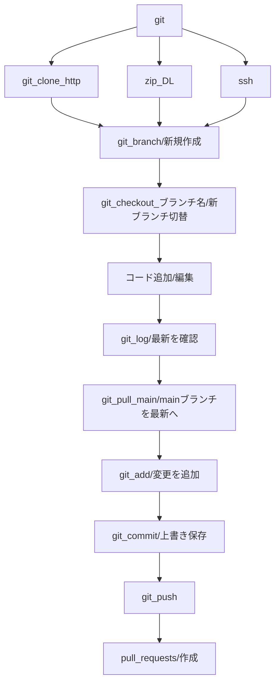

## 概要
エンジニアとして個人＆チーム開発をする中で必須のgit。

しかし、gitについては苦手意識を持つ人も多く、どのように扱えばいいのかわからない方も多いでしょう。

そこで、今回はgitの開発ツールとして一番有名なgituhubの手順一連とあれこれについてまとめました。


## gitとは？
一言でいえばソース管理ツールです。

GitHubは、サーバーアプリケーションが無くても、ユーザー登録のみで使えるGitのWebサービスです。

### そもそもgitとは？

チーム開発では、一つのプロジェクトやサービスのコードについて複数人で開発や運用をかけていきます。

ソースコードのバージョンをいつ誰がどこを編集したのか、最新のバージョンはどれかなどを管理するツールとしてgitは利用されています

ソースコードの管理にはSubversionやツールが他にもあります。Gitの特徴は、ソースコードの記録や追跡などのバージョン管理が「分散型」であること。過去のロールバックが簡単になったり、修正履歴を整理してログに残したりが簡単で、エンジニアがより便利に使うことができます。

引用：[ガチで5分で分かる分散型バージョン管理システムGit](https://atmarkit.itmedia.co.jp/ait/articles/1307/05/news028_3.html)

## githubの初期構築


### githubを扱う方法

◇GUIツール

GitHub Desktop
[ダウンロード](https://desktop.github.com/)

Sourcetree
[ダウンロード](https://www.atlassian.com/ja/software/sourcetree)

◇CLIコマンド


GUIではより簡易に扱えますが、IT案件へ参画した際に頻度高く使用されることから、今回はターミナルからのCLIコマンドについて詳しく解説します。

### 構築手順

ここからは
チーム開発プロジェクトのメンバーになったつもりで記載していきます！

1、招待をしてもらおう！
まず、githubに登録または既存アカウントがあればユーザーIDを送付して招待してもらいます。

github登録をするとユーザーページを開くと
「caius.github.io/github_id/」
というURLとなります。
github_idがユーザーIDなのでこのURL自体を送付して招待をもらいます。

2、リポジトリをローカルPCに作成

下記ページからいくつかの方法でリポジトリが作成できます。

引用：[GitHubのcloneは、リポジトリをローカル環境に複製 gitやghで実行](https://style.potepan.com/articles/31870.html)

3、ssh接続する手順~公開鍵・秘密鍵の生成方法
詳細な有難い内容がありましたので割愛します。


画面右上の「Add SSH key」のボタンを押します。


「title」に公開鍵名、「key」に公開鍵の中身を入れます。


なお、鍵の中身のクリップボードへのコピーは
[引用：ssh接続する手順~公開鍵・秘密鍵の生成方法](https://qiita.com/shizuma/items/2b2f873a0034839e47ce)


### 業務の流れ

gitを扱う上でフローをまとめました。
以下、「mermaid」が業務実行に伴うフローです。


pull_requests作成ページ
(github.com/ユーザーID/PJ名/pulls)


### コマンド一覧

```shell
$ ssh-keygen -t rsa #鍵作成
$ cat id_rsa.pub #ssh-rsa~サーバー側のカギを表示
$ git clone git@~.git #gitクローン
$ git branch 名称 #新規ブランチ作成
$ git checkout #権限変更
$ git branch #ブランチ確認
$ git add #追加
$ git status
$ git push origin master
$ git commit
$ git log #ログの確認
$ git push origin 新規ブランチ名
```

## まとめ

今回は、二段階認証/秘密鍵とgitに苦手意識を持った私自身が体系的に理解できるよう「mermaid」でまとめましたので、ご参考になれば幸いです。
