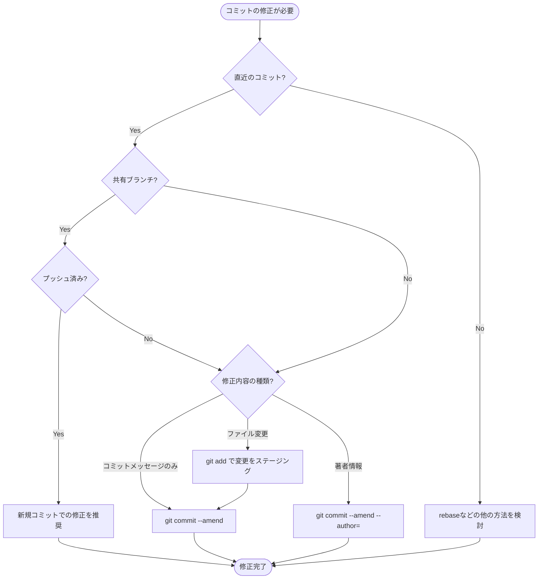
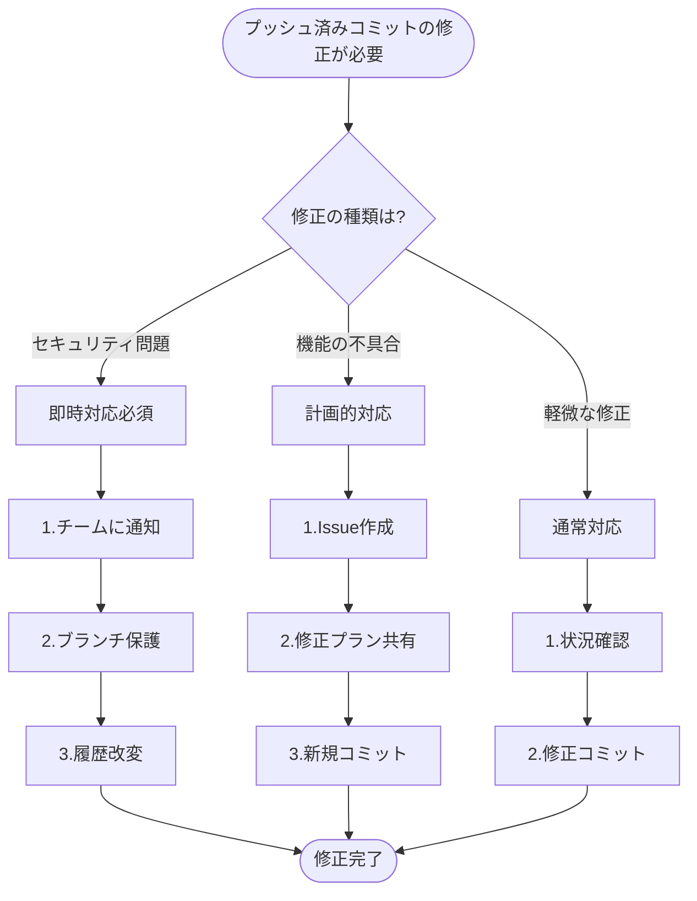

# Git Amendの実践的な使い方完全ガイド

## 目次
- [基本概念と使用判断](#基本概念と使用判断)
- [具体的なユースケースと解決方法](#具体的なユースケースと解決方法)
- [トラブルシューティング](#トラブルシューティング)
- [プッシュ済みコミットの修正ガイド](#プッシュ済みコミットの修正ガイド)
- [プロのTips](#プロのtips)
- [まとめ](#まとめ)

## 基本概念と使用判断



### なぜAmendが必要か
開発中によくある以下のような「しまった！」というケースを解決できます：
- コミットメッセージのtypo
- 必要なファイルの追加し忘れ
- 不要なファイルの誤コミット
- 設定ファイルの意図しない変更

## 具体的なユースケースと解決方法

### 1. コミットメッセージの修正
**ケース**: タイプミスや説明不足を修正したい
```bash
git commit --amend -m "正しいメッセージ"
```

### 2. ファイルの追加忘れ
**ケース**: 関連ファイルをコミットし忘れた
```bash
git add 忘れたファイル
git commit --amend --no-edit  # メッセージはそのまま
```

### 3. 著者情報の修正
**ケース**: 社用アカウントで個人アカウントのコミットをしてしまった
```bash
git commit --amend --author="正しい名前 <メール>" --no-edit
```

### 4. 不要ファイルの削除
**ケース**: パスワードファイルを誤ってコミット
```bash
git rm --cached 秘密のファイル
git commit --amend --no-edit
```

## トラブルシューティング

### よくある問題と解決方法

1. **`commit --amend`実行後にエラー**
   ```bash
   # 解決策: コミットするファイルがステージされているか確認
   git status
   ```

2. **amendしたコミットをプッシュできない**
   ```bash
   # 解決策: 強制プッシュ（個人ブランチのみ）
   git push --force-with-lease origin ブランチ名
   ```

3. **直前のamendを取り消したい**
   ```bash
   # 解決策: reflogから復元
   git reflog
   git reset --hard HEAD@{1}
   ```

## プッシュ済みコミットの修正ガイド



### 1. セキュリティ関連の緊急修正

**ケース**: パスワードや秘密鍵を誤ってプッシュした場合
```bash
# 1. 即時にチームに通知
# 2. 一時的なブランチ作成
git checkout -b security-fix

# 3. 該当ファイルの完全削除
git filter-branch --force --index-filter \
'git rm --cached --ignore-unmatch パスワードファイル' \
--prune-empty --tag-name-filter cat -- --all

# 4. 強制プッシュ（要チーム合意）
git push origin security-fix --force

# 5. 認証情報の無効化と再発行
```

### 2. 機能の不具合修正

**ケース**: バグや重要な機能の欠落
```bash
# 1. 修正用ブランチの作成
git checkout -b fix/issue-description

# 2. 修正コミットの作成
git add 修正ファイル
git commit -m "fix: 問題の修正 (#Issue番号)"

# 3. プルリクエスト作成
git push origin fix/issue-description
```

### 3. 軽微な修正（タイプミスなど）

**ケース**: コミットメッセージのタイプミスや小さな変更
```bash
# 1. 修正コミットの作成
git add 該当ファイル
git commit -m "chore: タイプミスの修正"

# 2. 通常のプッシュ
git push origin 現在のブランチ
```

## Tips

### 1. 安全な作業手順
- 重要な修正前は作業ブランチを作成
- `--force-with-lease`を使用して安全にプッシュ
- 変更前に`git status`で状態確認

### 2. 効率的な使用
- エディタでのメッセージ編集が不要な場合は`--no-edit`を使用
- `git config --global core.editor "好みのエディタ"`でデフォルトエディタを設定

### 3. チーム開発での注意点
- プッシュ済みのコミットはamendを避ける
- 共有ブランチでの使用は事前に周知
- 重要な変更は他のメンバーに確認を依頼

## まとめ
- Amendは直近のコミットの修正に特化した機能
- 使用前にフローチャートで適切な対応を確認
- チーム開発では慎重な運用が必要
- 定期的なコミット前の確認で修正の必要性を減らす
