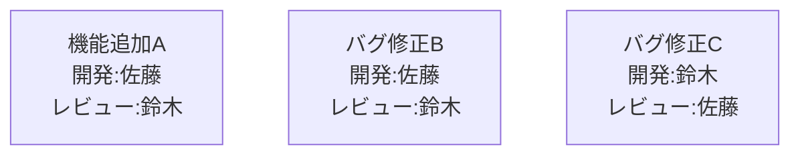
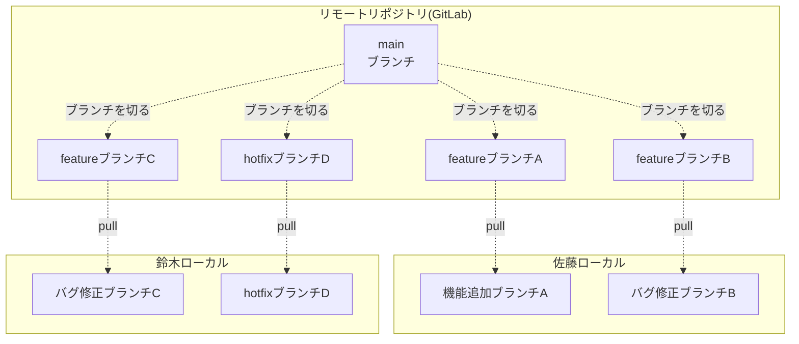
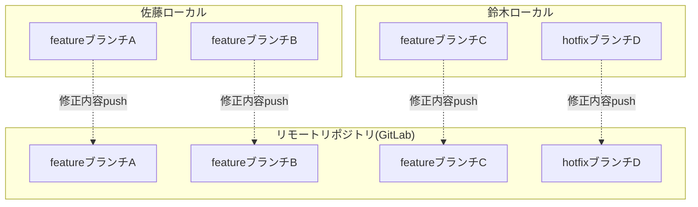
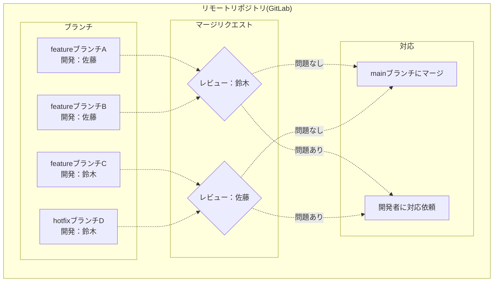
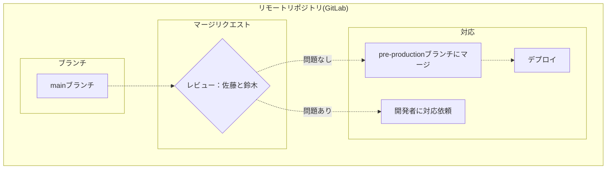
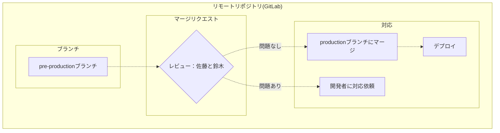

## はじめに
GitLabの導入が社内で始まり、ブランチ戦略を考える必要が出てきました。
既存のflowをそのまま取り入れるのではなく所々カスタマイズしたほうがいいらしく
カスタマイズって具体的に何をどうすれば？と思ったので備忘録もかねて残します。

## ブランチ戦略とは
***ブランチというGitの機能をどのように利用するかの規約のこと***

* 「私はローカルに作業用のブランチを1個だけ切っておく派」
* 「僕は作業内容ごとに細かくブランチを切っておく派」
* 「自分はブランチはmainブランチオンリー派」

のようにブランチの使い方はルールが無ければ人によってバラバラです。

ブランチをどのように作成し利用するのか認識を統一しないと運用事故につながりかねないので
ブランチ戦略を決める必要があります。

## ブランチ戦略は何を決めたらいいのか

### ブランチのジャンル
どのブランチ戦略を採用したとしても、大元となる「mainブランチ(昔の呼び方だとmasterブランチ)」があります。
それ以外のブランチは何があって、何のために存在するのかを定義します。

### ブランチの命名規則
ブランチの命名規則を統一させることでばらつきを無くします。
また、ブランチ名を見ただけでブランチの役割が分かるようにします。

### 開発フロー
機能改修/不具合発生/緊急対応発生時に各ブランチをどのように利用して開発～デプロイを行えばいいのかを決めておきます。ここでは各ブランチの使い方以外にGitLabの機能の使い方も含めてフローを作成します。

### コミット時やプッシュ・マージ時の細かいルール
今回はGitlab-flowの概要部分の話をするため、細かいルールについては省略します

***コミット***
* コミットメッセージ
* コミット粒度

***プッシュ***
* プッシュ粒度
* コンフリクト発生時対応
* pushコマンドのオプションの使用ルール

***マージ***
* マージ承認のルール策定
* マージリクエスト機能の運用方法(GitLab)

## ベースにGitlab-flowを選んだ理由
:::note warn
各flowの詳しい説明は別の方の記事を参照お願いします。
:::

***Git-flow***
3つの中で最初に作られたflowで、かなりの種類のブランチを駆使するので複雑
反面、ブランチの目的が細分化されているのでちゃんと使うのであれば事故は起きづらい？

|ブランチ名|説明|マージ先|利用後削除|
|:-:|:-:|:-:|:-:|
|main|リリース済みのソース格納用|しない|しない|
|hotfix|緊急対応時にmainブランチから切る|mainとdevelop|マージ後|
|release|リリース作業用の一時的なブランチとして developブランチから切る|main|リリース後|
|develop|開発環境として スタートアップ時にmainブランチから切る|しない|しない|
|feature|機能改修にdevelopブランチから切る|develop|しない|

現時点であえてこの複雑なGit-flowを選択するメリットが不明です。
（開発チームの規模やリリースサイクルが関係しているそうですが、これといった情報なし）
下記の記事を見る限りは他のシンプルなflowが採用できそうならそちらにした方がいいという認識でよさそう

https://qiita.com/ktateish/items/76ca0130aec3be05376c

***Github-flow***
デプロイまでのスピード感を出すためにもブランチの種類が少なく簡潔になっている

|ブランチ名|説明|マージ先|利用後削除|
|:-:|:-:|:-:|:-:|
|main|リリース済みのソース格納用|しない|しない|
|feature|機能改修・緊急対応時にmainブランチから切る|main|マージ後|

***どのような場合に用いられるか？***
➡1日に何度もデプロイするようなシステムが多いらしい。
プルリクエスト出して承認→マージ＆本番デプロイという構造がスピーディーであるため。
逆に大規模なシステムとかにはあまり向いていない。

***Gitlab-flow***
Github-flow＋リリース管理用ブランチ２つ

|ブランチ名|説明|マージ先|利用後削除|
|:-:|:-:|:-:|:-:|
|production|リリース済みのソース格納用 スタートアップ時にmainからブランチを切る|しない|しない|
|pre-production|リリース前のテスト環境がある場合使うブランチ スタートアップ時にmainからブランチを切る|production|しない|
|main|開発用ブランチ|pre-production|しない|
|feature|機能改修・緊急対応時にmainブランチから切る|main|マージ後|

***どのような場合に用いられるか？***
➡Github-flowとは逆で開発からデプロイのスパンが中長期的の開発
例えば開発後ステージング環境にアップし、そこでの確認が終わったら本番にデプロイするみたいな
本番にデプロイするまでにいくつかのステップを踏むような開発に用いられるflowだと思ってます。

ということで、どれをベースにするのか検討した結果
* マージリクエストのみで開発からいきなり本番は怖いのでGithub-flowは採用しない
また、本システムにデプロイは毎日のように発生しない（年に何度か改修がある程度）
* メンバーの習熟度的にGit-flowを採用するとブランチ管理で混乱を招きそう
* GItlab-flowも複雑ではあるが、複雑な部分をカスタマイズすることでもう少しだけシンプルにできそう

の理由によりGitlab-flowをベースにすることにしました。

## Gitlab-flowのカスタマイズ

### Gitlab-flowをカスタマイズする際に検討したこと

#### pre-productionブランチを用意するかどうか
「mainブランチをデプロイした環境で動作確認を行い、問題なければ即リリース」
とするのであればpre-productionブランチは不要です。
「mainブランチとは別にお客様が確認する環境が欲しい、お客様確認中に別機能を開発してmainブランチにマージしていく可能性がある」
みたいな場合はpre-productionブランチが必要になります。
今回はpre-productionを用意します。

#### バグ対応、緊急対応時のブランチの切り方
機能追加及び変更などの対応を行う際は「feature」ブランチを切ります。
それ以外のバグ修正(bug)や緊急対応(hotfix)を行う際のブランチの切り方をどうするかがカスタマイズ可能なポイントとなります。
とはいっても、hotfixブランチもfeatureブランチとして切ってしまうと、ブランチを作成した用途が名前から判断しづらくなってしまうので
1. きっちり3種類のブランチに分ける(feature-●●,bug-●●,hotfix-●●)
1. featureとbugはまとめてfeatureブランチにする(feature-●●,hotfix-●●)

のどちらかにするのが良いと思いました。
今回はfeatureブランチとhotfixブランチの2つに分ける形を採用します。

## ブランチ一覧

|ブランチ名|説明|マージ先|利用後削除|
|:-:|:-:|:-:|:-:|
|production|リリース済みのソース格納用 スタートアップ時にmainからブランチを切る|しない|しない|
|pre-production|リリース前のテスト環境がある場合使うブランチ スタートアップ時にmainからブランチを切る|production|しない|
|main|開発用ブランチ|pre-production|しない|
|feature|機能改修や急ぎではない不具合対応時に mainブランチから切る|main|マージ後|
|hotfix|緊急対応時にmainブランチから切る|main|マージ後|

***feature,hotfix***：各自作業用ブランチ
***main***：コードレビュー等を実施してリリースしても問題ないと判断された内容がマージされているブランチ、かつ社内確認用環境デプロイ用ブランチ
***pre-production***：ステージングにデプロイした内容を履歴として残すブランチ
***production***：本番にデプロイした内容を履歴として残すブランチ

の使い分けとします。

## 開発フローの整理

登場する人物は開発者とレビュアーです。スクラム開発では開発チームの中からそれぞれ割り当てられます。

***開発者***
スプリントバックログの内容を基にシステム開発を行います。
***レビュアー***
開発者の制作物をレビューし、必要に応じて改善を促します。
本番/ステージング環境に取り込んでもいいかどうかの承認者の役割も担います。

### ①各スプリントバックログを作成し担当者を決める

### ②ブランチの作成
開発者はスプリントバックログに対する作業用のブランチを切って、そのブランチに対して修正を行います。
なお、スプリントバックログに対して、Gitlab上で1つずつイシューが作成されている想定です。
***機能改修の場合***
mainブランチから「feature/{issueID数値}-{issue内容英語で}」の命名規則でブランチを切ります。
例：feature/5-make-settings
***緊急の不具合対応の場合***
mainブランチから「hotfix/{issueID数値}-{issue内容英語で}」の命名規則でブランチを切ります。
例：hotfix/9-patch-display-error

***ブランチの作成***

### ③修正を行いリモートのブランチにpushする
修正後、ローカルのブランチに対しコミットされた内容をリモートにpushします。
基本的にはhotfixの物を優先的に対応します。

***修正内容をリモートに反映***

### ④修正内容のレビューとマージ
レビュアーはリモートのブランチにpushされた内容についてレビューを行います。
問題ないと判断したものはリモートのmainブランチにマージして、問題ありの場合は開発者に対応を依頼します。
基本的にはhotfixの物を優先的に対応します。

***レビュー～ブランチのマージ***

### ⑤pre-productionへのマージ
pre-productionへのマージはステージング環境にデプロイする際に実施します。
ここでのレビューはステージング環境にデプロイする前にすべき作業が行われているか等を確認します。
マージを実施後にCI/CDで自動デプロイ、あるいは手動でのデプロイを実施します。

### ⑥productionへのマージ
productionへのマージは本番環境へデプロイする際に実施します。
ここでのレビューは本番環境へデプロイする前にすべき作業が行われているか等を確認します。
マージを実施後にCI/CDで自動デプロイ、あるいは手動でのデプロイを実施します。

## 参考URL

https://rightcode.co.jp/blog/information-technology/git-branch-strategy-syain
