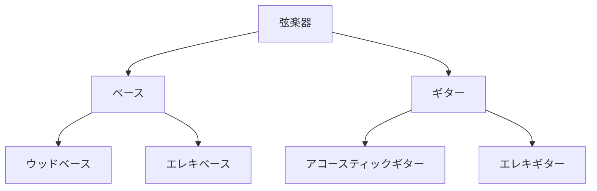

この記事は[Nuco アドベントカレンダー](https://qiita.com/advent-calendar/2022/nuco)の16日目の記事です。

はじめまして、[higasun](https://qiita.com/higasun)です。

今回の内容は、**データベース**についてです。
**種類や歴史**に始まり、**実際に作ってみる**ところまでやってみることで理解を深めていきます。

データベース初心者でも<strong>「データベースの基本を理解して、簡単なSQLなら書ける！」</strong>くらいの状態になれる仕上がりだと思っていますので、最後までお付き合いください。

**※もし間違いなどありましたらコメントで教えていただけると幸いです。**

# データベースって何？
### データベースの定義
データベースとは、<strong>構造を持ったデータの集合</strong>のことです。
平たく言うと、**あるルールに従って格納・取り出されるデータの集まり**です。
データベースには複数の種類があり、それぞれにデータの扱い方のルールがあります。

### データベースの歴史
最も最初に登場したデータベースは50年以上も前に遡ります。
ここでは、様々なデータベースを登場した時系列順に紹介していきます。
大きく分けると、**ナビゲーショナル**、**リレーショナル**、**ポストリレーショナル**という3つの時代に分類できます。

#### ナビゲーショナル
歴史上最初に登場したのは、**ナビゲーショナルデータベース**と呼ばれるものです。
データを検索する際に、**データからデータへと誘導(navigate)を行う**という特徴があります。

##### 階層型データベース
**階層型データベース**は、データを<strong>樹形図のように階層に分けて</strong>管理するデータベースです。
上から下に向かってデータ間で**親子**という関係があり、下の例では、弦楽器という親ノードがギターとベースという子ノードを持っています。

また、子ノードは1つの親ノードを持つことしかできないため、**ノードに対する経路が1つに定まりアクセス速度が速くなる**という特徴があります。
ただ、**データの登録・削除が起こるたびにノードへの経路が変わる**ため、データ管理が柔軟に行えないというデメリットがあります。




##### ネットワーク型データベース
**ネットワーク型データベース**は、下のように**データとデータがグラフ状に繋がっている**ものです。
(競プロをやったことがある人には馴染み深いかもしれません。)

階層型データベースとは異なり、**ノード間を自由に接続する**ことができます。
ただ、、階層型と同様に**データの登録・削除が起こるたびにノードへの経路が変わる**というデメリットは残っています。


#### リレーショナル
次に登場したデータベースが**リレーショナルデータベース**(**RDB**)です。
データの格納方法を<strong>二次元の表形式</strong>として**事前に定義**し、**構造化データ**として保存します。

RDBは、**SQL**という言語を用いて、**データの内容に応じた**処理(**登録・検索・更新・削除**)を行うことができます。
また、**複数の表を関係づける**ことで情報を効率的に保存したり、複雑な条件での検索が可能です。


具体的には下のようなアドレス帳のようなものです。
各行が1つのデータ(**レコード**)に対応していて、各列(**フィールド**)がデータの種類を示します。
このような1つの表のことを<strong>テーブル</strong>と呼びます。

|ID|  名前  |  住所  |  電話番号  |
| ---- | ---- | ---- | ---- |
|1|  田中太郎  |  東京都江東区  | 1234 |
|2|  佐藤花子  |  宮城県仙台市  | 5678 |
|3|  佐藤三郎  |  東京都足立区  | 0123 |

#### ポストリレーショナル
ポストリレーショナルなデータベースとして、登場したのが**NoSQL**です。
実はNoSQLは具体的なデータベースを指しているというわけではなく、**RDB以外のデータベース**を指す大まかな分類です。
もともと、「**RDB以外のデータベース利用を促進しよう(Not only SQL)**」というような**標語的な意味合い**がありました。

##### キーバリュー型データベース
キーバリュー型データベースは、データを**キー**と**バリュー**という単純なペアで保持します。
これは**辞書型**や**ハッシュテーブル**と呼ばれるデータ型としても知られます。
**大量のデータを保存**が必要で、**複雑なデータ検索を行わない**ような場合に適しています。

具体的には下のように、あるキーとそれに対応するバリューを格納します。
キーに対応して、データであるバリューが取得できます。
**バリューの内容はデータによって異なっても構いません**。


##### ドキュメント指向データベース
ドキュメント指向データベースでは、下の図のように**データを制約無く自由な形**で保存します。
**JSON**や**XML**といった形式で保存されることが多いです。
RDBのようにデータの構造設計は必要ない、という**スキーマレス**という特徴があります。
そのため**データの形式が変わっても対応ができます**。


出典: \<[ドキュメント指向データベースと列指向データベース](https://thinkit.co.jp/story/2010/10/15/1798)\>

##### NewSQL
NoSQLに競合するポストリレーショナルなデータベースとして**NewSQL**というものがあります。
これは、**従来のRDBとNoSQLのいいとこ取り**を目指したデータベースモデルです。
詳しく知りたい方は、以下の記事がまとまっていて分かりやすいので読んでみてください。

https://qiita.com/tzkoba/items/5316c6eac66510233115

### 各データベースの特徴
ここでは、現在よく使われている**RDB**と**NoSQL**の特徴を比較してみます。
比較のためにいくつかの概念をまず紹介します。

#### ACID特性
突然ですが、銀行のATMシステムが行なっている処理について考えてみましょう。
「**自分の口座から5万円を別の口座に送金する**」ということをしたい場合、ATMのシステムは
- 自分の口座から5万円を引く
- 送り先の口座に5万円足す

という処理を行なっていますね。


このような処理を**トランザクション処理**と言います。
正確に言うと、**相互依存の関係にある複数の処理をまとめて、矛盾なく処理する**ということです。
もし「**自分の口座からは5万円が引かれたのに、送り先の口座残額は増えていない**」というようなことが起こると困ってしまいますね。

このようなトラブルを防ぐために、トランザクション処理には**ACID特性**と呼ばれる「**データの整合性を保証する特性**」が求められます。
具体的には、以下のような4つの特性のことで、頭文字を取ってACIDと呼ばれています。

||意味|ATMの例|
|:---:|:---:|:---:|
|**A**tomicity|処理が中断されない|出金と入金をひとまとまりに行う|
|**C**onsistency|データに矛盾がない|口座残額がマイナスになったりしない|
|**I**solation|処理中の状態は外部から見えない|「出金されたが入金が行われていない」という状態は外部から見えない|
|**D**urability|処理の結果が必ず保存される|送金中に障害が起こっても元の口座にお金が戻る|

#### CAP定理
今度は、**インターネット上の大量のデータ**を扱う場合を考えましょう。
扱うデータが大きくなると1台のコンピュータでは処理が遅くなります。
そこで、<strong>複数のコンピュータでデータ処理を行う「分散処理」</strong>によって効率化を図ります。

**CAP定理**は、「**分散処理において次の3つの望ましい性質のうち、全てを同時に満たすことはできない**」というものです。

※ここでいう**ノード**とは**ネットワークに繋がっているひとつひとつのコンピュータ**のことだと理解していただいて大丈夫です。

||訳|意味|
|:---:|:---:|:---:|
|**C**onsistency|一貫性|**常に全てのノードで最新のデータが得られる**|
|**A**vailability|可用性|**ノードの一部に障害が発生しても生存ノードが応答する**|
|**P**artition-tolerance|分断耐性|**ネットワークに障害が起こってノード間が分断されても正常に動作する**|


例えば、**一貫性**(**C**)と**可用性**(**A**)を満たすシステムを作りたい場合、**全てのノードで最新のデータを共有**しなければなりません。
しかし、このようなシステムは**ネットワークが分断されると「全てのノードで最新のデータを共有」することは不可能**となり、**分断耐性**(**P**)を持つことができないということになります。

#### RDBとNoSQLの比較
簡単にRDBとNoSQLが適している用途をまとめると、以下のようになります。
|RDB|NoSQL|
|:---:|:---:|
|**構造化**データ|**非構造化**データ|
|データに対する**厳密な一貫性**|**大量**のデータに対する**迅速**な処理|


##### RDBのメリット
RDBは基本的に上で紹介した**トランザクション処理**に最適化された設計になっています。
ということは、RDBは「**データの整合性**を保つ」つまり**ACID特性**を持っているということです。

CAP定理で言うと、RDBが満たすのは**C**と**A**で、**データがいつでも利用可能で一貫**しています。
なので、先ほど挙げた銀行のシステムや電子商取引など、**データの厳密な一貫性**が求められる場合に活躍します。


##### RDBのデメリット
RDBには、**データ量が多いと処理速度が遅かったり**、元々1台のコンピュータで動くように設計されていたという背景もあり**分散処理をさせるために拡張しづらかったり**するという特徴があります。
また、構造化されたデータを扱うことはできますが、**画像や文章などの非構造化データは扱えません**。

インターネットが普及し、扱うデータの種類や量が増えると**このようなデメリットを持つRDBでは対応できなくなってきた**ため、**NoSQLの必要性**が叫ばれたという背景があります。

##### NoSQLのメリット
NoSQLは**処理速度が速く、分散処理を効率的に行う**ことができる上、画像や文章といった**非構造化データを扱える**といった特徴があり、RDBのデメリットをカバーしています。
したがって、NoSQLは**大量のデータを扱ったり、扱うデータに対する柔軟性が欲しい時**に活躍します。

CAP定理で言うと、NoSQLの多くは**C**+**P**または**A**+**P**を満たすものに分けられます。
**分散処理をしたいときは、Pの「システムの一部が分断しても機能できる」という性質が不可欠**だからですね。
その上で、**C**の一貫性と**A**の可用性のどちらを重視するかは実際のデータベースによって異なります。

##### NoSQLのデメリット
NoSQLは**ACID特性を求められる用途には向いていません**。
RDBは一貫性に特化したACID特性を基に設計されていますが、NoSQLは**BASE特性**と呼ばれる別の思想に基づいて設計されているからです。

**BASE特性**では、先ほど紹介したようjに**CAP**のうち一貫性(**C**)や可用性(**A**)の一部を犠牲にすることで、分散処理のために必要な分断耐性(**P**)を保証します。
したがって、ACID特性のように**いつでも最新のデータを得られるわけではありません**。
※ただしBASE特性では、**十分な時間が経つと一貫性が保たれます**。

また、RDBが得意とする**複雑な条件でのデータ検索**を行いたい場合には**適していません**。


# リレーショナルデータベースを作って遊んでみる
ここからは実際にリレーショナルデータベースを作ってみて、理解を深めましょう！

### データベースを使うためのツール
まず、RDBを扱うためのツールを紹介します。

#### DBMS
DBMSはデータベースマネジメントシステムの略で、**実際にデータベースを作成・管理するためのツール**です。
具体的な名前を上げるとMySQLやDB2、Oracleなど様々なものがあります。
注意してほしいのは、<strong>「データベース」はあくまで抽象的なもの</strong>であり、<strong>DBMSは「データベース」を実現するための具体的なツール</strong>であるということです。

今回はMySQLというDBMSを使用します。

https://www.mysql.com/jp/

#### SQL
SQLは<strong>Structured Query Language</strong>の略で、データベースを操作するための言語です。
データの<strong>追加</strong>、<strong>削除</strong>、<strong>更新</strong>、<strong>検索</strong>といった操作を行えます。

以下は検索を行うSQL文の例で、「stockというテーブルからpriceというフィールドが1000以下のレコードを取り出して」という意味です。
詳しい説明は後ほど行うので、ここではなんとなくイメージを掴んでもらえると良いです。

```SQL:データの検索
SELECT * FROM stock WHERE price <= 1000;
```

### MySQLのインストール
それでは実際にMySQLをインストールしてみましょう。
Progateのサイトが分かりやすいのでOSに応じて参照しながらインストールしてください。

https://prog-8.com/docs/mysql-env

https://prog-8.com/docs/mysql-env-win


上記のサイトに従ってMySQLのインストールとログインを済ませると、以下のような画面になると思います。
ここにSQL文を打ち込んでいきます。

```shell-session
mysql >
```

### Databaseの作成
今回は、<strong>果物屋の在庫表データベース</strong>を作ってみて理解を深めましょう。

MySQLではまずdatabaseというものを作り、その中にテーブルを作成していきます。
以下のコマンドでshopというdatabaseを作成しましょう。

```sql:databaseの作成
CREATE DATABASE shop;
```

作成できたらshopというdatabaseを使うことを宣言しましょう。
```SQL:databaseの選択
USE shop;
```

### 今回作りたい在庫表テーブル

今回作りたい果物の在庫表は以下のように、4つフィールドを持っているものとします
nameは果物の名前、priceは値段、countryは産地を表します。
ちなみにIDは、このテーブルにおける<strong>主キー</strong>と呼ばれるもので、<strong>レコードを一意に区別する</strong>ためのものです。

|id|  name  |  price  |  country  |
| ---- | ---- | ---- | ---- |
|1|  orange  |  100  | us |
|2|  apple  |  150  | japan |
|3|  mango  |  300  | taiwan |
|4|  orange  |  180  | japan |
|5|  grape  |  500  | italy |


### テーブルの作成
テーブルの作成は以下のように行います。

```SQL:テーブル作成
CREATE TABLE stock 
    (id INT AUTO_INCREMENT, 
     name TEXT,
     price INT,
     country TEXT,
     PRIMARY KEY (id));
```
```CREATE TABLE stock```でテーブルの名前をstockと定義していますね。
二行目以降は各フィールドのデータの型を定義しています。
最後の行でこのテーブルの主キーがidである、と宣言しています。
また、idの部分```AUTO_INCREMENT```とあるのは、<strong>新たなに追加されたレコードに対して、現在格納されているレコードのうち最大のidに1だけ足したidを与える</strong>という設定です。
これによって他のレコードと被ることはありませんね。

### 新しいデータを登録する
新しいレコードの登録は以下のような構文でできます。

```SQL:データ登録
INSERT INTO table
    (field1, field2, ...)
    VALUES (value1, value2)...
```
フィールドとそれに対応するデータを入れていくというイメージですね。

今回はこのようなデータを登録していきます。
|id|  name  |  price  |  country  |
| ---- | ---- | ---- | ---- |
|1|  orange  |  100  | us |
|2|  apple  |  150  | japan |
|3|  mango  |  300  | taiwan |
|4|  orange  |  180  | japan |
|5|  grape  |  500  | italy |

試しに1つめのUS産のオレンジを追加してみます。
```SQL:データ登録
INSERT INTO stock
    (name, price, country)
    VALUES ('orange', 100, 'us');
```
<strong>これに倣って表にある他の果物もどんどん追加してみてください。</strong>

答え合わせは、以下のSQLを打ち込んで
```SQL:すべてのデータを表示
SELECT * FROM stock;
```

このように表と同じ結果が得られれば、正解です！
```sql:結果
+----+--------+-------+---------+
| id | name   | price | country |
+----+--------+-------+---------+
|  1 | orange |   100 | us      |
|  2 | apple  |   150 | japan   |
|  3 | mango  |   300 | taiwan  |
|  4 | orange |   180 | japan   |
|  5 | grape  |   500 | italy   |
+----+--------+-------+---------+
```

### データを検索する

#### 基本的な構文
実は先ほどの答え合わせで使った、`SELECT`というコマンドは<strong>データを取り出す</strong>ためのものです。
以下のような構文でhogeというテーブルからfield1とfield2について取り出すことができます。

```sql:データの検索
SELECT field1, field2, ... FROM hoge;
```

先ほど使った<strong>＊はワイルドカード</strong>と呼ばれ、<strong>全てのフィールドについて取り出すことができます</strong>。

```sql:データの検索
SELECT * FROM hoge;
```

#### WHEREによる条件付け
作成したstockテーブルから日本産の果物だけを見たいときはどうすれば良いでしょうか。
ここで活躍するのが、**WHERE句による条件づけ**です。以下のSQL文を打ってみましょう。

```sql:日本産の果物を参照
SELECT * FROM stock
    WHERE country = 'japan';
```

このように日本産の果物の在庫が表示されると思います。

```sql:結果
+----+--------+-------+---------+
| id | name   | price | country |
+----+--------+-------+---------+
|  2 | apple  |   150 | japan   |
|  4 | orange |   180 | japan   |
+----+--------+-------+---------+
```

このSQLの`WHERE country = 'japan'`の部分が、**countryフィールドが'japan'となるような条件づけ**を行なっています。

他にも、**150円以上の果物を表示**したいときは以下のようにすれば良いです。

```sql:150円以上の果物を参照
SELECT * FROM stock
    WHERE price >= 150;
```

```sql:結果
+----+--------+-------+---------+
| id | name   | price | country |
+----+--------+-------+---------+
|  2 | apple  |   150 | japan   |
|  3 | mango  |   300 | taiwan  |
|  4 | orange |   180 | japan   |
|  5 | grape  |   500 | italy   |
+----+--------+-------+---------+
```

### データを更新する

では最後にデータの更新を行なってみます。
例として、日本産のオレンジの値段が130円を下げたい場合、このように書けば良いです。

```SQL:日本産オレンジの値下げ
UPDATE stock
    SET price = 130
    WHERE name = 'orange' AND country = 'japan';
```

ここでもWHERE句が使われていますね。
今回は、`AND`**によって２つの条件がどちらも成り立つようなレコードを指定**しています。　
さらに、`SET price = 130`によって**更新したいフィールド(price)に新しい値(130)を渡しています**。

正しくデータが更新されていることをSELECT文で確認してみましょう。

```SQL:値下げ確認
SELECT * FROM stock
    WHERE name = 'orange' AND country = 'japan';
```

このような結果が得られると思います。正しく130円に値下げされていますね。
```SQL:結果
+----+--------+-------+---------+
| id | name   | price | country |
+----+--------+-------+---------+
|  4 | orange |   130 | japan   |
+----+--------+-------+---------+
```

# もっとデータベースを学ぶ
### データベースの歴史
データベースの歴史やどんな種類があるのかを学びたい場合は以下のサイトが参考になります。
- [DBテクノロジーの過去と現在と未来](https://www.datatech.com/technology/history/?tabID=DB-Overview)

### SQLの練習
**ここで紹介したSQL文はほんの基礎の基礎に過ぎません**。
もっとSQLを練習したいという方は、以下のサイトを参考にして練習してみてください。
どちらもブラウザ上で動かせるので、手軽に勉強ができます。

http://sql.main.jp/

https://sqlzoo.net/wiki/SQL_Tutorial


### RDB
リレーショナルデータベースについて基本をしっかり押さえたいという方は以下の本をお勧めします。データベースの基本的な内容から運用コストや冗長化などの実践的な内容も学ぶことができます。

<a href="https://www.amazon.co.jp/%E3%81%8A%E3%81%86%E3%81%A1%E3%81%A7%E5%AD%A6%E3%81%B9%E3%82%8B%E3%83%87%E3%83%BC%E3%82%BF%E3%83%99%E3%83%BC%E3%82%B9%E3%81%AE%E3%81%8D%E3%81%BB%E3%82%93-%E3%83%9F%E3%83%83%E3%82%AF-ebook/dp/B00TTRZFDC">

</a>


# 参考
以下のサイトを参考にしました。
分かりやすいものが多いので是非見てみてください。

https://tips-memo.com/acid#BASE

https://www.datatech.com/technology/history/?tabID=DB-Overview

https://qiita.com/1amageek/items/3dbbc3112493a73880d0#__nosql__%E3%81%AE%E7%99%BB%E5%A0%B4

https://masawan-guitar.hatenablog.com/entry/2016/08/14/163447

https://ja.tak-cslab.org/archives/498


# おわりに

弊社では、経験の有無を問わず、社員やインターン生の採用を行っています。
興味のある方は[こちら](https://www.recruit.nuco.co.jp/)をご覧ください。
