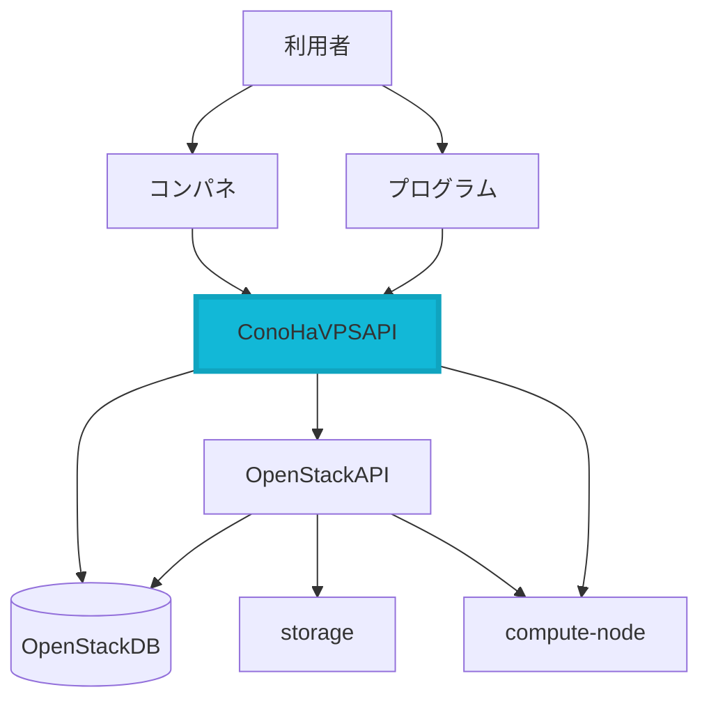

今回 [ConoHa Advent Calendar 2022](https://qiita.com/advent-calendar/2022/conoha) に参加しましたのでConoHaに関する話をしたいと思います。

この記事では主にConoHaのAPIについて話しますが、
APIの具体的な使い方については他の記事に譲りたいと思います。ご了承ください。

## そもそもConoHa VPSって何？
[ConoHa VPS](https://www.conoha.jp/vps/) はGMOインターネットグループが提供しているクラウドサービスのうち、
ConoHaブランドで展開しているVPSサービスです。
初期費用が掛からず、仮想サーバやストレージ、IPアドレス等のリソースを時間課金で利用できるため気軽さが魅力です。

そして ConoHa VPS は時間課金の他にも大きな特徴があります。
それは、[APIを公開している点](https://www.conoha.jp/vps/function/api/)です。
このAPIの事をここから先は「ConoHa VPS API」と呼びたいと思います。

## ConoHa VPS API とは？

* 全ConoHaユーザが**無料**で利用できます
* 提供API数は201個あります(2022年12月14日時点)
* ConoHa VPS の主要な全機能を **REST API** として提供しています
* 逆に ConoHa VPS API でしか利用できない機能もあります(ISOイメージの利用など)

## REST API についてざっくり

上記のように、ConoHa VPS API は REST API です。
「〇〇というサービスはAPIを公開している」「APIを使ってみよう」などとやり取りする際、
暗黙的に REST API の事を指す場面が多いかもしれません。
折角なのでここで REST API とは何か確認しておきましょう。

### そもそも API って何でしょうか

APIは「**A**pplication **P**rogramming **I**nterface」の略です。
いろんな表現があると思いますが、APIは「プログラムの情報をやり取りする**接点部分の仕様**」の事と言えます。

ですので、先程の「〇〇というサービスはAPIを公開している」という発言を言い換えると、
「〇〇というサービスは、外部のプログラムから内部の機能が実行できるように、接点(窓口)を開放している」という意味になります。

### REST とは？

では、REST とは何でしょうか。
RESTは「**RE**presentational **S**tate **T**ransfer」の略で、Webの設計思想(アーキテクチャスタイル)のひとつです。

RESTの思想をざっくり表すと「各URL(リソース)に対してGET/POST/PUT/DELETEメソッドでリクエストを送信し、レスポンスをXMLやJSONなどで受け取る」形式です。

RESTを詳しく知るにはWebに関しての前提知識が必要となり、
詳しく知りたい方には『[Webを支える技術 ―― HTTP，URI，HTML，そしてREST](https://gihyo.jp/book/2010/978-4-7741-4204-3)』という書籍をおすすめしています。
Qiitaで調べてみても良いかもしれません。([記事検索](https://qiita.com/search?sort=&q=%22Web%E3%82%92%E6%94%AF%E3%81%88%E3%82%8B%E6%8A%80%E8%A1%93%22))

### REST API とはつまり・・

REST と API を理解しました。
これを合わせたものが REST API です。

**REST API とはつまり、RESTの設計思想に従った「RESTっぽいAPI」のこと**です。

「RESTful API」とも呼ばれたりします。

## ConoHa API の特徴と経緯

ConoHaのAPIが REST APIなのはわかりましたが、なぜ REST APIなのでしょうか？
それは、ConoHaがOpenStackと呼ばれるOSSのクラウド基盤を利用して稼働しており、
このOpenStackがREST APIを提供している事から「**OpenStackのRESTっぽいAPIに極力準拠したAPIの提供を目指した**」からです。

OpenStackに準拠しているということは、OpenStack用に世の中に存在しているSDKやClientを
ConoHaで利用できるメリットを活かせるということです。[^1]

## ConoHa VPS API の歴史

来年で10周年のConoHaですが、初めからAPIが提供されていたのでしょうか？

この機会に振り返ってみましょう。

ConoHaはVPSサービスとして[2013年7月に提供が開始](https://cloud.watch.impress.co.jp/docs/news/606431.html)されました。

ですが当時はまだAPIを公開していません。

翌年の2014年9月にConoHaの新機能として[オブジェクトストレージを提供](https://internet.watch.impress.co.jp/docs/news/665045.html)した際に、初めてAPIを公開しました。

オブジェクトストレージは当時Conohaのコントロールパネルからファイルの参照やアップロード、ダウンロードが可能でしたが、
APIを公開することで Cyberduck のようなクライアントソフトウェアからも利用することができるのです。

その後2015年5月に[最新のOpenStackを使ったインフラへと刷新](https://cloud.watch.impress.co.jp/docs/news/702382.html)したタイミングで、現在のConoHa VPS APIが誕生しました。

## ConoHa VPS API の裏側

最後に少しだけ ConoHa VPS API の裏側を見てみましょう

ConoHaはOpenStackのAPIがベースになっていますが、残念ながらOpenStackは何でもできる万能なソフトウェアではなく、バグがあったり、ドキュメントに記載されていることが全くのデタラメだったり、必要な機能がなかったりします。

そこでConoHaではOpenStackのAPIの上にConoHa独自のAPIを作ることにしました。

ざっくり表すと以下のような構成です。[^2]

ConoHaの利用者はコンパネまたは公開されている ConoHa VPS API を利用することで、
OpenStackのAPIを実行したり、DBやVPSが格納される物理サーバへ様々なリクエストを行っているのです。
この構成にすることで以下のようなことを実現しています。

1. OpenStackに存在しないConoHa VPS独自機能の実現
    * 自動バックアップ、シリアルコンソール、ISOイメージ、スタートアップスクリプト、グラフ描画API など
1. 制限
    * パスワードルール設定・チェック、購入個数制限、アタッチ数制限 など
1. ConoHaVPSの中の人への必要な機能提供
    * サーバ在庫・IP在庫数取得、帯域関連機能、その他エラー検知 など
1. その他
    * DoS対策、OpenStack負荷対策(キャッシュ化、OpenStackDBへの直接的な操作) など

## おわりに

これで ConoHa VPS API について少し詳しくなったのではないでしょうか？

APIは誰でも無料で使えるのでぜひ使ってみてください。

最初の一歩はコンパネからのAPIユーザ作成とトークン発行から！

https://support.conoha.jp/v/addapiuser

https://support.conoha.jp/v/apitokens

ConoHa VPS API ドキュメントを見たい方はこちら

https://www.conoha.jp/docs/

[^1]:実際はConoHa独自の機能や仕様上の制限等により、ConoHa用に手を加えないといけないことも多いのですが・・
[^2]:都合上省略しているコンポーネントも多数あります
