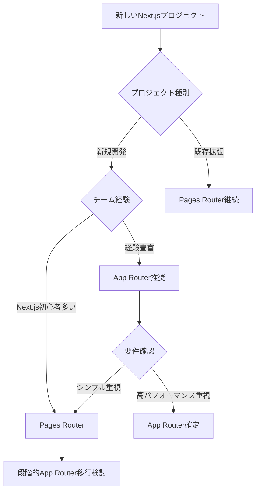

# Next.js 2025年版：Pages RouterとApp Routerの違いを完全理解👀✨

## 📝 **概要**
Next.js 13で導入された「App Router」は、2025年現在では安定したルーティングシステムとして確立されています。従来の「Pages Router」も引き続きサポートされており、両システムの並行運用も可能です。本記事では、2025年の視点で**Pages Router**と**App Router**の違いを分かりやすく解説し、最新のベストプラクティスに基づいた選択指針を提供します。

---

## 🆕 **2025年の重要な更新情報**
- **Node.js最小バージョン**: v18.17以上が必須
- **App Routerの安定性**: 本番環境での利用が推奨される成熟度に到達
- **並行運用サポート**: 同一プロジェクトでPages RouterとApp Routerの共存が可能
- **段階的移行**: 公式の移行ガイドが充実し、リスクを最小限に抑えた移行が可能

---

## 💡 **レンダリングとは？**
- **レンダリング**: ReactがコードをHTMLに変換し、ブラウザがUIを描画できるようにするプロセス
- **Server Components**: サーバー上で実行され、JavaScriptバンドルを削減する新しいReactコンポーネント
- **ハイドレーション**: レンダリング済みのHTMLにJavaScriptを注入し、インタラクティブ性を追加するプロセス
- **ストリーミング**: ページの一部を段階的に送信し、初期表示を高速化する技術

---

## 📂 **Pages Router（従来システム）**
### 🌟 **仕組み**
- ファイルシステムベースのルーティング（`pages/`ディレクトリ）
- 各ページは以下の方法でレンダリング可能：
  - **静的生成（SSG）**: `getStaticProps`でビルド時にHTMLを生成
  - **サーバーサイドレンダリング（SSR）**: `getServerSideProps`でリクエスト時にHTMLを生成

### ✅ **メリット**
- 成熟した安定性と豊富なコミュニティサポート
- シンプルで理解しやすい構造
- 既存ライブラリとの高い互換性
- 小〜中規模プロジェクトに最適

### ❌ **デメリット**
- ネストされたレイアウトの実装が複雑
- Server Componentsの未サポート
- 複雑な状態管理が必要

### 📌 **実装例**
```javascript
// pages/blog/[slug].js
export async function getServerSideProps({ params }) {
  const { slug } = params;
  const post = await fetchPost(slug);
  return { props: { post } };
}

export default function BlogPost({ post }) {
  return {post.title};
}
```

---

## 🚀 **App Router（最新システム）**
### 🌟 **仕組み**
- フォルダベースのルーティング（`app/`ディレクトリ）
- React Server Components（RSC）をデフォルトサポート
- 特殊ファイル規約：`page.js`、`layout.js`、`loading.js`、`error.js`

### ✅ **メリット**
- **ネストされたレイアウト**の簡単な実装
- **ストリーミング**と**部分レンダリング**による高速化
- **Server Components**によるJavaScriptバンドル削減
- **Built-in Loading UI**（`loading.tsx`）
- 大規模アプリケーションに最適

### ❌ **デメリット**
- 学習コストがやや高い
- 一部のサードパーティライブラリで互換性課題
- 従来のパターンからの思考転換が必要

### 📌 **実装例**
```javascript
// app/blog/[slug]/page.js
async function fetchPost(slug) {
  // サーバーで直接データフェッチ
  return await fetch(`/api/posts/${slug}`).then(res => res.json());
}

export default async function BlogPost({ params }) {
  const { slug } = params;
  const post = await fetchPost(slug);
  return {post.title};
}
```

---

## 🔍 **2025年版機能比較表**

| 機能                     | Pages Router                     | App Router                       | 2025年推奨度 |
|--------------------------|----------------------------------|----------------------------------|--------------|
| **ルーティング方式**      | ファイルベース                    | フォルダベース + 特殊ファイル     | ⭐⭐⭐        |
| **Server Components**    | ❌                               | ✅ デフォルト                     | ⭐⭐⭐        |
| **ネストレイアウト**      | 🔶 回避策が必要                   | ✅ ネイティブサポート             | ⭐⭐⭐        |
| **ストリーミング**        | ❌                               | ✅ 内蔵                          | ⭐⭐⭐        |
| **学習コスト**           | 低い                              | やや高い                          | ⭐⭐          |
| **安定性**               | ✅ 非常に安定                     | ✅ 2025年時点で安定               | ⭐⭐⭐        |
| **パフォーマンス**        | 良好                              | より高速                          | ⭐⭐⭐        |
| **移行サポート**          | -                                | ✅ 段階的移行可能                 | ⭐⭐⭐        |

---

## 🛠️ **2025年版選択ガイド**

### **📊 Pages Routerを選ぶべきケース**
- ✅ 既存プロジェクトの保守・拡張
- ✅ 小〜中規模のシンプルなWebサイト
- ✅ 短期間でのMVP開発
- ✅ チームのNext.js経験が浅い場合
- ✅ 特定のライブラリに依存している場合

### **🚀 App Routerを選ぶべきケース**
- ⭐ **新規プロジェクト**（2025年推奨）
- ⭐ 大規模で複雑なアプリケーション
- ⭐ パフォーマンスが重要な要件
- ⭐ 最新のReact機能を活用したい場合
- ⭐ 長期的な保守性を重視する場合

### **🎯 実践的な判断フロー**


---

## 🔄 **2025年版移行戦略**

### **段階的移行のベストプラクティス**

#### **Phase 1: 環境準備（1週間）**
```bash
# Node.js v18.17以上にアップグレード
node --version

# Next.js最新版への更新
npm install next@latest react@latest react-dom@latest

# ESLint設定の更新
npm install -D eslint-config-next@latest
```

#### **Phase 2: 並行運用開始（2-4週間）**
- `app/`ディレクトリを作成
- 簡単なページから移行開始
- 両システムの同時稼働で安全性確保

#### **Phase 3: 段階的移行（2-6ヶ月）**
```javascript
// 移行前：pages/products/[id].js
export async function getServerSideProps({ params }) {
  const product = await fetchProduct(params.id);
  return { props: { product } };
}

// 移行後：app/products/[id]/page.js
export default async function ProductPage({ params }) {
  const product = await fetchProduct(params.id);
  return {product.name};
}
```

### **移行時の重要な変更点**[4][5]
| 従来（Pages Router） | 新（App Router） | 備考 |
|---------------------|------------------|------|
| `getServerSideProps` | `async`コンポーネント | より直感的 |
| `pages/_app.js` | `app/layout.js` | レイアウト統合 |
| `pages/_error.js` | `app/error.js` | 細かいエラーハンドリング |
| `useRouter` (next/router) | `useRouter` (next/navigation) | API変更あり |

---

## ⚡ **2025年の開発ベストプラクティス**

### **パフォーマンス最適化**
```javascript
// Server Componentでのデータフェッチ（推奨）
export default async function Dashboard() {
  const data = await fetchDashboardData(); // サーバーで実行
  return ;
}

// Client Componentは必要な場合のみ
'use client'
export default function InteractiveChart() {
  const [data, setData] = useState([]);
  // クライアントサイドの状態管理
}
```

### **エラーハンドリング**
```javascript
// app/dashboard/error.js
'use client'
export default function Error({ error, reset }) {
  return (
    
      Something went wrong!
       reset()}>Try again
    
  );
}
```

### **ローディング状態**
```javascript
// app/dashboard/loading.js
export default function Loading() {
  return Loading dashboard...;
}
```

---

## 📊 **実際の導入事例とメトリクス**

### **パフォーマンス改善例**
- **初期ロード時間**: 平均30-50%短縮
- **JavaScript Bundle**: Server Componentsにより20-40%削減
- **Time to First Byte**: ストリーミングにより改善

### **開発効率の向上**
- **レイアウトの再利用**: コード重複50%削減
- **エラーハンドリング**: より細かい制御が可能
- **型安全性**: TypeScriptとの統合が向上

---

## 🎯 **2025年の結論と推奨事項**

### **新規プロジェクトの場合**
**App Router**を強く推奨します]。理由：
- 長期的なサポートと機能拡張
- 優れたパフォーマンス特性
- モダンなReact開発パターン

### **既存プロジェクトの場合**
**段階的移行**を検討してください：
1. 新機能はApp Routerで実装
2. 既存機能は安定動作を優先
3. 長期計画で完全移行を目指す

### **チーム学習の場合**
1. Pages Routerで基礎を理解
2. 小規模プロジェクトでApp Router体験
3. 実プロジェクトでの段階的適用

---

## 🚀 **次のステップ**

Next.js 2025年版では、App Routerが主流となっていますが、適切な選択と移行戦略が成功の鍵となります。プロジェクトの要件、チームの経験、長期的な保守性を総合的に判断し、最適なルーティングシステムを選択しましょう。

💬 *この記事が2025年のNext.js開発の参考になれば幸いです。最新のベストプラクティスを活用して、優れたWebアプリケーションを構築してください！ Happy Coding!* 😊✨


----


:::note
**この記事を書いた人✏️@YushiYamamoto** 
株式会社プロドウガ CEO / AIアーキテクト
Next.js / TypeScript / n8nを活用した自律型アーキテクチャ設計を専門としています。
日々の自動化の検証結果や、ビジネス側の視点（ROI等）に関するより深い考察は、以下の公式サイトおよびnoteで発信しています。
:::

https://itprodx.com

https://note.com/prodouga
