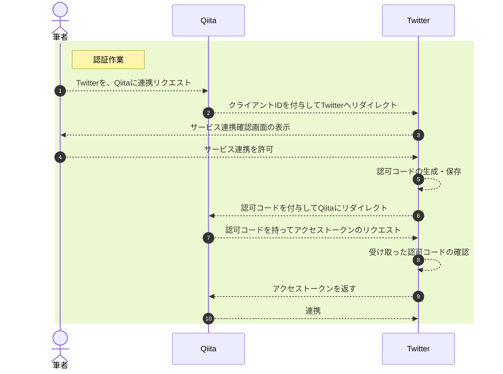

# はじめに
株式会社リンクアンドモチベーションでソフトウェアエンジニアとして働いているSです。
最近、モチベーションクラウドでOAuthを用いた認可を行う必要があり、認証・認可周りを調べることが多かったです。
本記事では、その学びについて記載していけたらと思います。

初心者~中級者向けの記事になっているので、理解が乏しい部分はご了承ください。

# OAuthってどうなってるの？
OAuthとは異なるシステム間でデータや機能へのアクセス権限の限定的な許可、いわゆる認可を行う**仕組みのこと**です。OAuthの仕組みが存在することで、他サービスへのリソースを連携することが可能になります。

### OAuthにまつわるワードの説明
具体の説明の前に、OAuthを学ぶ上でMustで理解しておいて欲しい単語について説明を添えておきます。

| 単語| 説明 |
| :-|:-   |
| リソースオーナー |リソースの所有者のこと|   
| リソースサーバー |保護されたリソースを管理しているサーバーのこと|
| 認可サーバー |リソースサーバーが保護しているリソースへのアクセストークンを付与するサーバーのこと|
| クライアント |認可サーバーからアクセストークンを取得し、リソースサーバーにアクセスを要求するサービスのこと|

### OAuthにまつわるトークンの説明
トークン版も置いておきます。

| 単語| 説明 |
| :-|:-   |
| アクセストークン |OAuthの概念に不可欠な要のトークン。認可サーバーから発行される。トークンの存続期間中は、トークンが発行されたリソースに対してアクセスが可能になります。通常のID, パスワード型の認証に比べて、こちらでトークンのアクセス期限を切れるのが大きい利点です。|   
| リフレッシュトークン  |アクセストークンを再取得（リフレッシュ）するためのトークンです。アクセストークンの有効期限が短い分、それより期限が長いリフレッシュトークンを保持することで、アクセストークンを再発行する手間を省くことができます。|
| IDトークン |認証したことを証明するためのトークンです。JWTという形式の文字列の中に認証情報が含まれています。|

### OAuthが生まれる前はそもそもはどうだったの？
OAuthが生まれる以前は、皆さんがよく知る、**ユーザーを識別する一意のログインID**と**パスワード**での認証が主流でした。

この場合だと、1つのリソースをエンドユーザー本人が使う場合は全く問題ありませんが、異なるシステムでID連携、ソーシャルログインを行うとなると少し話がややこしくなってしまいます。。

異なるシステムであるサードパーティのアプリケーションは自らのDBにそのエンドユーザーの認証情報を保存する必要があります。
例えば、そのサードパーティのアプリケーションの運営側に悪人がいたとしたら、そのユーザーの認証情報を盗み見られてしまう可能性があります。このように、セキュリティ面で不安が残る形となります。

### OAuthは何が嬉しいの？
それではここからOAuthの詳細について触れていければと思います。
OAuthでは従来のID・パスワード認証とは違って、**トークンベースの認証**となります。
許可された有効な**アクセストークン**を用いることで、予め認可されているリソースにアクセスが可能になります。

OAuthを用いることで、リソースへの読み取り権限のみの許可であったり、プロフィール画像のみの許可など、各種認証の制限をかけることも可能です。

認可サーバーがリソースオーナーの認証とアクセストークンの発行を行うので、サードパーティのアプリケーションはリソースオーナーの認証情報を自前で扱う必要はないので、先ほどの認証情報を盗み見られてしまう危険性もないです。

### OAuthのワークフロー
OAuthの中でも実際によく使われている認可コードグラント方式のワークフローに関して、シーケンス図を用いて説明していきます。
まずは、あるサービスAの内容を、サービスBでもシェアするケースです。イメージが湧きやすいように
> サービスA： Qiita
サービスB： Twitter

とします。
Qiitaで書いた投稿をTwitterでも投稿してシェアするケースを例にあげます。

##### 役割
筆者：リソースオーナー
Qiita：クライアント（QiitaからTwitterのPOST API等を許可してもらう）
Twitter：リソースサーバー、認可サーバー

※1：①は以下添付画像のようにQiita上で行う

qiitaより引用（https://qiita.com/settings/account）
※2：②~④は以下添付画像のようにTwitter上で行う

qiitaより引用（https://qiita.com/settings/account）
※3：今回の例で言うと、認可サーバーとリソースサーバーはTwitterが両方こなしていますが、認可サーバーだけ別に分けるケースもよくあります。例えばAuth0やOktaなどのIDaasに認証・認可を任せるケースがそれに当たります。

### 様々なOAuthの認証方法
| 単語| 説明 |
| :-|:-   |
| 認可コードグラント |先ほどのワークフローの例であげたように認可コードを用いて、アクセストークンを取得する方法です。|   
| インプリシットグラント  |ネイティブアプリやブラウザ上のJavaScriptから直接アクセストークンを発行する必要があるときの方法です。アクセストークンがブラウザーに直接渡されてしまい、ユーザーにも見えてしまう懸念があるため現在は非推奨となっています。|
| クライアントクレデンシャルグラント |クライアントIDとクライアントシークレットを使って、アクセストークンを発行する方法です。認可フローにユーザーが介在しないのが特徴です。|
| リソースオーナーパスワードクレデンシャルズフロー |クライアントIDとクライアントシークレットの代わりに、ログインIDとパスワードを渡す方法。クライアントがリソースオーナーのパスワードを知ってしまうので非推奨となっています。|

上記の表に記載のように、全ての方式がセキュリティ的に問題ないかというと、そうではないのがOAuthの現状です。
なので各形式で、拡張が必要なケースも多々あります。

### OpenID Connectとの違い
ただ実際にアクセストークン単体だと、そのトークンが「いつ」「どこで」「なんのために」作られたのか、そのような情報はブラックボックスとなっています。なので誰かがそのアクセストークンを盗んでもしたら、簡単に成り済ますことができてしまいます。

OpenID Connectとは、OAuth 2.0で定義されているAPI保護の仕組みをベースとして、 ID連携に必要な機能を追加した**プロトコルです**。
OpenID Connectでは、アクセストークンとは別にIDトークンを発行します。

このIDトークンの中に「いつ」「どこで」「なんのために」作られたのか、という認証の情報を持たせるのです。

IDトークンでは、**JWT（JSON Web Token）** という仕組みを利用して、トークンの中に、リソースオーナーの識別子や、 認可サーバーの識別子、アクセス対象となるユーザー情報の範囲などを含めています。

実際にFacebookアカウントを使って、Spotifyなどの各種サービスにログインができるのは実はOpenID Connectがあるおかげなのです。

理解としては、OAuthだけでは対応できなかった複雑な認証のケースを補完してくれるものという理解で問題ないと思います。

# 最後に
入社以来、フロントエンド をメインに活動してきましたが、認証・認可の仕組みって面白いなと思い始めています。
拙い文章ではありますが、誰かの理解の助けになると嬉しいです。
